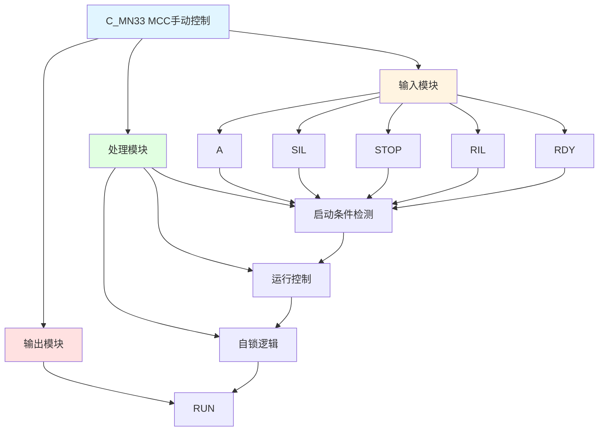

# C_MN33 功能块分析报告

## 基本信息

| 项目 | 内容 |
|------|------|
| 功能块名称 | C_MN33 |
| 功能描述 | MCC Manual Function Block（电机控制中心手动功能块） |
| 最后修改 | 2017.07.31 |
| 作者 | Gao Yi Ju |
| 页数 | 1页 |

## 功能概述

C_MN33 是一个电机控制中心（MCC）手动功能块，用于控制电机的启停。该功能块实现基本的电机运行控制逻辑，包含启动联锁、停止命令、运行联锁和准备就绪检测。

**主要应用场景**：
- 电机启停控制
- MCC（Motor Control Center）控制
- 简单的设备启停控制

**MCC说明**：
- **MCC**: Motor Control Center（电机控制中心），是集中控制多台电机的控制柜
- 通常包含断路器、接触器、热继电器等保护器件

## 思维导图

## 流程路径描述

### 启动路径：
开始 → A信号 AND SIL AND NOT STOP AND RIL AND RDY → RUN输出
**功能**: 启动电机运行

### 停止路径：
开始 → STOP信号 → RUN复位
**功能**: 停止电机运行

### 自锁路径：
开始 → RUN信号 → 保持RUN状态
**功能**: 保持运行状态

## 逐帧功能分析

### Rung 7: 运行控制

**功能描述**: 控制电机运行

**输入条件**:
| 信号名称 | 信号描述 | 信号类型 | 触发值 |
|----------|----------|----------|--------|
| A | 启动命令 | BOOL | TRUE |
| SIL | 启动联锁 | BOOL | TRUE |
| STOP | 停止命令 | BOOL | FALSE |
| RIL | 运行联锁 | BOOL | TRUE |
| RDY | 准备就绪 | BOOL | TRUE |

**输出功能**:
| 信号名称 | 信号描述 | 信号类型 |
|----------|----------|----------|
| RUN | 运行输出 | BOOL |

**触发逻辑**:
- IF A = TRUE AND SIL = TRUE AND STOP = FALSE AND RIL = TRUE AND RDY = TRUE THEN RUN = TRUE
- RUN自锁，直到STOP = TRUE

**功能实现**: 
当启动命令有效且所有联锁条件满足时，输出运行信号并自锁。当停止命令有效时，复位运行信号。

## 触发条件总结

### 控制条件
| 状态 | 触发条件 | 复位条件 |
|------|----------|----------|
| RUN | A=TRUE AND SIL=TRUE AND STOP=FALSE AND RIL=TRUE AND RDY=TRUE | STOP=TRUE |

### 联锁类型
- **启动联锁(SIL)**: 启动时的联锁条件，如设备安全门关闭等
- **运行联锁(RIL)**: 运行时的联锁条件，如润滑油压力正常等

## 实现功能总结

### 主要功能
1. **启动控制**: 控制电机启动
2. **停止控制**: 控制电机停止
3. **自锁功能**: 运行状态自锁
4. **联锁保护**: 启动和运行联锁保护

## 关键信号说明

| 信号名称 | 信号描述 | 信号类型 | 用途 |
|----------|----------|----------|------|
| A | 启动命令 | BOOL | 启动控制命令 |
| SIL | 启动联锁 | BOOL | 启动联锁信号 |
| STOP | 停止命令 | BOOL | 停止控制命令 |
| RIL | 运行联锁 | BOOL | 运行联锁信号 |
| RDY | 准备就绪 | BOOL | 准备就绪信号 |
| RUN | 运行输出 | BOOL | 运行状态输出 |

## 调试技巧

### 调试步骤
1. 检查A信号，确认启动命令正常
2. 检查SIL信号，确认启动联锁条件满足
3. 检查STOP信号，确认停止功能正常
4. 检查RIL信号，确认运行联锁条件满足
5. 检查RDY信号，确认准备就绪
6. 监控RUN信号，观察运行状态

### 常见问题
1. **电机不启动**: 检查启动命令和联锁信号
2. **停止不生效**: 检查STOP信号
3. **自锁失效**: 检查逻辑是否正确

### 监控信号列表
- A、STOP（命令信号）
- SIL、RIL（联锁信号）
- RDY（准备就绪）
- RUN（运行输出）
