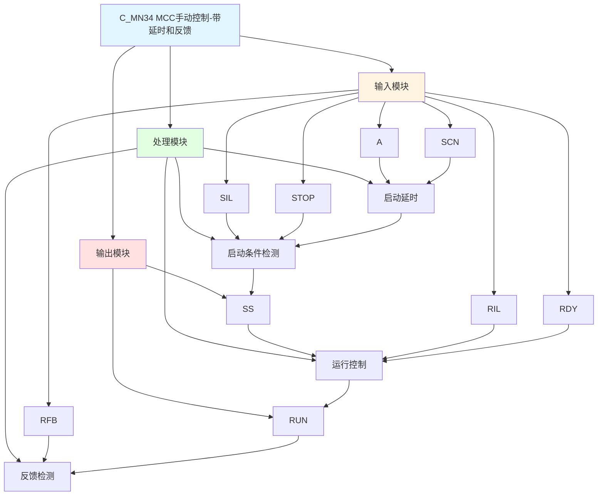

# C_MN34 功能块分析报告

## 基本信息

| 项目 | 内容 |
|------|------|
| 功能块名称 | C_MN34 |
| 功能描述 | Manual Sequence of MCC Drive with STOP Operation and running feedback Device（MCC驱动手动顺序控制，带停止操作和运行反馈装置） |
| 最后修改 | 2016.01.04 |
| 作者 | Gao Weidi |
| 页数 | 1页 |

## 功能概述

C_MN34 是一个带停止操作和运行反馈装置的MCC驱动手动顺序控制功能块。与C_MN33相比，该功能块增加了启动延时和运行反馈功能，实现更可靠的电机控制。

**主要应用场景**：
- 需要运行反馈确认的电机控制
- 安全要求较高的设备启停控制
- 需要确认动作执行的MCC控制

**与C_MN33的区别**：
- C_MN33: 无启动延时，无运行反馈
- C_MN34: 带启动延时(1000ms)，带运行反馈

## 思维导图

## 流程路径描述

### 启动延时路径：
开始 → A信号 AND NOT STOP → 延时1000ms → SS输出
**功能**: 启动延时确认

### 运行控制路径：
开始 → SS信号 AND SIL AND NOT STOP AND RIL AND RDY → RUN输出
**功能**: 控制电机运行

### 反馈检测路径：
开始 → RUN信号 AND NOT RFB → 异常状态（反馈超时）
**功能**: 检测运行反馈是否正常

## 逐帧功能分析

### Rung 7: 启动延时

**功能描述**: 启动命令延时确认

**输入条件**:
| 信号名称 | 信号描述 | 信号类型 | 触发值 |
|----------|----------|----------|--------|
| A | 启动命令 | BOOL | TRUE |
| STOP | 停止命令 | BOOL | FALSE |
| SCN | 扫描时间 | INT | 设定值 |

**输出功能**:
| 信号名称 | 信号描述 | 信号类型 |
|----------|----------|----------|
| SS | 启动确认 | BOOL |

**触发逻辑**:
- IF A = TRUE AND STOP = FALSE THEN SS = TRUE（延时1000ms后）

**功能实现**: 
使用C_SPDT单次触发定时器，在启动命令有效后延时1000ms产生启动确认信号。

### Rung 8: 运行控制

**功能描述**: 控制电机运行，带反馈检测

**输入条件**:
| 信号名称 | 信号描述 | 信号类型 | 触发值 |
|----------|----------|----------|--------|
| SS | 启动确认 | BOOL | TRUE |
| SIL | 启动联锁 | BOOL | TRUE |
| STOP | 停止命令 | BOOL | FALSE |
| RIL | 运行联锁 | BOOL | TRUE |
| RDY | 准备就绪 | BOOL | TRUE |
| RFB | 运行反馈 | BOOL | TRUE |

**输出功能**:
| 信号名称 | 信号描述 | 信号类型 |
|----------|----------|----------|
| RUN | 运行输出 | BOOL |

**触发逻辑**:
- IF SS = TRUE AND SIL = TRUE AND STOP = FALSE AND RIL = TRUE AND RDY = TRUE THEN RUN = TRUE
- IF RUN = TRUE AND RFB = FALSE THEN RUN复位（反馈超时保护）

**功能实现**: 
当所有条件满足时输出运行信号，如果反馈信号未到达，则自动复位。

## 触发条件总结

### 控制条件
| 状态 | 触发条件 | 复位条件 |
|------|----------|----------|
| SS | A=TRUE AND STOP=FALSE（延时1000ms） | STOP=TRUE |
| RUN | SS=TRUE AND SIL=TRUE AND STOP=FALSE AND RIL=TRUE AND RDY=TRUE | STOP=TRUE 或 反馈超时 |

### 延时参数
- 启动延时: 1000ms

## 实现功能总结

### 主要功能
1. **启动延时**: 延时确认启动命令
2. **运行控制**: 控制电机运行
3. **停止功能**: 支持紧急停止
4. **反馈保护**: 反馈超时自动复位
5. **联锁保护**: 启动和运行联锁保护

## 关键信号说明

| 信号名称 | 信号描述 | 信号类型 | 用途 |
|----------|----------|----------|------|
| A | 启动命令 | BOOL | 启动控制命令 |
| STOP | 停止命令 | BOOL | 停止控制命令 |
| SIL | 启动联锁 | BOOL | 启动联锁信号 |
| RIL | 运行联锁 | BOOL | 运行联锁信号 |
| RDY | 准备就绪 | BOOL | 准备就绪信号 |
| RFB | 运行反馈 | BOOL | 运行反馈信号 |
| SCN | 扫描时间 | INT | 扫描时间设定 |
| SS | 启动确认 | BOOL | 启动确认信号 |
| RUN | 运行输出 | BOOL | 运行状态输出 |

## 调试技巧

### 调试步骤
1. 检查A信号，确认启动命令正常
2. 检查STOP信号，确认停止功能正常
3. 检查联锁信号，确认联锁条件满足
4. 检查RDY信号，确认准备就绪
5. 检查RFB信号，确认反馈正常
6. 监控SS和RUN信号，观察启动和运行状态

### 常见问题
1. **启动延时过长**: 检查SCN值设置
2. **电机不启动**: 检查启动命令和联锁信号
3. **停止不生效**: 检查STOP信号
4. **反馈超时**: 检查RFB信号是否正常

### 监控信号列表
- A、STOP（命令信号）
- SIL、RIL（联锁信号）
- RDY（准备就绪）
- RFB（反馈信号）
- SS、RUN（输出信号）
