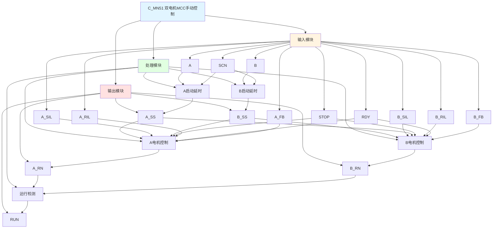

# C_MN51 功能块分析报告

## 基本信息

| 项目 | 内容 |
|------|------|
| 功能块名称 | C_MN51 |
| 功能描述 | Manual Sequence of MCC Drive with STOP Operation and running feedback Device（双电机MCC驱动手动顺序控制，带停止操作和运行反馈装置） |
| 最后修改 | 2016.01.04 |
| 作者 | Gao Weidi |
| 页数 | 1页 |

## 功能概述

C_MN51 是一个双电机MCC驱动手动顺序控制功能块，用于控制两台电机的启停。该功能块支持两台电机的独立控制和互锁，每台电机都有启动延时和运行反馈功能。

**主要应用场景**：
- 双电机驱动系统
- 主/备电机控制
- 需要互锁的双电机控制

**双电机控制特点**：
- 两台电机独立控制
- A/B电机互锁保护
- 各自的启动延时和反馈检测

## 思维导图

## 流程路径描述

### A电机启动路径：
开始 → A信号 AND NOT B AND NOT STOP → 延时1000ms → A_SS → A_RN输出
**功能**: 控制A电机启动

### B电机启动路径：
开始 → B信号 AND NOT A AND NOT STOP → 延时1000ms → B_SS → B_RN输出
**功能**: 控制B电机启动

### 运行检测路径：
开始 → A_RN OR B_RN → RUN输出
**功能**: 检测任一电机运行

## 逐帧功能分析

### Rung 7: A启动延时

**功能描述**: A电机启动命令延时确认

**输入条件**:
| 信号名称 | 信号描述 | 信号类型 | 触发值 |
|----------|----------|----------|--------|
| A | A启动命令 | BOOL | TRUE |
| B | B启动命令 | BOOL | FALSE |
| STOP | 停止命令 | BOOL | FALSE |
| SCN | 扫描时间 | INT | 设定值 |

**输出功能**:
| 信号名称 | 信号描述 | 信号类型 |
|----------|----------|----------|
| A_SS | A启动确认 | BOOL |

**触发逻辑**:
- IF A = TRUE AND B = FALSE AND STOP = FALSE THEN A_SS = TRUE（延时1000ms后）

**功能实现**: 
使用C_SPDT单次触发定时器，在A启动命令有效且B命令无效时，延时1000ms产生A启动确认信号。

### Rung 8: B启动延时

**功能描述**: B电机启动命令延时确认

**输入条件**:
| 信号名称 | 信号描述 | 信号类型 | 触发值 |
|----------|----------|----------|--------|
| B | B启动命令 | BOOL | TRUE |
| A | A启动命令 | BOOL | FALSE |
| STOP | 停止命令 | BOOL | FALSE |
| SCN | 扫描时间 | INT | 设定值 |

**输出功能**:
| 信号名称 | 信号描述 | 信号类型 |
|----------|----------|----------|
| B_SS | B启动确认 | BOOL |

**触发逻辑**:
- IF B = TRUE AND A = FALSE AND STOP = FALSE THEN B_SS = TRUE（延时1000ms后）

**功能实现**: 
使用C_SPDT单次触发定时器，在B启动命令有效且A命令无效时，延时1000ms产生B启动确认信号。

### Rung 9: A电机控制

**功能描述**: 控制A电机运行，带反馈检测

**输入条件**:
| 信号名称 | 信号描述 | 信号类型 | 触发值 |
|----------|----------|----------|--------|
| A_SS | A启动确认 | BOOL | TRUE |
| A_SIL | A启动联锁 | BOOL | TRUE |
| B_SS | B启动确认 | BOOL | FALSE |
| STOP | 停止命令 | BOOL | FALSE |
| A_RIL | A运行联锁 | BOOL | TRUE |
| RDY | 准备就绪 | BOOL | TRUE |
| A_FB | A运行反馈 | BOOL | TRUE |

**输出功能**:
| 信号名称 | 信号描述 | 信号类型 |
|----------|----------|----------|
| A_RN | A运行输出 | BOOL |

**触发逻辑**:
- IF A_SS = TRUE AND A_SIL = TRUE AND B_SS = FALSE AND STOP = FALSE AND A_RIL = TRUE AND RDY = TRUE THEN A_RN = TRUE
- IF A_RN = TRUE AND A_FB = FALSE THEN A_RN复位（反馈超时保护）

**功能实现**: 
当所有条件满足时输出A运行信号，如果反馈信号未到达，则自动复位。

### Rung 10: B电机控制

**功能描述**: 控制B电机运行，带反馈检测

**输入条件**:
| 信号名称 | 信号描述 | 信号类型 | 触发值 |
|----------|----------|----------|--------|
| B_SS | B启动确认 | BOOL | TRUE |
| B_SIL | B启动联锁 | BOOL | TRUE |
| A_SS | A启动确认 | BOOL | FALSE |
| STOP | 停止命令 | BOOL | FALSE |
| B_RIL | B运行联锁 | BOOL | TRUE |
| RDY | 准备就绪 | BOOL | TRUE |
| B_FB | B运行反馈 | BOOL | TRUE |

**输出功能**:
| 信号名称 | 信号描述 | 信号类型 |
|----------|----------|----------|
| B_RN | B运行输出 | BOOL |

**触发逻辑**:
- IF B_SS = TRUE AND B_SIL = TRUE AND A_SS = FALSE AND STOP = FALSE AND B_RIL = TRUE AND RDY = TRUE THEN B_RN = TRUE
- IF B_RN = TRUE AND B_FB = FALSE THEN B_RN复位（反馈超时保护）

**功能实现**: 
当所有条件满足时输出B运行信号，如果反馈信号未到达，则自动复位。

### Rung 11: 运行检测

**功能描述**: 检测任一电机运行状态

**输入条件**:
| 信号名称 | 信号描述 | 信号类型 | 触发值 |
|----------|----------|----------|--------|
| A_RN | A运行输出 | BOOL | TRUE |
| B_RN | B运行输出 | BOOL | TRUE |

**输出功能**:
| 信号名称 | 信号描述 | 信号类型 |
|----------|----------|----------|
| RUN | 运行状态 | BOOL |

**触发逻辑**:
- IF A_RN = TRUE OR B_RN = TRUE THEN RUN = TRUE

**功能实现**: 
当A或B任一电机运行时，输出运行状态信号。

## 触发条件总结

### 控制条件
| 电机 | 启动延时条件 | 运行条件 |
|------|--------------|----------|
| A | A=TRUE AND B=FALSE AND STOP=FALSE | A_SS=TRUE AND A_SIL=TRUE AND B_SS=FALSE AND STOP=FALSE AND A_RIL=TRUE AND RDY=TRUE |
| B | B=TRUE AND A=FALSE AND STOP=FALSE | B_SS=TRUE AND B_SIL=TRUE AND A_SS=FALSE AND STOP=FALSE AND B_RIL=TRUE AND RDY=TRUE |

### 互锁逻辑
- A和B启动命令互锁，不能同时启动
- A_SS和B_SS互锁，确保只有一台电机运行

## 实现功能总结

### 主要功能
1. **A电机控制**: 控制A电机启停
2. **B电机控制**: 控制B电机启停
3. **启动延时**: 两台电机都有1000ms启动延时
4. **停止功能**: 支持紧急停止
5. **反馈保护**: 反馈超时自动复位
6. **互锁保护**: A和B电机互锁

## 关键信号说明

| 信号名称 | 信号描述 | 信号类型 | 用途 |
|----------|----------|----------|------|
| A | A启动命令 | BOOL | A电机启动命令 |
| B | B启动命令 | BOOL | B电机启动命令 |
| STOP | 停止命令 | BOOL | 停止控制命令 |
| A_SIL | A启动联锁 | BOOL | A启动联锁信号 |
| B_SIL | B启动联锁 | BOOL | B启动联锁信号 |
| A_RIL | A运行联锁 | BOOL | A运行联锁信号 |
| B_RIL | B运行联锁 | BOOL | B运行联锁信号 |
| RDY | 准备就绪 | BOOL | 准备就绪信号 |
| A_FB | A运行反馈 | BOOL | A电机运行反馈 |
| B_FB | B运行反馈 | BOOL | B电机运行反馈 |
| SCN | 扫描时间 | INT | 扫描时间设定 |
| A_SS | A启动确认 | BOOL | A启动确认信号 |
| B_SS | B启动确认 | BOOL | B启动确认信号 |
| A_RN | A运行输出 | BOOL | A电机运行输出 |
| B_RN | B运行输出 | BOOL | B电机运行输出 |
| RUN | 运行状态 | BOOL | 任一电机运行状态 |

## 调试技巧

### 调试步骤
1. 检查A和B信号，确认启动命令正常
2. 检查STOP信号，确认停止功能正常
3. 检查联锁信号，确认联锁条件满足
4. 检查RDY信号，确认准备就绪
5. 检查A_FB和B_FB信号，确认反馈正常
6. 监控A_SS、B_SS、A_RN、B_RN、RUN信号，观察启动和运行状态

### 常见问题
1. **电机不启动**: 检查启动命令和联锁信号
2. **两台电机同时启动**: 检查互锁逻辑
3. **停止不生效**: 检查STOP信号
4. **反馈超时**: 检查反馈信号是否正常

### 监控信号列表
- A、B、STOP（命令信号）
- A_SIL、B_SIL、A_RIL、B_RIL（联锁信号）
- RDY（准备就绪）
- A_FB、B_FB（反馈信号）
- A_SS、B_SS、A_RN、B_RN、RUN（输出信号）
