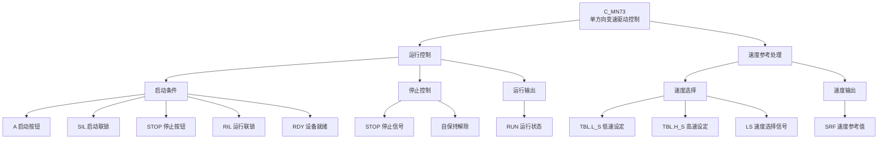

# C_MN73 功能块分析报告

## 基本信息

| 项目 | 内容 |
|------|------|
| 功能块名称 | C_MN73 |
| 功能描述 | Manual Sequence of Single Direction Variable Speed Drive (单方向变速驱动手动顺序控制) |
| 最后修改 | 2016.01.04 |
| 作者 | GaoWeidi |
| 页数 | 1页 (2个程序段) |

> **注意**：源代码文件中的功能名称注释为"C_MN81"，这可能是复制粘贴时的错误。根据文件名C_MN73，本报告以C_MN73为准进行分析。

---

## 功能概述

### 核心功能
C_MN73是一个**单方向变速驱动控制功能块**，用于控制只需单向运行的变速驱动设备。该功能块支持**低速/高速两档速度选择**，并具有完整的联锁保护功能。

### 应用场景
- **单方向输送带**：只需单向运行的输送设备
- **风机控制**：只需单向旋转的风机设备
- **泵类设备**：只需单向运行的泵类设备
- **单向辊道**：只需单向输送的辊道设备
- **搅拌设备**：单向旋转的搅拌机

### 功能特点
1. **单方向控制**：只需一个启动按钮和一个停止按钮
2. **两档速度**：支持低速(LS)和高速(HS)两档速度选择
3. **联锁保护**：启动联锁(SIL)和运行联锁(RIL)双重保护
4. **停止功能**：独立的停止按钮(STOP)用于紧急停止
5. **就绪检测**：设备就绪信号(RDY)检测后才允许启动
6. **速度参考输出**：根据速度选择自动输出对应的速度参考值

---

## 思维导图



---

## 流程路径描述

### 主控制流程

```
启动请求 → 联锁检查 → 停止检查 → 运行命令输出 → 速度参考处理 → 运行状态指示
```

### 详细路径说明

1. **运行控制流程**：
   ```
   A(启动) + SIL(启动联锁) + NOT STOP + RIL(运行联锁) + RDY(就绪) → RUN(运行)
   ```

2. **自保持逻辑**：
   ```
   RUN(自保持) + NOT STOP → RUN(持续运行)
   ```

3. **速度参考处理流程**：
   ```
   根据LS信号选择TBL.L_S或TBL.H_S → C_NSWR选择 → 输出SRF
   ```

---

## 逐帧功能分析

### 程序段1：运行控制

| 元素 | 类型 | 功能说明 |
|------|------|----------|
| A | NOCON (常开触点) | 启动按钮信号 |
| SIL | NOCON (常开触点) | 启动联锁信号，为ON时允许启动 |
| STOP | NOCON (常开触点) | 停止按钮信号，为ON时停止运行 |
| RIL | NOCON (常开触点) | 运行联锁信号，运行过程中必须保持ON |
| RDY | NOCON (常开触点) | 设备就绪信号，必须为ON才能启动 |
| RUN | COIL (输出线圈) | 运行命令输出 |
| RUN | NOCON (常开触点) | 自保持触点 |

**逻辑分析**：
```
RUN = (A AND SIL AND NOT STOP AND RIL AND RDY) OR (RUN AND NOT STOP)
```

- **启动条件**：启动按钮按下(A=ON)、启动联锁正常(SIL=ON)、停止按钮未按下(STOP=OFF)、运行联锁正常(RIL=ON)、设备就绪(RDY=ON)
- **自保持**：启动后通过RUN触点实现自保持
- **停止方式**：按下STOP按钮或RIL联锁断开

### 程序段2：速度参考处理

| 元素 | 类型 | 功能说明 |
|------|------|----------|
| C_NSWR | CALL (功能块调用) | 实数型数值选择器 |
| TBL.L_S | 输入参数 | 低速设定值 |
| TBL.H_S | 输入参数 | 高速设定值 |
| LS | 输入参数 | 速度选择信号 |
| RUN | 输入参数 | 运行状态信号 |
| SRF | 输出参数 | 速度参考值输出 |
| C_NSWR | CALL (功能块调用) | 第二次调用用于运行状态判断 |
| ADD_REAL | 运算指令 | 实数加法运算 |

**逻辑分析**：
- 调用C_NSWR功能块进行速度参考值选择
- 当LS=OFF时，选择TBL.L_S（低速）
- 当LS=ON时，选择TBL.H_S（高速）
- 只有在RUN=ON时才输出速度参考值

---

## 触发条件总结

| 触发事件 | 触发条件 | 输出结果 |
|----------|----------|----------|
| 启动运行 | A=ON, SIL=ON, STOP=OFF, RIL=ON, RDY=ON | RUN=ON |
| 保持运行 | RUN=ON, STOP=OFF | RUN=ON (自保持) |
| 停止运行 | STOP=ON 或 RIL=OFF | RUN=OFF |
| 低速输出 | RUN=ON, LS=OFF | SRF=TBL.L_S |
| 高速输出 | RUN=ON, LS=ON | SRF=TBL.H_S |
| 停止速度 | RUN=OFF | SRF=0.0 |

---

## 实现功能总结

### 主要功能
1. **启停控制**：实现设备的启动和停止控制
2. **联锁保护**：启动联锁和运行联锁双重保护
3. **速度选择**：支持低速/高速两档速度选择
4. **自保持功能**：启动后自动保持运行状态
5. **速度输出**：根据运行状态和速度选择输出速度参考值

### 与其他MN系列功能块对比

| 功能块 | 方向数 | 停止按钮 | 速度档位 | 适用场景 |
|--------|--------|----------|----------|----------|
| C_MN01 | 单向 | 无 | 1档 | 单速驱动 |
| C_MN02 | 单向 | 有 | 1档 | 单速驱动(带停止) |
| **C_MN73** | **单向** | **有** | **2档** | **变速驱动** |
| C_MN81 | 双向 | 无 | 2档 | 可逆变速驱动 |
| C_MN91 | 双向 | 无 | 2档 | 可逆变速驱动(无停止) |

---

## 关键信号说明

### 输入信号

| 信号名 | 数据类型 | 说明 | 备注 |
|--------|----------|------|------|
| A | BOOL | 启动按钮 | 上升沿触发启动 |
| SIL | BOOL | 启动联锁 | 必须为ON才能启动 |
| STOP | BOOL | 停止按钮 | ON时停止运行 |
| RIL | BOOL | 运行联锁 | 运行中必须保持ON |
| RDY | BOOL | 设备就绪信号 | 必须为ON才能启动 |
| LS | BOOL | 速度选择信号 | ON=高速, OFF=低速 |
| TBL.L_S | REAL | 低速设定值 | 速度参考值 |
| TBL.H_S | REAL | 高速设定值 | 速度参考值 |

### 输出信号

| 信号名 | 数据类型 | 说明 | 备注 |
|--------|----------|------|------|
| RUN | BOOL | 运行命令 | 输出到驱动器 |
| SRF | REAL | 速度参考值 | 输出到驱动器的速度给定 |

---

## 调试技巧

### 常见问题排查

1. **设备无法启动**
   - 检查RDY信号是否为ON
   - 检查SIL启动联锁是否正常
   - 检查STOP按钮是否被按下
   - 检查RIL运行联锁是否正常

2. **设备无法停止**
   - 检查STOP按钮信号是否正常
   - 检查RIL运行联锁是否断开
   - 确认程序逻辑正确

3. **速度参考值异常**
   - 检查TBL表中的速度设定值是否正确
   - 检查LS速度选择信号状态
   - 使用在线监视查看SRF输出值

4. **速度无法切换**
   - 检查LS信号是否正常变化
   - 确认设备处于运行状态
   - 检查C_NSWR功能块调用参数

### 调试建议

1. **首次调试**
   - 先不连接实际设备，使用模拟信号测试逻辑
   - 逐一验证启动、停止、速度切换功能
   - 确认速度参考值输出正确

2. **联机调试**
   - 先测试低速运行，确认运行方向正确
   - 再测试高速运行，确认速度切换正常
   - 最后测试各种故障情况下的保护功能

3. **维护建议**
   - 定期检查联锁信号状态
   - 记录速度设定值以便故障分析
   - 定期测试停止功能是否正常
