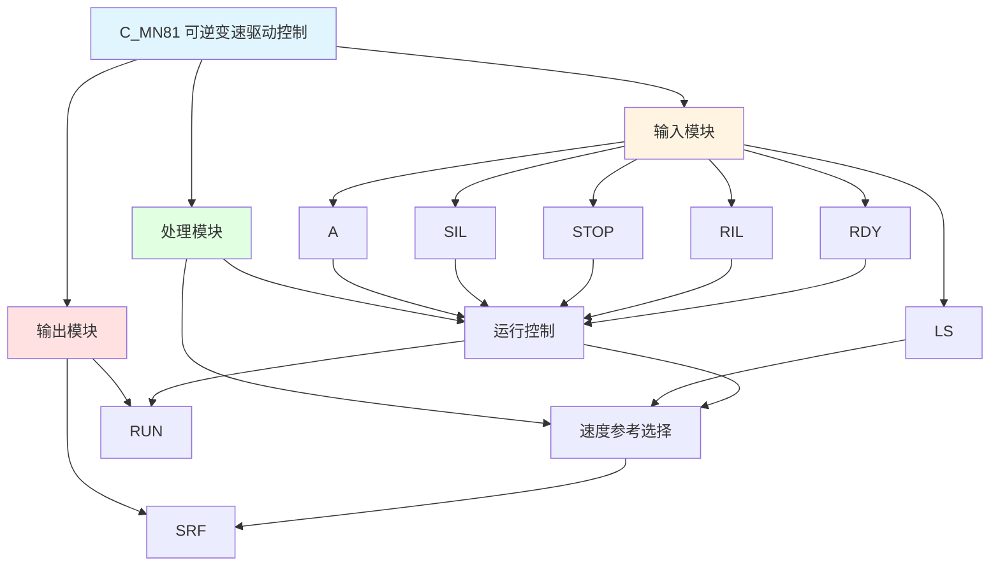

# C_MN81 功能块分析报告

## 基本信息

| 项目 | 内容 |
|------|------|
| 功能块名称 | C_MN81 |
| 功能描述 | Manual Sequence of Reversible Variable Speed Drive without STOP Operation Device（可逆变速驱动手动顺序控制，无停止操作装置） |
| 最后修改 | 2016.01.04 |
| 作者 | Gao Weidi |
| 页数 | 1页 |

## 功能概述

C_MN81 是一个可逆变速驱动手动顺序控制功能块，用于控制可逆变速电机的启停和速度参考输出。该功能块支持正反转控制，并根据限位开关状态自动切换速度参考。

**主要应用场景**：
- 可逆变速电机控制
- 需要限位速度切换的场合
- 简单的正反转控制

**可逆变速驱动说明**：
- 支持正转(A)和反转(B)两个方向
- 根据限位开关(LS)状态自动切换低速(L_S)和高速(H_S)
- 无停止操作装置，只能通过反向命令停止

## 思维导图

## 流程路径描述

### 运行控制路径：
开始 → A信号 AND SIL AND NOT STOP AND RIL AND RDY → RUN输出
**功能**: 控制电机运行

### 速度参考选择路径：
开始 → LS状态 → 选择L_S或H_S → 输出SRF
**功能**: 根据限位状态选择速度参考

## 逐帧功能分析

### Rung 7: 运行控制

**功能描述**: 控制电机运行

**输入条件**:
| 信号名称 | 信号描述 | 信号类型 | 触发值 |
|----------|----------|----------|--------|
| A | 启动命令 | BOOL | TRUE |
| SIL | 启动联锁 | BOOL | TRUE |
| STOP | 停止命令 | BOOL | FALSE |
| RIL | 运行联锁 | BOOL | TRUE |
| RDY | 准备就绪 | BOOL | TRUE |

**输出功能**:
| 信号名称 | 信号描述 | 信号类型 |
|----------|----------|----------|
| RUN | 运行输出 | BOOL |

**触发逻辑**:
- IF A = TRUE AND SIL = TRUE AND STOP = FALSE AND RIL = TRUE AND RDY = TRUE THEN RUN = TRUE

**功能实现**: 
当所有条件满足时输出运行信号，RUN自锁。

### Rung 8: 速度参考选择

**功能描述**: 根据限位状态选择速度参考

**输入条件**:
| 信号名称 | 信号描述 | 信号类型 | 触发值 |
|----------|----------|----------|--------|
| LS | 限位开关 | BOOL | TRUE/FALSE |
| L_S | 低速参考 | REAL | 设定值 |
| H_S | 高速参考 | REAL | 设定值 |
| RUN | 运行状态 | BOOL | TRUE |

**输出功能**:
| 信号名称 | 信号描述 | 信号类型 |
|----------|----------|----------|
| SRF | 速度参考输出 | REAL |

**触发逻辑**:
- IF LS = TRUE THEN SRF = L_S（低速）
- IF LS = FALSE THEN SRF = H_S（高速）
- IF RUN = FALSE THEN SRF = 0

**功能实现**: 
使用C_NSWR选择功能块，根据限位开关状态选择低速或高速参考，运行停止时输出0。

## 触发条件总结

### 控制条件
| 状态 | 条件 | 结果 |
|------|------|------|
| 运行 | A=TRUE AND SIL=TRUE AND STOP=FALSE AND RIL=TRUE AND RDY=TRUE | RUN=TRUE |
| 停止 | STOP=TRUE | RUN=FALSE |

### 速度选择
| LS状态 | 速度参考 |
|--------|----------|
| TRUE | L_S（低速） |
| FALSE | H_S（高速） |
| RUN=FALSE | 0 |

## 实现功能总结

### 主要功能
1. **运行控制**: 控制电机启停
2. **速度参考选择**: 根据限位状态选择速度
3. **联锁保护**: 启动和运行联锁保护

## 关键信号说明

| 信号名称 | 信号描述 | 信号类型 | 用途 |
|----------|----------|----------|------|
| A | 启动命令 | BOOL | 启动控制 |
| SIL | 启动联锁 | BOOL | 启动联锁信号 |
| STOP | 停止命令 | BOOL | 停止控制 |
| RIL | 运行联锁 | BOOL | 运行联锁信号 |
| RDY | 准备就绪 | BOOL | 准备就绪信号 |
| LS | 限位开关 | BOOL | 限位检测 |
| L_S | 低速参考 | REAL | 低速设定值 |
| H_S | 高速参考 | REAL | 高速设定值 |
| RUN | 运行输出 | BOOL | 运行状态 |
| SRF | 速度参考输出 | REAL | 速度参考值 |

## 调试技巧

### 调试步骤
1. 检查A信号，确认启动命令正常
2. 检查联锁信号，确认联锁条件满足
3. 检查LS信号，确认限位状态
4. 监控RUN和SRF信号，观察运行状态和速度参考

### 常见问题
1. **电机不启动**: 检查启动命令和联锁信号
2. **速度参考不正确**: 检查LS信号和速度设定值

### 监控信号列表
- A、STOP（命令信号）
- SIL、RIL、RDY（联锁信号）
- LS（限位信号）
- RUN、SRF（输出信号）
