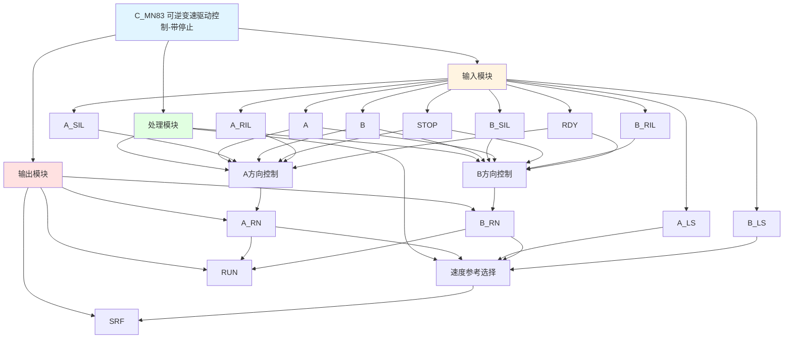

# C_MN83 功能块分析报告

## 基本信息

| 项目 | 内容 |
|------|------|
| 功能块名称 | C_MN83 |
| 功能描述 | Manual Sequence of Reversible Variable Speed Drive with STOP Operation Device（可逆变速驱动手动顺序控制，带停止操作装置） |
| 最后修改 | 2016.01.05 |
| 作者 | Gao Weidi |
| 页数 | 1页 |

## 功能概述

C_MN83 是一个带停止操作装置的可逆变速驱动手动顺序控制功能块。与C_MN81相比，该功能块支持正反转独立控制，并增加了停止命令输入。

**主要应用场景**：
- 可逆变速电机控制
- 需要正反转控制的场合
- 需要限位速度切换的场合

**与C_MN81的区别**：
- C_MN81: 单方向控制，带停止
- C_MN83: 双方向控制(A/B)，带停止

## 思维导图

## 流程路径描述

### A方向控制路径：
开始 → A信号 AND A_SIL AND NOT B AND NOT STOP AND A_RIL AND RDY → A_RN输出
**功能**: 控制A方向运行

### B方向控制路径：
开始 → B信号 AND B_SIL AND NOT A AND NOT STOP AND B_RIL AND RDY → B_RN输出
**功能**: 控制B方向运行

### 速度参考选择路径：
开始 → A_RN/B_RN状态 → 选择对应速度参考 → 输出SRF
**功能**: 根据运行方向和限位状态选择速度参考

## 逐帧功能分析

### Rung 7: A方向控制

**功能描述**: 控制A方向运行

**输入条件**:
| 信号名称 | 信号描述 | 信号类型 | 触发值 |
|----------|----------|----------|--------|
| A | A命令 | BOOL | TRUE |
| A_SIL | A启动联锁 | BOOL | TRUE |
| B | B命令 | BOOL | FALSE |
| STOP | 停止命令 | BOOL | FALSE |
| A_RIL | A运行联锁 | BOOL | TRUE |
| RDY | 准备就绪 | BOOL | TRUE |

**输出功能**:
| 信号名称 | 信号描述 | 信号类型 |
|----------|----------|----------|
| A_RN | A运行输出 | BOOL |

**触发逻辑**:
- IF A = TRUE AND A_SIL = TRUE AND B = FALSE AND STOP = FALSE AND A_RIL = TRUE AND RDY = TRUE THEN A_RN = TRUE

### Rung 8: B方向控制

**功能描述**: 控制B方向运行

**输入条件**:
| 信号名称 | 信号描述 | 信号类型 | 触发值 |
|----------|----------|----------|--------|
| B | B命令 | BOOL | TRUE |
| B_SIL | B启动联锁 | BOOL | TRUE |
| A | A命令 | BOOL | FALSE |
| STOP | 停止命令 | BOOL | FALSE |
| B_RIL | B运行联锁 | BOOL | TRUE |
| RDY | 准备就绪 | BOOL | TRUE |

**输出功能**:
| 信号名称 | 信号描述 | 信号类型 |
|----------|----------|----------|
| B_RN | B运行输出 | BOOL |

**触发逻辑**:
- IF B = TRUE AND B_SIL = TRUE AND A = FALSE AND STOP = FALSE AND B_RIL = TRUE AND RDY = TRUE THEN B_RN = TRUE

### Rung 9: 运行检测

**功能描述**: 检测任一方向运行状态

**触发逻辑**:
- IF A_RN = TRUE OR B_RN = TRUE THEN RUN = TRUE

### Rung 10: 速度参考选择

**功能描述**: 根据运行方向和限位状态选择速度参考

**触发逻辑**:
- A方向低速: A_LS限位有效时选择A_LS
- A方向高速: A_LS限位无效时选择A_HS
- B方向低速: B_LS限位有效时选择B_LS
- B方向高速: B_LS限位无效时选择B_HS
- 停止时: SRF = 0

## 触发条件总结

### 控制条件
| 方向 | 触发条件 |
|------|----------|
| A_RN | A=TRUE AND A_SIL=TRUE AND B=FALSE AND STOP=FALSE AND A_RIL=TRUE AND RDY=TRUE |
| B_RN | B=TRUE AND B_SIL=TRUE AND A=FALSE AND STOP=FALSE AND B_RIL=TRUE AND RDY=TRUE |

### 速度选择
| 方向 | 限位状态 | 速度参考 |
|------|----------|----------|
| A | A_LS=TRUE | A_LS（低速） |
| A | A_LS=FALSE | A_HS（高速） |
| B | B_LS=TRUE | B_LS（低速） |
| B | B_LS=FALSE | B_HS（高速） |
| 停止 | - | 0 |

## 实现功能总结

### 主要功能
1. **A方向控制**: 控制A方向运行
2. **B方向控制**: 控制B方向运行
3. **停止功能**: 支持停止命令
4. **速度参考选择**: 根据方向和限位选择速度
5. **互锁保护**: A和B命令互锁

## 关键信号说明

| 信号名称 | 信号描述 | 信号类型 | 用途 |
|----------|----------|----------|------|
| A | A命令 | BOOL | A方向控制 |
| B | B命令 | BOOL | B方向控制 |
| A_SIL | A启动联锁 | BOOL | A启动联锁 |
| B_SIL | B启动联锁 | BOOL | B启动联锁 |
| STOP | 停止命令 | BOOL | 停止控制 |
| A_RIL | A运行联锁 | BOOL | A运行联锁 |
| B_RIL | B运行联锁 | BOOL | B运行联锁 |
| RDY | 准备就绪 | BOOL | 准备就绪信号 |
| A_LS | A限位 | BOOL | A方向限位 |
| B_LS | B限位 | BOOL | B方向限位 |
| A_LS/A_HS | A速度参考 | REAL | A方向低速/高速 |
| B_LS/B_HS | B速度参考 | REAL | B方向低速/高速 |
| A_RN | A运行输出 | BOOL | A运行状态 |
| B_RN | B运行输出 | BOOL | B运行状态 |
| RUN | 运行状态 | BOOL | 任一方向运行 |
| SRF | 速度参考输出 | REAL | 速度参考值 |

## 调试技巧

### 调试步骤
1. 检查A、B信号，确认命令正常
2. 检查联锁信号，确认联锁条件满足
3. 检查STOP信号，确认停止功能正常
4. 检查限位信号，确认限位状态
5. 监控A_RN、B_RN、RUN、SRF信号

### 常见问题
1. **方向不切换**: 检查互锁逻辑
2. **速度参考不正确**: 检查限位信号和速度设定值

### 监控信号列表
- A、B、STOP（命令信号）
- A_SIL、B_SIL、A_RIL、B_RIL、RDY（联锁信号）
- A_LS、B_LS（限位信号）
- A_RN、B_RN、RUN、SRF（输出信号）
