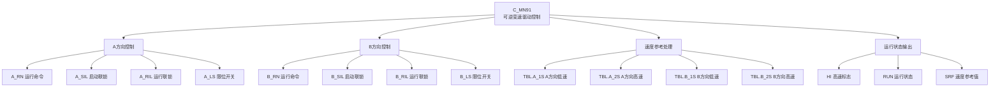

# C_MN91 功能块分析报告

## 基本信息

| 项目 | 内容 |
|------|------|
| 功能块名称 | C_MN91 |
| 功能描述 | Manual Sequence of Reversible Variable Speed Drive without STOP Operation Device (无停止操作设备的可逆变速驱动手动顺序控制) |
| 最后修改 | 2016.01.05 |
| 作者 | GaoWeidi |
| 页数 | 1页 (5个程序段) |

---

## 功能概述

### 核心功能
C_MN91是一个**双方向可逆变速驱动控制功能块**，专门用于控制具有A方向和B方向两种运行模式的变速驱动设备。该功能块**不包含停止操作设备**，适用于需要双向控制但无需独立停止按钮的应用场景。

### 应用场景
- **轧机辊道传动控制**：控制辊道的正反转运行
- **输送带双向控制**：实现物料的双向输送
- **升降机/提升机控制**：控制上升和下降两个方向
- **阀门执行机构**：控制开启和关闭两个方向
- **风机/泵类设备**：需要正反转控制的场合

### 功能特点
1. **双方向独立控制**：A方向和B方向各有独立的启动联锁和运行联锁
2. **互锁保护**：A方向和B方向之间具有电气互锁，防止同时启动
3. **速度参考切换**：根据运行方向自动切换速度参考值
4. **限位开关支持**：支持A_LS和B_LS限位开关信号
5. **就绪信号检测**：检测设备就绪状态(RDY)后才能启动

---

## 思维导图



---

## 流程路径描述

### 主控制流程

```
启动请求 → 联锁检查 → 方向互锁检查 → 运行命令输出 → 速度参考切换 → 运行状态指示
```

### 详细路径说明

1. **A方向启动流程**：
   ```
   A_1(启动按钮) + A_SIL(启动联锁) + NOT B_1 + NOT B_2 + A_RIL(运行联锁) + RDY(就绪) → A_RN(A运行)
   ```

2. **B方向启动流程**：
   ```
   B_1(启动按钮) + B_SIL(启动联锁) + NOT A_1 + NOT A_2 + B_RIL(运行联锁) + RDY(就绪) → B_RN(B运行)
   ```

3. **高速选择流程**：
   ```
   A_RN + A_2(高速选择) + A_LS(限位正常) → HI(高速标志)
   B_RN + B_2(高速选择) + B_LS(限位正常) → HI(高速标志)
   ```

4. **运行状态输出**：
   ```
   A_RN → RUN(运行状态)
   B_RN → RUN(运行状态)
   ```

---

## 逐帧功能分析

### 程序段1：A方向运行控制

| 元素 | 类型 | 功能说明 |
|------|------|----------|
| A_1 | NOCON (常开触点) | A方向启动按钮信号 |
| A_SIL | NOCON (常开触点) | A方向启动联锁信号，为ON时允许启动 |
| B_1 | NCCON (常闭触点) | B方向启动按钮互锁，B方向启动时禁止A方向启动 |
| B_2 | NCCON (常闭触点) | B方向高速选择互锁，B方向高速时禁止A方向启动 |
| A_RIL | NOCON (常开触点) | A方向运行联锁信号，运行过程中必须保持ON |
| RDY | NOCON (常开触点) | 设备就绪信号，必须为ON才能启动 |
| A_RN | COIL (输出线圈) | A方向运行命令输出 |
| A_2 | NOCON (常开触点) | A方向高速选择信号（自保持用） |

**逻辑分析**：
- A方向启动需要满足：启动按钮按下、启动联锁正常、B方向未运行、运行联锁正常、设备就绪
- 启动后通过A_2触点实现自保持
- B_1和B_2触点实现与B方向的互锁保护

### 程序段2：B方向运行控制

| 元素 | 类型 | 功能说明 |
|------|------|----------|
| B_1 | NOCON (常开触点) | B方向启动按钮信号 |
| B_SIL | NOCON (常开触点) | B方向启动联锁信号 |
| A_1 | NCCON (常闭触点) | A方向启动按钮互锁 |
| A_2 | NCCON (常闭触点) | A方向高速选择互锁 |
| B_RIL | NOCON (常开触点) | B方向运行联锁信号 |
| RDY | NOCON (常开触点) | 设备就绪信号 |
| B_RN | COIL (输出线圈) | B方向运行命令输出 |
| B_2 | NOCON (常开触点) | B方向高速选择信号（自保持用） |

**逻辑分析**：
- B方向控制逻辑与A方向对称
- A_1和A_2触点实现与A方向的互锁保护

### 程序段3：高速选择与限位检测

| 元素 | 类型 | 功能说明 |
|------|------|----------|
| A_RN | NOCON (常开触点) | A方向运行命令 |
| A_2 | NOCON (常开触点) | A方向高速选择信号 |
| A_LS | NOCON (常开触点) | A方向限位开关正常信号 |
| B_RN | NOCON (常开触点) | B方向运行命令 |
| B_2 | NOCON (常开触点) | B方向高速选择信号 |
| B_LS | NOCON (常开触点) | B方向限位开关正常信号 |
| HI | COIL (输出线圈) | 高速运行标志 |

**逻辑分析**：
- 当A方向运行且选择高速且限位正常时，输出高速标志
- 当B方向运行且选择高速且限位正常时，输出高速标志
- 限位开关异常时自动降速

### 程序段4：运行状态输出

| 元素 | 类型 | 功能说明 |
|------|------|----------|
| A_RN | NOCON (常开触点) | A方向运行命令 |
| B_RN | NOCON (常开触点) | B方向运行命令 |
| RUN | COIL (输出线圈) | 设备运行状态输出 |

**逻辑分析**：
- A方向或B方向任一运行时，输出RUN状态信号
- 用于指示设备正在运行

### 程序段5：速度参考处理

| 元素 | 类型 | 功能说明 |
|------|------|----------|
| C_NSWR | CALL (功能块调用) | 实数型数值选择器 |
| TBL.A_1S | 输入参数 | A方向低速设定值 |
| TBL.A_2S | 输入参数 | A方向高速设定值 |
| TBL.B_1S | 输入参数 | B方向低速设定值 |
| TBL.B_2S | 输入参数 | B方向高速设定值 |
| HI | 输入参数 | 高速选择标志 |
| A_RN | 输入参数 | A方向运行命令 |
| B_RN | 输入参数 | B方向运行命令 |
| SRF | 输出参数 | 速度参考值输出 |

**逻辑分析**：
- 调用C_NSWR功能块进行速度参考值选择
- A方向运行时：低速(A_1S)或高速(A_2S)根据HI标志选择
- B方向运行时：低速(B_1S)或高速(B_2S)根据HI标志选择
- 使用ADD_REAL进行速度参考值的累加处理

---

## 触发条件总结

| 触发事件 | 触发条件 | 输出结果 |
|----------|----------|----------|
| A方向启动 | A_1=ON, A_SIL=ON, B_1/B_2=OFF, A_RIL=ON, RDY=ON | A_RN=ON |
| B方向启动 | B_1=ON, B_SIL=ON, A_1/A_2=OFF, B_RIL=ON, RDY=ON | B_RN=ON |
| 高速运行 | (A_RN或B_RN)=ON, (A_2或B_2)=ON, (A_LS或B_LS)=ON | HI=ON |
| 设备运行 | A_RN=ON 或 B_RN=ON | RUN=ON |
| 速度输出 | 根据运行方向和高速标志 | SRF输出对应速度值 |

---

## 实现功能总结

### 主要功能
1. **双向运行控制**：实现A方向和B方向的独立控制
2. **互锁保护**：A/B方向之间电气互锁，防止同时启动
3. **联锁保护**：启动联锁(SIL)和运行联锁(RIL)双重保护
4. **速度切换**：支持低速/高速两档速度选择
5. **限位保护**：限位开关异常时自动降速
6. **就绪检测**：设备就绪后才允许启动

### 与其他MN系列功能块对比

| 功能块 | 方向数 | 停止按钮 | 速度档位 | 适用场景 |
|--------|--------|----------|----------|----------|
| C_MN81 | 双向 | 无 | 2档 | 可逆变速驱动 |
| C_MN83 | 双向 | 有 | 2档 | 可逆变速驱动(带停止) |
| **C_MN91** | **双向** | **无** | **2档** | **可逆变速驱动(无停止)** |
| C_MN92 | 双向 | 有 | 2档 | 可逆变速驱动(带停止) |

---

## 关键信号说明

### 输入信号

| 信号名 | 数据类型 | 说明 | 备注 |
|--------|----------|------|------|
| A_1 | BOOL | A方向启动按钮 | 上升沿触发启动 |
| A_2 | BOOL | A方向高速选择 | ON=高速, OFF=低速 |
| A_SIL | BOOL | A方向启动联锁 | 必须为ON才能启动 |
| A_RIL | BOOL | A方向运行联锁 | 运行中必须保持ON |
| A_LS | BOOL | A方向限位开关 | ON=限位正常 |
| B_1 | BOOL | B方向启动按钮 | 上升沿触发启动 |
| B_2 | BOOL | B方向高速选择 | ON=高速, OFF=低速 |
| B_SIL | BOOL | B方向启动联锁 | 必须为ON才能启动 |
| B_RIL | BOOL | B方向运行联锁 | 运行中必须保持ON |
| B_LS | BOOL | B方向限位开关 | ON=限位正常 |
| RDY | BOOL | 设备就绪信号 | 必须为ON才能启动 |
| TBL.A_1S | REAL | A方向低速设定值 | 速度参考值 |
| TBL.A_2S | REAL | A方向高速设定值 | 速度参考值 |
| TBL.B_1S | REAL | B方向低速设定值 | 速度参考值 |
| TBL.B_2S | REAL | B方向高速设定值 | 速度参考值 |

### 输出信号

| 信号名 | 数据类型 | 说明 | 备注 |
|--------|----------|------|------|
| A_RN | BOOL | A方向运行命令 | 输出到驱动器 |
| B_RN | BOOL | B方向运行命令 | 输出到驱动器 |
| HI | BOOL | 高速运行标志 | 用于指示当前速度档位 |
| RUN | BOOL | 设备运行状态 | 总运行状态指示 |
| SRF | REAL | 速度参考值 | 输出到驱动器的速度给定 |

---

## 调试技巧

### 常见问题排查

1. **设备无法启动**
   - 检查RDY信号是否为ON
   - 检查对应的SIL启动联锁是否正常
   - 检查反方向是否正在运行（互锁）
   - 检查RIL运行联锁是否正常

2. **无法切换到高速**
   - 检查A_2或B_2高速选择信号是否为ON
   - 检查A_LS或B_LS限位开关信号是否正常
   - 检查HI高速标志是否输出

3. **速度参考值异常**
   - 检查TBL表中的速度设定值是否正确
   - 检查C_NSWR功能块的调用参数
   - 使用在线监视查看SRF输出值

4. **方向互锁失效**
   - 检查B_1/B_2和A_1/A_2互锁触点
   - 确认程序段1和程序段2的逻辑正确

### 调试建议

1. **首次调试**
   - 先不连接实际设备，使用模拟信号测试逻辑
   - 逐一验证各联锁功能
   - 确认速度参考值输出正确

2. **联机调试**
   - 先测试低速运行，确认方向正确
   - 再测试高速运行，确认限位保护有效
   - 最后测试各种故障情况下的保护功能

3. **维护建议**
   - 定期检查限位开关状态
   - 定期测试联锁功能
   - 记录速度设定值以便故障分析
