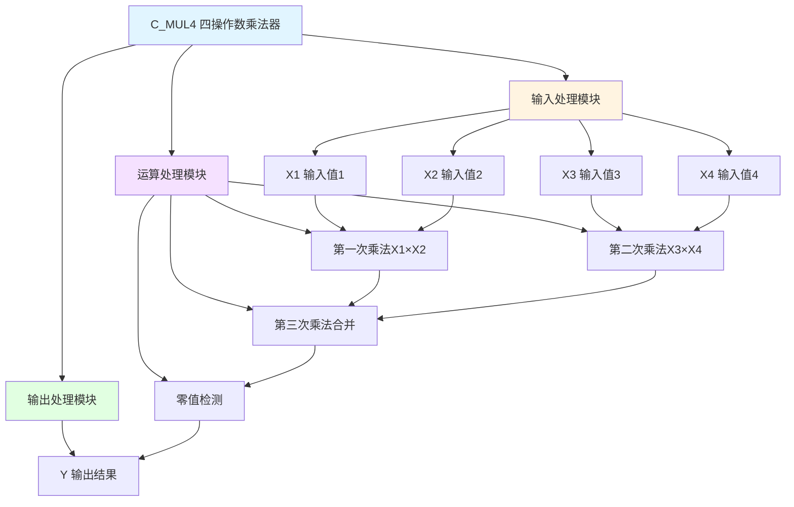

# C_MUL4 功能块分析报告

## 基本信息

| 项目 | 内容 |
|------|------|
| 功能块名称 | C_MUL4 |
| 功能描述 | Multiplexer(4 Multiplicator, REAL type)（四操作数乘法器-REAL类型） |
| 最后修改 | 2015.12.15 |
| 作者 | ShiChunLiang |
| 页数 | 1页（1个程序段） |

## 功能概述

C_MUL4是一个四操作数乘法器功能块，用于将四个REAL类型的输入值相乘，并输出乘积。当结果为零时，强制输出为零。

### 应用场景
- **多参数计算**：将多个参数相乘得到最终结果
- **比例计算**：计算多个比例因子的综合效果
- **物理量计算**：计算如功率=电压×电流×功率因数×效率等
- **补偿计算**：多个补偿系数的乘积

### 功能特点
1. **四操作数乘法**：支持四个输入值相乘
2. **REAL类型**：支持实数类型运算
3. **零值处理**：结果为零时强制输出零

## 思维导图



## 流程路径描述

### 乘法运算路径：
开始 → X1×X2 → X3×X4 → 两次结果相乘 → 零值检测 → 输出Y
**功能**: 将四个输入值相乘并输出结果

## 逐帧功能分析

### Rung 1: 四操作数乘法

**功能描述**: 将四个输入值相乘并输出结果

**输入条件**:
| 信号名称 | 信号描述 | 信号类型 | 触发值 |
|----------|----------|----------|--------|
| X1 | 输入值1 | REAL | 数值 |
| X2 | 输入值2 | REAL | 数值 |
| X3 | 输入值3 | REAL | 数值 |
| X4 | 输入值4 | REAL | 数值 |

**输出功能**:
| 信号名称 | 信号描述 | 信号类型 |
|----------|----------|----------|
| Y | 输出结果 | REAL |

**触发逻辑**:
- Y = X1 × X2 × X3 × X4
- IF Y = 0.0 THEN Y = 0.0（强制零值处理）

**功能实现**: 
1. 使用MUL_REAL计算X1 × X2得到中间结果1
2. 使用MUL_REAL计算X3 × X4得到中间结果2
3. 使用MUL_REAL将两个中间结果相乘得到Y
4. 使用EQ_REAL检测结果是否为零
5. 如果为零，使用MOVE_REAL强制输出0.0

## 触发条件总结

### 运算条件
- **正常运算**: 每个扫描周期执行一次
- **零值处理**: 当计算结果为零时

### 输出条件
- **Y输出**: 四个输入值的乘积

## 实现功能总结

### 主要功能
1. **四值乘法**: 将四个REAL值相乘
2. **零值处理**: 结果为零时强制输出零

### 计算公式
```
Y = X1 × X2 × X3 × X4
```

### 与其他运算功能块对比
| 功能块 | 运算类型 | 操作数数量 | 数据类型 |
|--------|----------|------------|----------|
| C_ADD4 | 加法 | 4 | REAL |
| C_ADD4_D | 加法 | 4 | DINT |
| **C_MUL4** | **乘法** | **4** | **REAL** |
| C_MULD | 乘除法 | 3 | REAL |

## 关键信号说明

| 信号名称 | 信号描述 | 信号类型 | 用途 |
|----------|----------|----------|------|
| X1 | 输入值1 | REAL | 第1个乘数 |
| X2 | 输入值2 | REAL | 第2个乘数 |
| X3 | 输入值3 | REAL | 第3个乘数 |
| X4 | 输入值4 | REAL | 第4个乘数 |
| Y | 输出结果 | REAL | 乘积 |

## 调试技巧

### 调试步骤
1. 检查各输入值是否正确
2. 监控中间计算结果
3. 验证最终输出是否正确
4. 测试零值情况

### 常见问题
1. **结果溢出**: 检查输入值范围
2. **结果不正确**: 检查各输入值
3. **零值处理异常**: 检查零值检测逻辑

### 监控信号列表
- X1/X2/X3/X4（输入值）
- Y（输出结果）
