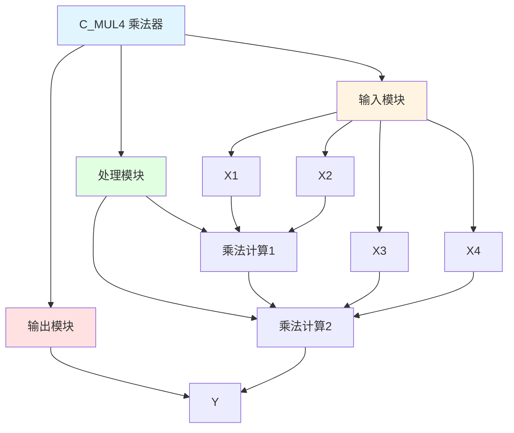

# C_MUL4 功能块分析报告

## 基本信息

| 项目 | 内容 |
|------|------|
| 功能块名称 | C_MUL4 |
| 功能描述 | Multiplexer(4 Multiplicator, REAL type)（乘法器，4个乘数，实数类型） |
| 最后修改 | 2015.12.15 |
| 作者 | Shi Chun Liang |
| 页数 | 1页 |

## 功能概述

C_MUL4 是一个乘法器功能块，用于计算四个实数类型输入值的乘积。该功能块将四个输入值相乘，并输出乘积。

## 思维导图

## 流程路径描述

### 乘法计算路径：
开始 → X1 * X2 → 中间结果 → 中间结果 * X3 → 中间结果 → 中间结果 * X4 → 输出Y
**功能**: 计算四个输入值的乘积

## 逐帧功能分析

### Rung 7: 乘法计算1

**功能描述**: 计算X1和X2的乘积

**输入条件**:
| 信号名称 | 信号描述 | 信号类型 | 触发值 |
|----------|----------|----------|--------|
| X1 | 输入1 | REAL | 数值 |
| X2 | 输入2 | REAL | 数值 |

**输出功能**:
| 信号名称 | 信号描述 | 信号类型 |
|----------|----------|----------|
| 中间结果 | X1*X2 | REAL |

**触发逻辑**:
- 中间结果 = X1 * X2

**功能实现**: 
使用MUL功能块，计算X1和X2的乘积。

### Rung 7: 乘法计算2

**功能描述**: 计算中间结果、X3和X4的乘积

**输入条件**:
| 信号名称 | 信号描述 | 信号类型 | 触发值 |
|----------|----------|----------|--------|
| 中间结果 | X1*X2 | REAL | 数值 |
| X3 | 输入3 | REAL | 数值 |
| X4 | 输入4 | REAL | 数值 |

**输出功能**:
| 信号名称 | 信号描述 | 信号类型 |
|----------|----------|----------|
| Y | 输出(X1*X2*X3*X4) | REAL |

**触发逻辑**:
- Y = (X1 * X2) * X3 * X4

**功能实现**: 
使用MUL功能块，计算中间结果、X3和X4的乘积，输出到Y。

## 触发条件总结

### 乘法条件
- **乘法计算**: 所有输入值都有值

## 实现功能总结

### 主要功能
1. **乘法计算**: 计算四个输入值的乘积

## 关键信号说明

| 信号名称 | 信号描述 | 信号类型 | 用途 |
|----------|----------|----------|------|
| X1 | 输入1 | REAL | 输入值1 |
| X2 | 输入2 | REAL | 输入值2 |
| X3 | 输入3 | REAL | 输入值3 |
| X4 | 输入4 | REAL | 输入值4 |
| Y | 输出 | REAL | 乘法结果 |

## 调试技巧

### 调试步骤
1. 检查X1、X2、X3、X4值，确认输入正常
2. 监控Y值，观察乘法结果

### 常见问题
1. **结果不正确**: 检查X1、X2、X3、X4值是否正确

### 监控信号列表
- X1、X2、X3、X4（输入值）
- Y（输出）
