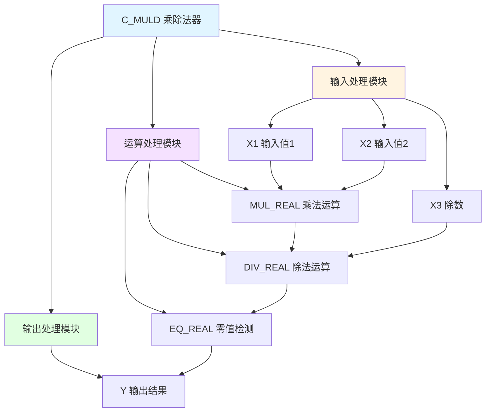

# C_MULD 功能块分析报告

## 基本信息

| 项目 | 内容 |
|------|------|
| 功能块名称 | C_MULD |
| 功能描述 | Multiplier and Divider(REAL type)（乘除法器-REAL类型） |
| 最后修改 | 2015.11.20 |
| 作者 | ShiChunLiang |
| 页数 | 1页（1个程序段） |

## 功能概述

C_MULD是一个乘除法器功能块，用于实现三个REAL类型输入值的乘除运算。计算公式为Y = X1 × X2 / X3，当结果为零时强制输出零。

### 应用场景
- **比例计算**：计算比例因子与输入的乘积再除以基准值
- **单位转换**：实现带比例因子的单位转换
- **补偿计算**：带基准值的补偿计算
- **物理量计算**：如速度=距离×系数/时间等

### 功能特点
1. **乘除运算**：先乘后除的复合运算
2. **REAL类型**：支持实数类型运算
3. **零值处理**：结果为零时强制输出零

## 思维导图



## 流程路径描述

### 乘除运算路径：
开始 → X1×X2 → 除以X3 → 零值检测 → 输出Y
**功能**: 实现Y = X1 × X2 / X3的运算

## 逐帧功能分析

### Rung 1: 乘除运算

**功能描述**: 计算X1乘以X2再除以X3

**输入条件**:
| 信号名称 | 信号描述 | 信号类型 | 触发值 |
|----------|----------|----------|--------|
| X1 | 输入值1 | REAL | 数值 |
| X2 | 输入值2 | REAL | 数值 |
| X3 | 除数 | REAL | 非零 |

**输出功能**:
| 信号名称 | 信号描述 | 信号类型 |
|----------|----------|----------|
| Y | 输出结果 | REAL |

**触发逻辑**:
- Y = (X1 × X2) / X3
- IF Y = 0.0 THEN Y = 0.0（强制零值处理）

**功能实现**: 
1. 使用MUL_REAL计算X1 × X2得到中间结果
2. 使用DIV_REAL将中间结果除以X3得到Y
3. 使用EQ_REAL检测结果是否为零
4. 如果为零，使用MOVE_REAL强制输出0.0

## 触发条件总结

### 运算条件
- **正常运算**: 每个扫描周期执行一次
- **除数检查**: X3不应为零（需外部保证）
- **零值处理**: 当计算结果为零时

### 输出条件
- **Y输出**: X1 × X2 / X3的结果

## 实现功能总结

### 主要功能
1. **乘除运算**: 先乘后除的复合运算
2. **零值处理**: 结果为零时强制输出零

### 计算公式
```
Y = X1 × X2 / X3
```

### 与其他运算功能块对比
| 功能块 | 运算类型 | 操作数数量 | 数据类型 |
|--------|----------|------------|----------|
| C_ADD4 | 加法 | 4 | REAL |
| C_MUL4 | 乘法 | 4 | REAL |
| **C_MULD** | **乘除法** | **3** | **REAL** |

## 关键信号说明

| 信号名称 | 信号描述 | 信号类型 | 用途 |
|----------|----------|----------|------|
| X1 | 输入值1 | REAL | 第1个乘数 |
| X2 | 输入值2 | REAL | 第2个乘数 |
| X3 | 除数 | REAL | 除数 |
| Y | 输出结果 | REAL | 运算结果 |

## 调试技巧

### 调试步骤
1. 检查各输入值是否正确
2. 确认X3除数不为零
3. 监控中间计算结果
4. 验证最终输出是否正确

### 常见问题
1. **除零错误**: 检查X3是否为零
2. **结果溢出**: 检查输入值范围
3. **结果不正确**: 检查各输入值

### 监控信号列表
- X1/X2/X3（输入值）
- Y（输出结果）
