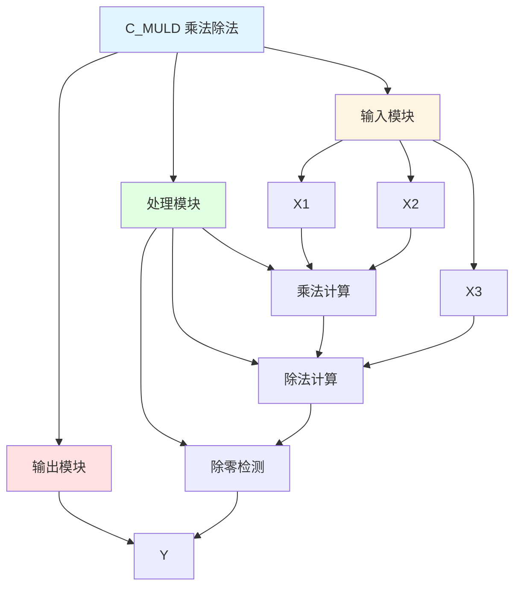

# C_MULD 功能块分析报告

## 基本信息

| 项目 | 内容 |
|------|------|
| 功能块名称 | C_MULD |
| 功能描述 | Multiplier and Divider(REAL type)（乘法和除法，实数类型） |
| 最后修改 | 2015.11.20 |
| 作者 | Shi Chun Liang |
| 页数 | 1页 |

## 功能概述

C_MULD 是一个乘法和除法功能块，用于计算三个实数类型输入值的乘除结果。该功能块计算 X1 * X2 / X3 的结果，并输出到 Y。

## 思维导图

## 流程路径描述

### 乘法除法路径：
开始 → X1 * X2 → 乘积 / X3 → 输出Y
**功能**: 计算 X1 * X2 / X3

### 除零检测路径：
开始 → X3 = 0 → 输出0.0
**功能**: 防止除零错误

## 逐帧功能分析

### Rung 7: 乘法计算

**功能描述**: 计算X1和X2的乘积

**输入条件**:
| 信号名称 | 信号描述 | 信号类型 | 触发值 |
|----------|----------|----------|--------|
| X1 | 输入1 | REAL | 数值 |
| X2 | 输入2 | REAL | 数值 |

**输出功能**:
| 信号名称 | 信号描述 | 信号类型 |
|----------|----------|----------|
| 乘积 | X1*X2 | REAL |

**触发逻辑**:
- 乘积 = X1 * X2

**功能实现**: 
使用MUL（乘法）功能块，计算X1和X2的乘积。

### Rung 7: 除法计算

**功能描述**: 计算乘积除以X3的结果

**输入条件**:
| 信号名称 | 信号描述 | 信号类型 | 触发值 |
|----------|----------|----------|--------|
| 乘积 | X1*X2 | REAL | 数值 |
| X3 | 输入3 | REAL | 数值 |

**输出功能**:
| 信号名称 | 信号描述 | 信号类型 |
|----------|----------|----------|
| Y | 输出(X1*X2/X3) | REAL |

**触发逻辑**:
- Y = (X1 * X2) / X3

**功能实现**: 
使用DIV（除法）功能块，计算乘积除以X3的结果，并输出到Y。

### Rung 7: 除零检测

**功能描述**: 检测X3是否为0，防止除零错误

**输入条件**:
| 信号名称 | 信号描述 | 信号类型 | 触发值 |
|----------|----------|----------|--------|
| X3 | 输入3 | REAL | 0.0 |

**输出功能**:
| 信号名称 | 信号描述 | 信号类型 |
|----------|----------|----------|
| Y | 输出 | REAL |

**触发逻辑**:
- IF X3 = 0.0 THEN Y = 0.0

**功能实现**: 
使用EQ（等于）比较器检测X3是否等于0.0，当X3等于0.0时，输出0.0到Y，防止除零错误。

## 触发条件总结

### 计算条件
- **乘法计算**: X1和X2都有值
- **除法计算**: X3不等于0.0
- **除零保护**: X3 = 0.0

## 实现功能总结

### 主要功能
1. **乘法计算**: 计算X1和X2的乘积
2. **除法计算**: 计算乘积除以X3的结果
3. **除零保护**: 防止除零错误

## 关键信号说明

| 信号名称 | 信号描述 | 信号类型 | 用途 |
|----------|----------|----------|------|
| X1 | 输入1 | REAL | 输入值1 |
| X2 | 输入2 | REAL | 输入值2 |
| X3 | 输入3 | REAL | 输入值3（除数） |
| Y | 输出(X1*X2/X3) | REAL | 乘除结果输出 |

## 调试技巧

### 调试步骤
1. 检查X1、X2、X3值，确认输入正常
2. 监控Y值，观察乘除结果
3. 检查X3值，确认除数不为0

### 常见问题
1. **结果不正确**: 检查X1、X2、X3值是否正确
2. **除零错误**: 检查X3值是否为0

### 监控信号列表
- X1（输入1）
- X2（输入2）
- X3（输入3）
- Y（输出）
