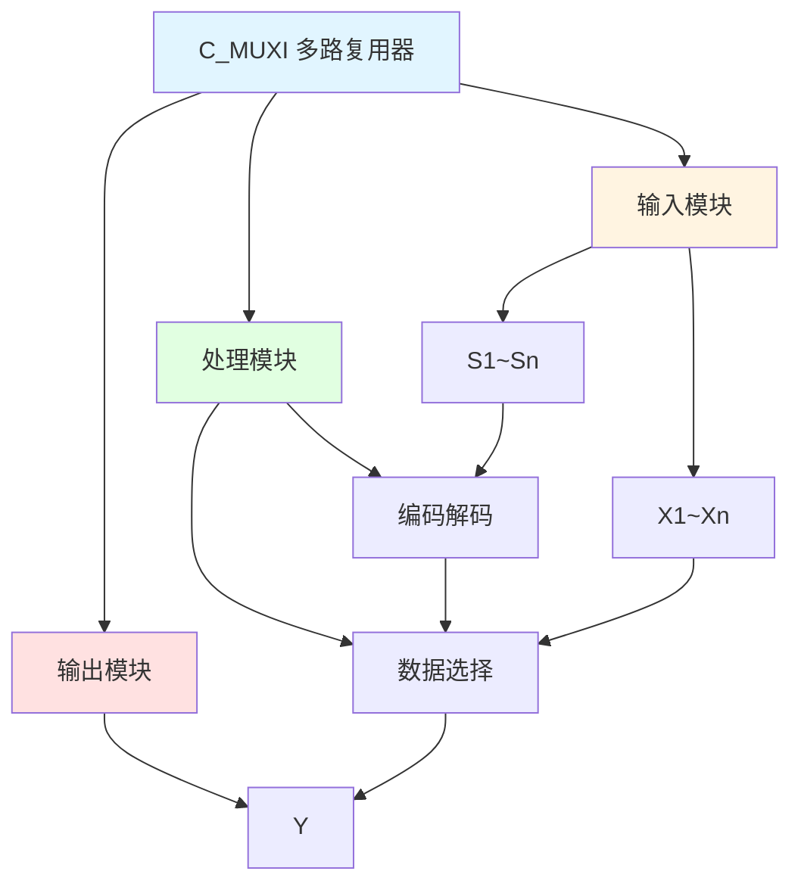

# C_MUXI 功能块分析报告

## 基本信息

| 项目 | 内容 |
|------|------|
| 功能块名称 | C_MUXI |
| 功能描述 | Multiplexer(INT type)（多路复用器，INT类型） |
| 最后修改 | 2015.11.20 |
| 作者 | Shi Chun Liang |
| 页数 | 1页 |

## 功能概述

C_MUXI 是一个多路复用器功能块，用于根据选择信号从多个INT类型输入值中选择一个输出。与C_NSW系列不同，MUX使用编码选择信号（S1、S2等）来选择输入，而不是独立的布尔选择信号。

**主要应用场景**：
- 多路数据选择
- 编码选择器
- 数据路由
- 多通道切换

**MUX与NSW的区别**：
- **NSW系列**: 使用独立的布尔选择信号（I1、I2、I3...），按优先级选择
- **MUX系列**: 使用编码选择信号（S1、S2...），按二进制编码选择

## 思维导图

## 流程路径描述

### 编码选择路径：
开始 → 选择信号编码 → 解码 → 选择对应输入 → 输出Y
**功能**: 根据编码选择输入值

## 逐帧功能分析

### Rung 7: 编码选择

**功能描述**: 根据选择信号编码选择输入值

**输入条件**:
| 信号名称 | 信号描述 | 信号类型 | 触发值 |
|----------|----------|----------|--------|
| X1~Xn | 输入值 | INT | 数值 |
| S1~Sn | 选择信号 | BOOL | 编码值 |

**输出功能**:
| 信号名称 | 信号描述 | 信号类型 |
|----------|----------|----------|
| Y | 输出 | INT |

**触发逻辑**:
- 根据选择信号的二进制编码选择对应的输入值

**功能实现**: 
将选择信号解码为选择索引，然后选择对应的输入值输出。

## 触发条件总结

### 选择逻辑（以4选1为例）
| S2 | S1 | 输出Y |
|----|----|----|
| FALSE | FALSE | X1 |
| FALSE | TRUE | X2 |
| TRUE | FALSE | X3 |
| TRUE | TRUE | X4 |

## 实现功能总结

### 主要功能
1. **编码选择**: 根据编码选择输入值
2. **多路复用**: 实现多路数据选择

## 关键信号说明

| 信号名称 | 信号描述 | 信号类型 | 用途 |
|----------|----------|----------|------|
| X1~Xn | 输入值 | INT | 数据输入 |
| S1~Sn | 选择信号 | BOOL | 编码选择 |
| Y | 输出 | INT | 选择输出 |

## 调试技巧

### 调试步骤
1. 检查输入值，确认输入正常
2. 检查选择信号，确认编码正确
3. 监控Y值，观察输出是否正确

### 常见问题
1. **输出不正确**: 检查选择信号编码
2. **选择错误**: 验证编码逻辑

### 监控信号列表
- X1~Xn（输入值）
- S1~Sn（选择信号）
- Y（输出）
