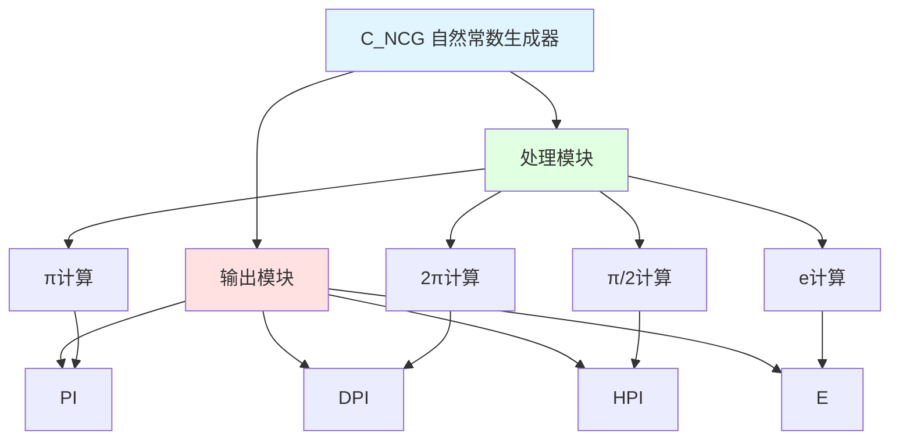

# C_NCG 功能块分析报告

## 基本信息

| 项目 | 内容 |
|------|------|
| 功能块名称 | C_NCG |
| 功能描述 | Natural Constants Generator (REAL type)（自然常数生成器，实数类型） |
| 最后修改 | 2015.11.20 |
| 作者 | Shi Chun Liang |
| 页数 | 1页 |

## 功能概述

C_NCG 是一个自然常数生成器功能块，用于生成常用的数学常数。该功能块生成圆周率π、2π、π/2和自然常数e等常用数学常数。

## 思维导图

## 流程路径描述

### π生成路径：
开始 → 输入π值 → 输出PI
**功能**: 生成圆周率π

### 2π生成路径：
开始 → π * 2 → 输出DPI
**功能**: 生成2π

### π/2生成路径：
开始 → π / 2 → 输出HPI
**功能**: 生成π/2

### e生成路径：
开始 → 输入e值 → 输出E
**功能**: 生成自然常数e

## 逐帧功能分析

### Rung 7: π计算

**功能描述**: 生成圆周率π

**输入条件**:
| 信号名称 | 信号描述 | 信号类型 | 触发值 |
|----------|----------|----------|--------|
| π | 圆周率 | REAL | 3.141592653589793238461 |

**输出功能**:
| 信号名称 | 信号描述 | 信号类型 |
|----------|----------|----------|
| PI | π | REAL |

**触发逻辑**:
- PI = 3.141592653589793238461

**功能实现**: 
使用MOVE功能块，将π的值输出到PI。

### Rung 7: 2π计算

**功能描述**: 计算2π

**输入条件**:
| 信号名称 | 信号描述 | 信号类型 | 触发值 |
|----------|----------|----------|--------|
| PI | π | REAL | 3.141592653589793238461 |
| 2.0 | 乘数 | REAL | 2.0 |

**输出功能**:
| 信号名称 | 信号描述 | 信号类型 |
|----------|----------|----------|
| DPI | 2π | REAL |

**触发逻辑**:
- DPI = PI * 2.0

**功能实现**: 
使用MUL（乘法）功能块，计算PI乘以2.0，得到2π并输出到DPI。

### Rung 7: π/2计算

**功能描述**: 计算π/2

**输入条件**:
| 信号名称 | 信号描述 | 信号类型 | 触发值 |
|----------|----------|----------|--------|
| PI | π | REAL | 3.141592653589793238461 |
| 2.0 | 除数 | REAL | 2.0 |

**输出功能**:
| 信号名称 | 信号描述 | 信号类型 |
|----------|----------|----------|
| HPI | π/2 | REAL |

**触发逻辑**:
- HPI = PI / 2.0

**功能实现**: 
使用DIV（除法）功能块，计算PI除以2.0，得到π/2并输出到HPI。

### Rung 8: e计算

**功能描述**: 生成自然常数e

**输入条件**:
| 信号名称 | 信号描述 | 信号类型 | 触发值 |
|----------|----------|----------|--------|
| e | 自然常数 | REAL | 2.71828182845904523541 |

**输出功能**:
| 信号名称 | 信号描述 | 信号类型 |
|----------|----------|----------|
| E | e | REAL |

**触发逻辑**:
- E = 2.71828182845904523541

**功能实现**: 
使用MOVE功能块，将e的值输出到E。

## 触发条件总结

### 计算条件
- **π生成**: 直接输出
- **2π计算**: PI * 2.0
- **π/2计算**: PI / 2.0
- **e生成**: 直接输出

## 实现功能总结

### 主要功能
1. **π生成**: 生成圆周率π
2. **2π计算**: 计算2π
3. **π/2计算**: 计算π/2
4. **e生成**: 生成自然常数e

## 关键信号说明

| 信号名称 | 信号描述 | 信号类型 | 用途 |
|----------|----------|----------|------|
| PI | π | REAL | 圆周率 |
| DPI | 2π | REAL | 2倍圆周率 |
| HPI | π/2 | REAL | 半圆周率 |
| E | e | REAL | 自然常数 |

## 调试技巧

### 调试步骤
1. 检查PI值，确认π值正确
2. 检查DPI值，确认2π计算正确
3. 检查HPI值，确认π/2计算正确
4. 检查E值，确认e值正确

### 常见问题
1. **常数值不正确**: 检查输入常数值是否正确
2. **计算结果不正确**: 检查乘法和除法计算

### 监控信号列表
- PI（π）
- DPI（2π）
- HPI（π/2）
- E（e）
