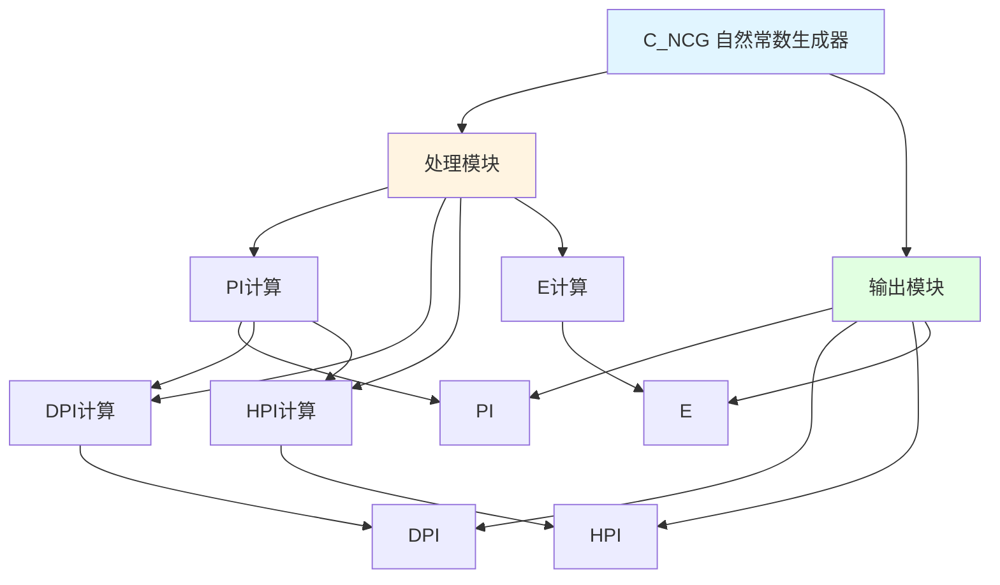

# C_NCG 功能块分析报告

## 基本信息

| 项目 | 内容 |
|------|------|
| 功能块名称 | C_NCG |
| 功能描述 | Natural Constants Generator(REAL type)（自然常数生成器，REAL类型） |
| 最后修改 | 2015.11.20 |
| 作者 | Shi Chun Liang |
| 页数 | 1页 |

## 功能概述

C_NCG 是一个自然常数生成器功能块，用于生成常用的数学常数。该功能块输出圆周率(PI)、双倍圆周率(DPI)、半圆周率(HPI)和自然常数(E)等数学常数。

**主要应用场景**：
- 数学计算
- 几何计算
- 科学计算
- 控制算法中的常数引用

**数学常数说明**：
- **PI (π)**: 圆周率，约3.141592653589793
- **DPI (2π)**: 双倍圆周率，约6.283185307179586
- **HPI (π/2)**: 半圆周率，约1.570796326794896
- **E**: 自然常数，约2.718281828459045

## 思维导图

## 流程路径描述

### PI生成路径：
开始 → 赋值3.14159265358979323846 → PI输出
**功能**: 生成圆周率常数

### DPI生成路径：
开始 → PI × 2 → DPI输出
**功能**: 生成双倍圆周率常数

### HPI生成路径：
开始 → PI ÷ 2 → HPI输出
**功能**: 生成半圆周率常数

### E生成路径：
开始 → 赋值2.7182818284590452354 → E输出
**功能**: 生成自然常数

## 逐帧功能分析

### Rung 7: PI、DPI、HPI计算

**功能描述**: 计算圆周率相关常数

**输出功能**:
| 信号名称 | 信号描述 | 信号类型 | 数值 |
|----------|----------|----------|------|
| PI | 圆周率 | REAL | 3.14159265358979323846 |
| DPI | 双倍圆周率 | REAL | PI × 2 |
| HPI | 半圆周率 | REAL | PI ÷ 2 |

**触发逻辑**:
- PI = 3.14159265358979323846
- DPI = PI × 2.0
- HPI = PI ÷ 2.0

**功能实现**: 
首先赋值圆周率PI，然后通过乘法和除法计算DPI和HPI。

### Rung 8: E计算

**功能描述**: 计算自然常数

**输出功能**:
| 信号名称 | 信号描述 | 信号类型 | 数值 |
|----------|----------|----------|------|
| E | 自然常数 | REAL | 2.7182818284590452354 |

**触发逻辑**:
- E = 2.7182818284590452354

**功能实现**: 
直接赋值自然常数E。

## 输出常数总结

### 数学常数表
| 常数名称 | 符号 | 数值（约） | 说明 |
|----------|------|------------|------|
| 圆周率 | PI | 3.141592653589793 | 圆的周长与直径之比 |
| 双倍圆周率 | DPI | 6.283185307179586 | 2π |
| 半圆周率 | HPI | 1.570796326794896 | π/2 |
| 自然常数 | E | 2.718281828459045 | 自然对数的底 |

## 实现功能总结

### 主要功能
1. **PI生成**: 生成圆周率常数
2. **DPI生成**: 生成双倍圆周率常数
3. **HPI生成**: 生成半圆周率常数
4. **E生成**: 生成自然常数

## 关键信号说明

| 信号名称 | 信号描述 | 信号类型 | 用途 |
|----------|----------|----------|------|
| PI | 圆周率 | REAL | 数学计算 |
| DPI | 双倍圆周率 | REAL | 角度/弧度转换 |
| HPI | 半圆周率 | REAL | 直角计算 |
| E | 自然常数 | REAL | 指数/对数计算 |

## 调试技巧

### 调试步骤
1. 监控PI值，确认圆周率正确
2. 监控DPI值，确认双倍圆周率正确
3. 监控HPI值，确认半圆周率正确
4. 监控E值，确认自然常数正确

### 常见问题
1. **精度问题**: 注意REAL类型的精度限制
2. **计算误差**: 理解浮点数计算的精度限制

### 监控信号列表
- PI（圆周率）
- DPI（双倍圆周率）
- HPI（半圆周率）
- E（自然常数）
