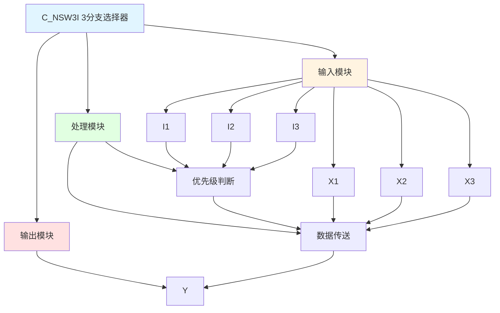

# C_NSW3I 功能块分析报告

## 基本信息

| 项目 | 内容 |
|------|------|
| 功能块名称 | C_NSW3I |
| 功能描述 | Numerical Changeover Switch, 3 Branch Selector(INT type)（数值选择开关，3分支选择器，INT类型） |
| 最后修改 | 2015.11.20 |
| 作者 | Shi Chun Liang |
| 页数 | 1页 |

## 功能概述

C_NSW3I 是一个3分支数值选择开关功能块，用于根据选择信号在三个INT类型输入值之间切换输出。选择信号I1、I2、I3按优先级顺序选择对应的输入值输出。

**主要应用场景**：
- 多档位速度选择
- 多模式参数切换
- 多数据源选择
- 优先级选择器

**与C_NSW3R的区别**：
- C_NSW3I: INT类型（16位整数）
- C_NSW3R: REAL类型（32位浮点数）

## 思维导图

## 流程路径描述

### 选择X1路径：
开始 → I1=TRUE → 输出X1
**功能**: 选择输入X1输出（最高优先级）

### 选择X2路径：
开始 → I1=FALSE AND I2=TRUE → 输出X2
**功能**: 选择输入X2输出（次优先级）

### 选择X3路径：
开始 → I1=FALSE AND I2=FALSE AND I3=TRUE → 输出X3
**功能**: 选择输入X3输出（最低优先级）

### 默认输出路径：
开始 → I1=FALSE AND I2=FALSE AND I3=FALSE → 输出0
**功能**: 无选择时输出默认值0

## 逐帧功能分析

### Rung 7: 选择X1

**功能描述**: 当I1为TRUE时输出X1

**输入条件**:
| 信号名称 | 信号描述 | 信号类型 | 触发值 |
|----------|----------|----------|--------|
| I1 | 选择信号1 | BOOL | TRUE |
| X1 | 输入值1 | INT | 数值 |

**输出功能**:
| 信号名称 | 信号描述 | 信号类型 |
|----------|----------|----------|
| Y | 输出 | INT |

**触发逻辑**:
- IF I1 = TRUE THEN Y = X1

**功能实现**: 
当I1为TRUE时，将X1传送到输出Y。

### Rung 8: 选择X2

**功能描述**: 当I1为FALSE且I2为TRUE时输出X2

**输入条件**:
| 信号名称 | 信号描述 | 信号类型 | 触发值 |
|----------|----------|----------|--------|
| I1 | 选择信号1 | BOOL | FALSE |
| I2 | 选择信号2 | BOOL | TRUE |
| X2 | 输入值2 | INT | 数值 |

**输出功能**:
| 信号名称 | 信号描述 | 信号类型 |
|----------|----------|----------|
| Y | 输出 | INT |

**触发逻辑**:
- IF I1 = FALSE AND I2 = TRUE THEN Y = X2

**功能实现**: 
当I1为FALSE且I2为TRUE时，将X2传送到输出Y。

### Rung 9: 选择X3

**功能描述**: 当I1和I2都为FALSE且I3为TRUE时输出X3

**输入条件**:
| 信号名称 | 信号描述 | 信号类型 | 触发值 |
|----------|----------|----------|--------|
| I1 | 选择信号1 | BOOL | FALSE |
| I2 | 选择信号2 | BOOL | FALSE |
| I3 | 选择信号3 | BOOL | TRUE |
| X3 | 输入值3 | INT | 数值 |

**输出功能**:
| 信号名称 | 信号描述 | 信号类型 |
|----------|----------|----------|
| Y | 输出 | INT |

**触发逻辑**:
- IF I1 = FALSE AND I2 = FALSE AND I3 = TRUE THEN Y = X3

**功能实现**: 
当I1和I2都为FALSE且I3为TRUE时，将X3传送到输出Y。

### Rung 10: 默认输出

**功能描述**: 当所有选择信号都为FALSE时输出0

**输入条件**:
| 信号名称 | 信号描述 | 信号类型 | 触发值 |
|----------|----------|----------|--------|
| I1 | 选择信号1 | BOOL | FALSE |
| I2 | 选择信号2 | BOOL | FALSE |
| I3 | 选择信号3 | BOOL | FALSE |

**输出功能**:
| 信号名称 | 信号描述 | 信号类型 |
|----------|----------|----------|
| Y | 输出 | INT |

**触发逻辑**:
- IF I1 = FALSE AND I2 = FALSE AND I3 = FALSE THEN Y = 0

**功能实现**: 
当所有选择信号都为FALSE时，输出默认值0。

## 触发条件总结

### 选择逻辑
| I1 | I2 | I3 | 输出Y |
|----|----|----|----|
| TRUE | X | X | X1 |
| FALSE | TRUE | X | X2 |
| FALSE | FALSE | TRUE | X3 |
| FALSE | FALSE | FALSE | 0 |

**注**: X表示任意值（TRUE或FALSE）

## 实现功能总结

### 主要功能
1. **3分支选择**: 根据选择信号选择三个输入之一
2. **优先级控制**: I1优先级最高，依次递减
3. **默认输出**: 无选择时输出0

## 关键信号说明

| 信号名称 | 信号描述 | 信号类型 | 用途 |
|----------|----------|----------|------|
| X1 | 输入值1 | INT | 选择输入1（最高优先级） |
| X2 | 输入值2 | INT | 选择输入2（次优先级） |
| X3 | 输入值3 | INT | 选择输入3（最低优先级） |
| I1 | 选择信号1 | BOOL | 选择输入1 |
| I2 | 选择信号2 | BOOL | 选择输入2 |
| I3 | 选择信号3 | BOOL | 选择输入3 |
| Y | 输出 | INT | 选择输出 |

## 调试技巧

### 调试步骤
1. 检查X1、X2、X3值，确认输入正常
2. 检查I1、I2、I3信号，确认选择信号正常
3. 监控Y值，观察输出是否正确
4. 验证优先级逻辑是否正确

### 常见问题
1. **输出不变化**: 检查选择信号
2. **优先级错误**: 检查选择信号逻辑
3. **输出为0**: 检查所有选择信号是否都为FALSE

### 监控信号列表
- X1、X2、X3（输入值）
- I1、I2、I3（选择信号）
- Y（输出）
