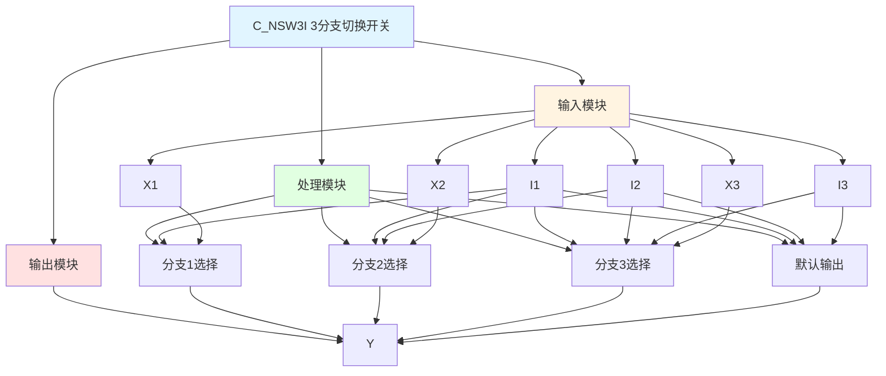

# C_NSW3I 功能块分析报告

## 基本信息

| 项目 | 内容 |
|------|------|
| 功能块名称 | C_NSW3I |
| 功能描述 | Numerical Changeover Switch, 3 Branch Selector(INT type)（数值切换开关，3分支选择器，INT类型） |
| 最后修改 | 2015.11.20 |
| 作者 | Shi Chun Liang |
| 页数 | 2页 |

## 功能概述

C_NSW3I 是一个3分支数值切换开关功能块，用于根据开关设置选择三个INT类型输入值中的一个。该功能块支持优先级选择，I1优先级最高，I2次之，I3最低。

## 思维导图

## 流程路径描述

### 分支1选择路径：
开始 → I1 = TRUE → 选择X1 → 输出Y
**功能**: 选择分支1输入值

### 分支2选择路径：
开始 → I1 = FALSE AND I2 = TRUE → 选择X2 → 输出Y
**功能**: 选择分支2输入值

### 分支3选择路径：
开始 → I1 = FALSE AND I2 = FALSE AND I3 = TRUE → 选择X3 → 输出Y
**功能**: 选择分支3输入值

### 默认输出路径：
开始 → I1 = FALSE AND I2 = FALSE AND I3 = FALSE → 输出0.1
**功能**: 默认输出0.1

## 逐帧功能分析

### Rung 7: 分支1选择

**功能描述**: 当I1为TRUE时，选择X1

**输入条件**:
| 信号名称 | 信号描述 | 信号类型 | 触发值 |
|----------|----------|----------|--------|
| I1 | 分支1开关设置（优先级1） | BOOL | TRUE |
| X1 | 分支1输入 | INT | 数值 |

**输出功能**:
| 信号名称 | 信号描述 | 信号类型 |
|----------|----------|----------|
| Y | 输出 | INT |

**触发逻辑**:
- IF I1 = TRUE THEN Y = X1

**功能实现**: 
当I1为TRUE时，使用MOVE功能块将X1的值输出到Y。

### Rung 8: 分支2选择

**功能描述**: 当I1为FALSE且I2为TRUE时，选择X2

**输入条件**:
| 信号名称 | 信号描述 | 信号类型 | 触发值 |
|----------|----------|----------|--------|
| I1 | 分支1开关设置（优先级1） | BOOL | FALSE |
| I2 | 分支2开关设置（优先级2） | BOOL | TRUE |
| X2 | 分支2输入 | INT | 数值 |

**输出功能**:
| 信号名称 | 信号描述 | 信号类型 |
|----------|----------|----------|
| Y | 输出 | INT |

**触发逻辑**:
- IF I1 = FALSE AND I2 = TRUE THEN Y = X2

**功能实现**: 
当I1为FALSE且I2为TRUE时，使用MOVE功能块将X2的值输出到Y。

### Rung 9: 分支3选择

**功能描述**: 当I1、I2为FALSE且I3为TRUE时，选择X3

**输入条件**:
| 信号名称 | 信号描述 | 信号类型 | 触发值 |
|----------|----------|----------|--------|
| I1 | 分支1开关设置（优先级1） | BOOL | FALSE |
| I2 | 分支2开关设置（优先级2） | BOOL | FALSE |
| I3 | 分支3开关设置（优先级3） | BOOL | TRUE |
| X3 | 分支3输入 | INT | 数值 |

**输出功能**:
| 信号名称 | 信号描述 | 信号类型 |
|----------|----------|----------|
| Y | 输出 | INT |

**触发逻辑**:
- IF I1 = FALSE AND I2 = FALSE AND I3 = TRUE THEN Y = X3

**功能实现**: 
当I1、I2为FALSE且I3为TRUE时，使用MOVE功能块将X3的值输出到Y。

### Rung 10: 默认输出

**功能描述**: 当所有开关都为FALSE时，输出0.1

**输入条件**:
| 信号名称 | 信号描述 | 信号类型 | 触发值 |
|----------|----------|----------|--------|
| I1 | 分支1开关设置（优先级1） | BOOL | FALSE |
| I2 | 分支2开关设置（优先级2） | BOOL | FALSE |
| I3 | 分支3开关设置（优先级3） | BOOL | FALSE |

**输出功能**:
| 信号名称 | 信号描述 | 信号类型 |
|----------|----------|----------|
| Y | 输出 | INT |

**触发逻辑**:
- IF I1 = FALSE AND I2 = FALSE AND I3 = FALSE THEN Y = 0.1

**功能实现**: 
当所有开关都为FALSE时，使用MOVE功能块将0.1输出到Y。

## 触发条件总结

### 选择条件
- **分支1选择**: I1 = TRUE
- **分支2选择**: I1 = FALSE AND I2 = TRUE
- **分支3选择**: I1 = FALSE AND I2 = FALSE AND I3 = TRUE
- **默认输出**: I1 = FALSE AND I2 = FALSE AND I3 = FALSE

## 实现功能总结

### 主要功能
1. **分支1选择**: 选择分支1输入值
2. **分支2选择**: 选择分支2输入值
3. **分支3选择**: 选择分支3输入值
4. **默认输出**: 当所有开关都为FALSE时输出0.1

## 关键信号说明

| 信号名称 | 信号描述 | 信号类型 | 用途 |
|----------|----------|----------|------|
| I1 | 分支1开关设置（优先级1） | BOOL | 分支1选择 |
| I2 | 分支2开关设置（优先级2） | BOOL | 分支2选择 |
| I3 | 分支3开关设置（优先级3） | BOOL | 分支3选择 |
| X1 | 分支1输入 | INT | 分支1输入值 |
| X2 | 分支2输入 | INT | 分支2输入值 |
| X3 | 分支3输入 | INT | 分支3输入值 |
| Y | 输出 | INT | 选择输出值 |

## 调试技巧

### 调试步骤
1. 检查I1、I2、I3信号，确认开关设置
2. 检查X1、X2、X3值，确认输入值
3. 监控Y值，观察选择输出

### 常见问题
1. **选择不正确**: 检查I1、I2、I3开关设置
2. **输出不正确**: 检查X1、X2、X3输入值

### 监控信号列表
- I1、I2、I3（开关设置）
- X1、X2、X3（输入值）
- Y（输出）
