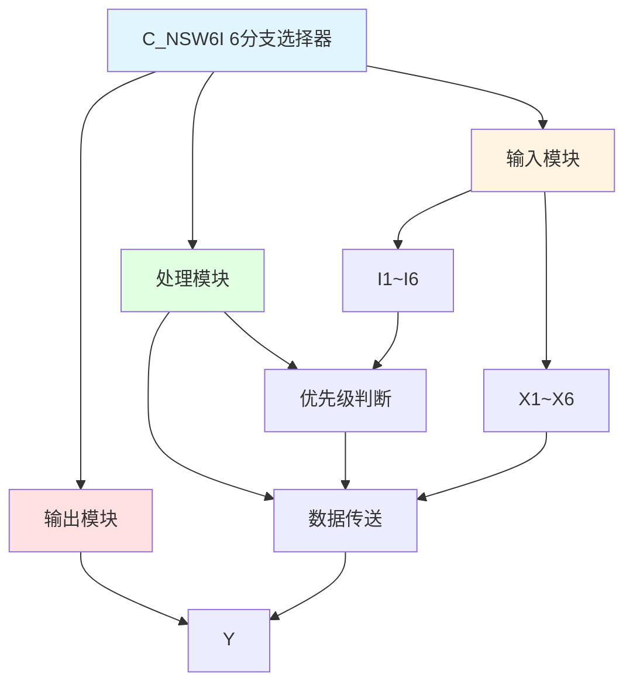

# C_NSW6I 功能块分析报告

## 基本信息

| 项目 | 内容 |
|------|------|
| 功能块名称 | C_NSW6I |
| 功能描述 | Numerical Changeover Switch, 6 Branch Selector(INT type)（数值选择开关，6分支选择器，INT类型） |
| 最后修改 | 2017.10.12 |
| 作者 | Hu Jing Qi |
| 页数 | 1页 |

## 功能概述

C_NSW6I 是一个6分支数值选择开关功能块，用于根据选择信号在六个INT类型输入值之间切换输出。选择信号I1~I6按优先级顺序选择对应的输入值输出。

**主要应用场景**：
- 多档位速度选择（6档）
- 多模式参数切换
- 多数据源选择
- 优先级选择器

**选择优先级说明**：
- I1优先级最高，I1=TRUE时输出X1
- I2优先级次之，I1=FALSE且I2=TRUE时输出X2
- 依次类推...
- I6优先级最低，I1~I5都为FALSE且I6=TRUE时输出X6
- 所有选择信号都为FALSE时输出0

## 思维导图

## 流程路径描述

### 选择X1路径：
开始 → I1=TRUE → 输出X1
**功能**: 选择输入X1输出（最高优先级）

### 选择X2路径：
开始 → I1=FALSE AND I2=TRUE → 输出X2
**功能**: 选择输入X2输出（次优先级）

### 选择X3路径：
开始 → I1=FALSE AND I2=FALSE AND I3=TRUE → 输出X3
**功能**: 选择输入X3输出（第三优先级）

### 选择X4路径：
开始 → I1~I3=FALSE AND I4=TRUE → 输出X4
**功能**: 选择输入X4输出（第四优先级）

### 选择X5路径：
开始 → I1~I4=FALSE AND I5=TRUE → 输出X5
**功能**: 选择输入X5输出（第五优先级）

### 选择X6路径：
开始 → I1~I5=FALSE AND I6=TRUE → 输出X6
**功能**: 选择输入X6输出（最低优先级）

### 默认输出路径：
开始 → I1~I6=FALSE → 输出0
**功能**: 无选择时输出默认值0

## 逐帧功能分析

### Rung 7: 选择X1

**功能描述**: 当I1为TRUE时输出X1

**触发逻辑**:
- IF I1 = TRUE THEN Y = X1

### Rung 8: 选择X2

**功能描述**: 当I1为FALSE且I2为TRUE时输出X2

**触发逻辑**:
- IF I1 = FALSE AND I2 = TRUE THEN Y = X2

### Rung 9: 选择X3

**功能描述**: 当I1、I2都为FALSE且I3为TRUE时输出X3

**触发逻辑**:
- IF I1 = FALSE AND I2 = FALSE AND I3 = TRUE THEN Y = X3

### Rung 10: 选择X4

**功能描述**: 当I1~I3都为FALSE且I4为TRUE时输出X4

**触发逻辑**:
- IF I1 = FALSE AND I2 = FALSE AND I3 = FALSE AND I4 = TRUE THEN Y = X4

### Rung 11: 选择X5

**功能描述**: 当I1~I4都为FALSE且I5为TRUE时输出X5

**触发逻辑**:
- IF I1~I4 = FALSE AND I5 = TRUE THEN Y = X5

### Rung 12: 选择X6

**功能描述**: 当I1~I5都为FALSE且I6为TRUE时输出X6

**触发逻辑**:
- IF I1~I5 = FALSE AND I6 = TRUE THEN Y = X6

### Rung 13: 默认输出

**功能描述**: 当所有选择信号都为FALSE时输出0

**触发逻辑**:
- IF I1~I6 = FALSE THEN Y = 0

## 触发条件总结

### 选择逻辑
| I1 | I2 | I3 | I4 | I5 | I6 | 输出Y |
|----|----|----|----|----|----|----|
| TRUE | X | X | X | X | X | X1 |
| FALSE | TRUE | X | X | X | X | X2 |
| FALSE | FALSE | TRUE | X | X | X | X3 |
| FALSE | FALSE | FALSE | TRUE | X | X | X4 |
| FALSE | FALSE | FALSE | FALSE | TRUE | X | X5 |
| FALSE | FALSE | FALSE | FALSE | FALSE | TRUE | X6 |
| FALSE | FALSE | FALSE | FALSE | FALSE | FALSE | 0 |

**注**: X表示任意值（TRUE或FALSE）

## 实现功能总结

### 主要功能
1. **6分支选择**: 根据选择信号选择六个输入之一
2. **优先级控制**: I1优先级最高，依次递减
3. **默认输出**: 无选择时输出0

## 关键信号说明

| 信号名称 | 信号描述 | 信号类型 | 用途 |
|----------|----------|----------|------|
| X1~X6 | 输入值1~6 | INT | 选择输入（按优先级排序） |
| I1~I6 | 选择信号1~6 | BOOL | 选择控制信号 |
| Y | 输出 | INT | 选择输出 |

## 调试技巧

### 调试步骤
1. 检查X1~X6值，确认输入正常
2. 检查I1~I6信号，确认选择信号正常
3. 监控Y值，观察输出是否正确
4. 验证优先级逻辑是否正确

### 常见问题
1. **输出不变化**: 检查选择信号
2. **优先级错误**: 检查选择信号逻辑
3. **输出为0**: 检查所有选择信号是否都为FALSE

### 监控信号列表
- X1~X6（输入值）
- I1~I6（选择信号）
- Y（输出）
