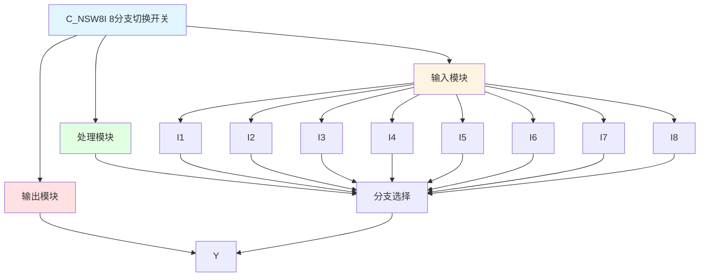

# C_NSW8I 功能块分析报告

## 基本信息

| 项目 | 内容 |
|------|------|
| 功能块名称 | C_NSW8I |
| 功能描述 | Numerical Changeover Switch, 8 Branch Selector(INT type)（数值切换开关，8分支选择器，INT类型） |
| 最后修改 | 2017.10.12 |
| 作者 | Hu Jing Qi |
| 页数 | 2页 |

## 功能概述

C_NSW8I 是一个8分支数值切换开关功能块，用于根据开关设置选择八个INT类型输入值中的一个。该功能块支持优先级选择，I1优先级最高，I8最低。

## 思维导图

## 流程路径描述

### 分支选择路径：
开始 → 根据I1-I8开关状态 → 选择对应输入值 → 输出Y
**功能**: 根据优先级选择输入值

## 逐帧功能分析

### Rung 7-15: 分支选择

**功能描述**: 根据开关设置选择输入值

**输入条件**:
| 信号名称 | 信号描述 | 信号类型 | 触发值 |
|----------|----------|----------|--------|
| I1-I8 | 分支开关设置 | BOOL | TRUE/FALSE |
| X1-X8 | 分支输入 | INT | 数值 |

**输出功能**:
| 信号名称 | 信号描述 | 信号类型 |
|----------|----------|----------|
| Y | 输出 | INT |

**触发逻辑**:
- IF I1 = TRUE THEN Y = X1
- IF I1 = FALSE AND I2 = TRUE THEN Y = X2
- IF I1 = FALSE AND I2 = FALSE AND I3 = TRUE THEN Y = X3
- IF I1 = FALSE AND I2 = FALSE AND I3 = FALSE AND I4 = TRUE THEN Y = X4
- IF I1 = FALSE AND I2 = FALSE AND I3 = FALSE AND I4 = FALSE AND I5 = TRUE THEN Y = X5
- IF I1 = FALSE AND I2 = FALSE AND I3 = FALSE AND I4 = FALSE AND I5 = FALSE AND I6 = TRUE THEN Y = X6
- IF I1 = FALSE AND I2 = FALSE AND I3 = FALSE AND I4 = FALSE AND I5 = FALSE AND I6 = FALSE AND I7 = TRUE THEN Y = X7
- IF I1 = FALSE AND I2 = FALSE AND I3 = FALSE AND I4 = FALSE AND I5 = FALSE AND I6 = FALSE AND I7 = FALSE AND I8 = TRUE THEN Y = X8
- ELSE Y = 0.1

**功能实现**: 
使用MOVE功能块，根据I1-I8的开关状态，选择相应的输入值输出到Y。当所有开关都为FALSE时，输出默认值0.1。

## 触发条件总结

### 选择条件
- **分支1选择**: I1 = TRUE
- **分支2选择**: I1 = FALSE AND I2 = TRUE
- **分支3选择**: I1 = FALSE AND I2 = FALSE AND I3 = TRUE
- **分支4选择**: I1 = FALSE AND I2 = FALSE AND I3 = FALSE AND I4 = TRUE
- **分支5选择**: I1 = FALSE AND I2 = FALSE AND I3 = FALSE AND I4 = FALSE AND I5 = TRUE
- **分支6选择**: I1 = FALSE AND I2 = FALSE AND I3 = FALSE AND I4 = FALSE AND I5 = FALSE AND I6 = TRUE
- **分支7选择**: I1 = FALSE AND I2 = FALSE AND I3 = FALSE AND I4 = FALSE AND I5 = FALSE AND I6 = FALSE AND I7 = TRUE
- **分支8选择**: I1 = FALSE AND I2 = FALSE AND I3 = FALSE AND I4 = FALSE AND I5 = FALSE AND I6 = FALSE AND I7 = FALSE AND I8 = TRUE
- **默认输出**: 所有开关都为FALSE

## 实现功能总结

### 主要功能
1. **分支选择**: 根据优先级选择八个输入值中的一个

## 关键信号说明

| 信号名称 | 信号描述 | 信号类型 | 用途 |
|----------|----------|----------|------|
| I1-I8 | 分支开关设置 | BOOL | 分支选择 |
| X1-X8 | 分支输入 | INT | 分支输入值 |
| Y | 输出 | INT | 选择输出值 |

## 调试技巧

### 调试步骤
1. 检查I1-I8信号，确认开关设置
2. 检查X1-X8值，确认输入值
3. 监控Y值，观察选择输出

### 常见问题
1. **选择不正确**: 检查I1-I8开关设置
2. **输出不正确**: 检查X1-X8输入值

### 监控信号列表
- I1-I8（开关设置）
- X1-X8（输入值）
- Y（输出）
