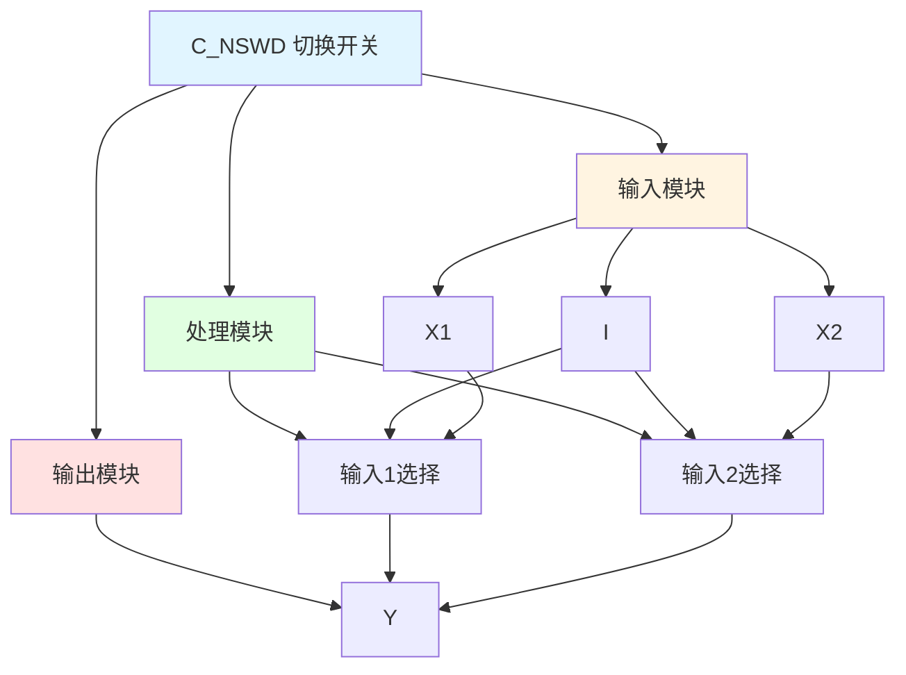

# C_NSWD 功能块分析报告

## 基本信息

| 项目 | 内容 |
|------|------|
| 功能块名称 | C_NSWD |
| 功能描述 | Numerical Changeover Switch (DINT type)（数值切换开关，DINT类型） |
| 最后修改 | 2015.11.20 |
| 作者 | Shi Chun Liang |
| 页数 | 1页 |

## 功能概述

C_NSWD 是一个数值切换开关功能块，用于根据开关设置选择两个DINT类型输入值中的一个。该功能块支持优先级选择，当I为TRUE时选择X1，否则选择X2。

## 思维导图

## 流程路径描述

### 输入1选择路径：
开始 → I = TRUE → 选择X1 → 输出Y
**功能**: 选择输入1值

### 输入2选择路径：
开始 → I = FALSE → 选择X2 → 输出Y
**功能**: 选择输入2值

## 逐帧功能分析

### Rung 7: 输入1选择

**功能描述**: 当I为TRUE时，选择X1

**输入条件**:
| 信号名称 | 信号描述 | 信号类型 | 触发值 |
|----------|----------|----------|--------|
| I | 开关设置 | BOOL | TRUE |
| X1 | 输入1 | DINT | 数值 |

**输出功能**:
| 信号名称 | 信号描述 | 信号类型 |
|----------|----------|----------|
| Y | 输出 | DINT |

**触发逻辑**:
- IF I = TRUE THEN Y = X1

**功能实现**: 
当I为TRUE时，使用MOVE功能块将X1的值输出到Y。

### Rung 8: 输入2选择

**功能描述**: 当I为FALSE时，选择X2

**输入条件**:
| 信号名称 | 信号描述 | 信号类型 | 触发值 |
|----------|----------|----------|--------|
| I | 开关设置 | BOOL | FALSE |
| X2 | 输入2 | DINT | 数值 |

**输出功能**:
| 信号名称 | 信号描述 | 信号类型 |
|----------|----------|----------|
| Y | 输出 | DINT |

**触发逻辑**:
- IF I = FALSE THEN Y = X2

**功能实现**: 
当I为FALSE时，使用MOVE功能块将X2的值输出到Y。

## 触发条件总结

### 选择条件
- **输入1选择**: I = TRUE
- **输入2选择**: I = FALSE

## 实现功能总结

### 主要功能
1. **输入1选择**: 选择输入1值
2. **输入2选择**: 选择输入2值

## 关键信号说明

| 信号名称 | 信号描述 | 信号类型 | 用途 |
|----------|----------|----------|------|
| I | 开关设置 | BOOL | 选择开关 |
| X1 | 输入1 | DINT | 输入值1 |
| X2 | 输入2 | DINT | 输入值2 |
| Y | 输出 | DINT | 选择输出值 |

## 调试技巧

### 调试步骤
1. 检查I信号，确认开关设置
2. 检查X1、X2值，确认输入值
3. 监控Y值，观察选择输出

### 常见问题
1. **选择不正确**: 检查I开关设置
2. **输出不正确**: 检查X1、X2输入值

### 监控信号列表
- I（开关设置）
- X1、X2（输入值）
- Y（输出）
