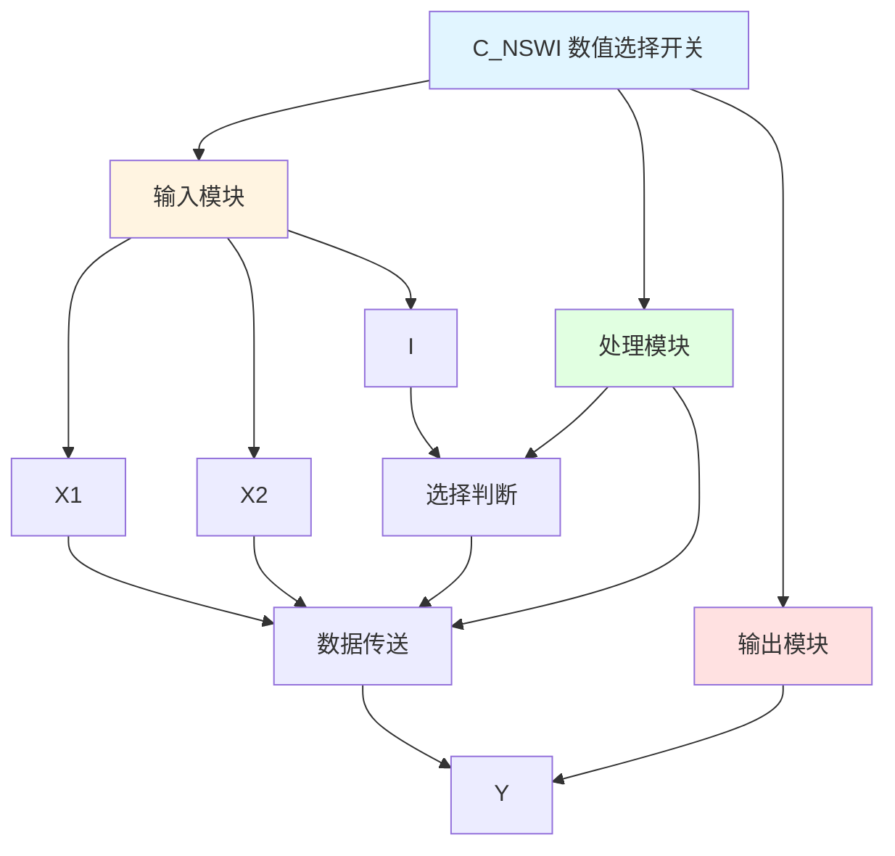

# C_NSWI 功能块分析报告

## 基本信息

| 项目 | 内容 |
|------|------|
| 功能块名称 | C_NSWI |
| 功能描述 | Numerical Changeover Switch(INT type)（数值选择开关，INT类型） |
| 最后修改 | 2015.11.20 |
| 作者 | Shi Chun Liang |
| 页数 | 1页 |

## 功能概述

C_NSWI 是一个数值选择开关功能块，用于根据选择信号在两个INT类型输入值之间切换输出。当选择信号为FALSE时输出X1，当选择信号为TRUE时输出X2。

**主要应用场景**：
- 手动/自动模式切换
- 参数选择
- 数据源切换
- 多路选择器

**选择开关说明**：
- 类似于一个二选一数据选择器
- 根据控制信号选择不同的输入值输出

## 思维导图

## 流程路径描述

### 选择X1路径：
开始 → I=FALSE → 输出X1
**功能**: 选择输入X1输出

### 选择X2路径：
开始 → I=TRUE → 输出X2
**功能**: 选择输入X2输出

## 逐帧功能分析

### Rung 7: 选择X1

**功能描述**: 当选择信号为FALSE时输出X1

**输入条件**:
| 信号名称 | 信号描述 | 信号类型 | 触发值 |
|----------|----------|----------|--------|
| I | 选择信号 | BOOL | FALSE |
| X1 | 输入值1 | INT | 数值 |

**输出功能**:
| 信号名称 | 信号描述 | 信号类型 |
|----------|----------|----------|
| Y | 输出 | INT |

**触发逻辑**:
- IF I = FALSE THEN Y = X1

**功能实现**: 
当选择信号为FALSE时，将X1传送到输出Y。

### Rung 8: 选择X2

**功能描述**: 当选择信号为TRUE时输出X2

**输入条件**:
| 信号名称 | 信号描述 | 信号类型 | 触发值 |
|----------|----------|----------|--------|
| I | 选择信号 | BOOL | TRUE |
| X2 | 输入值2 | INT | 数值 |

**输出功能**:
| 信号名称 | 信号描述 | 信号类型 |
|----------|----------|----------|
| Y | 输出 | INT |

**触发逻辑**:
- IF I = TRUE THEN Y = X2

**功能实现**: 
当选择信号为TRUE时，将X2传送到输出Y。

## 触发条件总结

### 选择逻辑
| 选择信号I | 输出Y |
|-----------|-------|
| FALSE | X1 |
| TRUE | X2 |

## 实现功能总结

### 主要功能
1. **数值选择**: 根据选择信号选择输出值
2. **数据切换**: 实现两个输入值的切换

## 关键信号说明

| 信号名称 | 信号描述 | 信号类型 | 用途 |
|----------|----------|----------|------|
| X1 | 输入值1 | INT | 选择输入1 |
| X2 | 输入值2 | INT | 选择输入2 |
| I | 选择信号 | BOOL | 选择控制 |
| Y | 输出 | INT | 选择输出 |

## 调试技巧

### 调试步骤
1. 检查X1和X2值，确认输入正常
2. 检查I信号，确认选择信号正常
3. 监控Y值，观察输出是否正确

### 常见问题
1. **输出不变化**: 检查I信号
2. **输出值错误**: 检查X1和X2值

### 监控信号列表
- X1、X2（输入值）
- I（选择信号）
- Y（输出）
