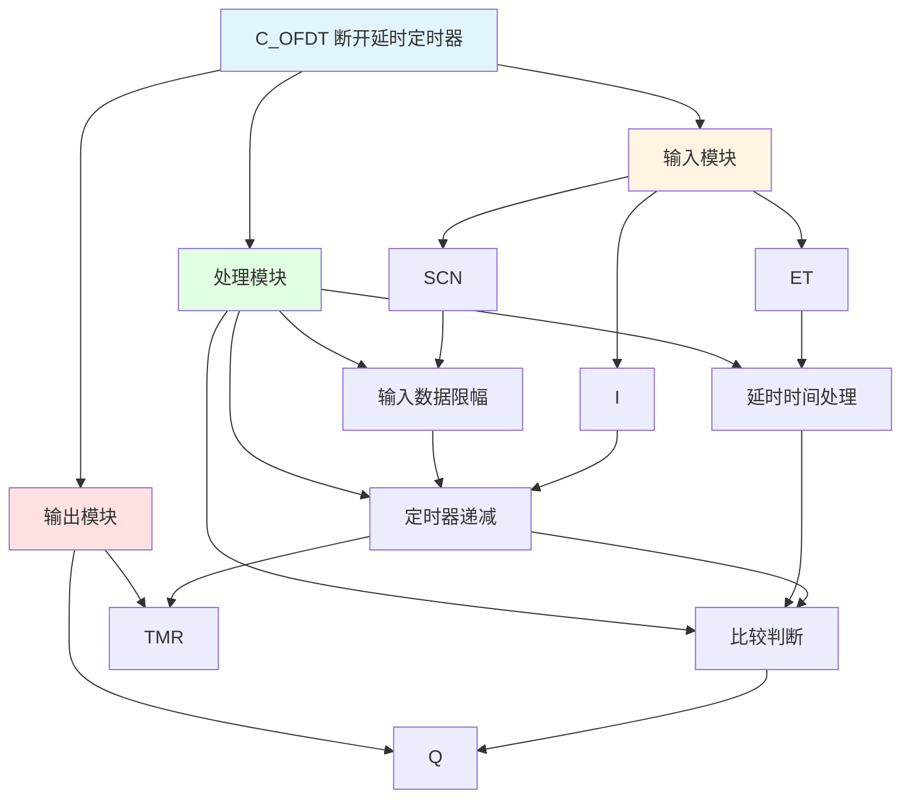

# C_OFDT 功能块分析报告

## 基本信息

| 项目 | 内容 |
|------|------|
| 功能块名称 | C_OFDT |
| 功能描述 | Switch OFF Delay Timer(BOOL type)（断开延时定时器，布尔类型） |
| 最后修改 | 2015.11.27 |
| 作者 | Shi Chun Liang |
| 页数 | 1页 |

## 功能概述

C_OFDT 是一个断开延时定时器功能块，用于在输入信号无效后延时一定时间再断开输出。当输入信号从TRUE变为FALSE时，定时器开始倒计时，达到设定延时时间后输出变为FALSE。

**主要应用场景**：
- 设备停止延时保护
- 信号保持处理
- 顺序控制中的延时断开
- 设备安全保护延时

**定时器类型说明**：
- **TON (On-Delay Timer)**: 接通延时定时器
- **TOF (Off-Delay Timer)**: 断开延时定时器，输入无效后延时断开
- C_OFDT属于TOF类型

## 思维导图



## 流程路径描述

### 立即接通路径：
开始 → I信号有效 → Q输出TRUE
**功能**: 输入有效时立即输出

### 延时断开路径：
开始 → I信号无效 → 定时器递减 → TMR = 0 → Q输出FALSE
**功能**: 输入无效后延时断开

## 逐帧功能分析

### Rung 7: 输入数据限幅

**功能描述**: 对扫描时间和延时时间进行限幅处理

**输入条件**:
| 信号名称 | 信号描述 | 信号类型 | 触发值 |
|----------|----------|----------|--------|
| SCN | 扫描时间 | INT | 设定值 |
| ET | 延时时间 | DINT | 设定值 |

**输出功能**:
| 信号名称 | 信号描述 | 信号类型 |
|----------|----------|----------|
| ScanTm | 扫描时间 | DINT |
| PlsExtTm | 延时时间 | DINT |

**触发逻辑**:
- ScanTm = LIMIT(SCN, 1, 150)
- PlsExtTm = ABS(ET)

**功能实现**: 
将扫描时间转换为DINT类型并限制在1~150范围内，延时时间取绝对值。

### Rung 8: 断开延时定时器序列

**功能描述**: 实现断开延时定时器功能

**输入条件**:
| 信号名称 | 信号描述 | 信号类型 | 触发值 |
|----------|----------|----------|--------|
| I | 输入信号 | BOOL | TRUE/FALSE |
| TMR | 定时器值 | DINT | 数值 |
| PlsExtTm | 延时时间 | DINT | 设定值 |
| ScanTm | 扫描时间 | DINT | 计算值 |

**输出功能**:
| 信号名称 | 信号描述 | 信号类型 |
|----------|----------|----------|
| Q | 输出 | BOOL |
| TMR | 定时器值 | DINT |

**触发逻辑**:
- IF I = FALSE AND TMR > 0 THEN TMR = TMR - ScanTm, Q = TRUE
- IF I = FALSE AND TMR <= 0 THEN Q = FALSE
- IF I = TRUE THEN TMR = PlsExtTm, Q = TRUE

**功能实现**: 
当输入有效时，定时器加载延时时间，输出立即有效。当输入无效时，定时器开始递减，当定时器值减到0时输出变为FALSE。

## 触发条件总结

### 控制条件
| 状态 | 条件 | 结果 |
|------|------|------|
| 立即接通 | I=TRUE | Q=TRUE, TMR=ET |
| 延时断开中 | I=FALSE AND TMR > 0 | Q=TRUE, TMR递减 |
| 断开完成 | I=FALSE AND TMR <= 0 | Q=FALSE |

### 时序图
```
输入 I:    ___/^^^^^^^^^^^\_______
定时器TMR: ________/^^^^^^^^^^^\___
输出 Q:    ___/^^^^^^^^^^^^^^^^^^\_
                |<-延时->|
```

## 实现功能总结

### 主要功能
1. **立即接通**: 输入有效时立即输出
2. **延时断开**: 输入无效后延时断开
3. **定时器递减**: 实时显示剩余延时时间

## 关键信号说明

| 信号名称 | 信号描述 | 信号类型 | 用途 |
|----------|----------|----------|------|
| I | 输入信号 | BOOL | 触发输入 |
| ET | 延时时间 | DINT | 延时时间设定（毫秒） |
| SCN | 扫描时间 | INT | 扫描时间设定（毫秒） |
| Q | 输出 | BOOL | 延时输出 |
| TMR | 定时器值 | DINT | 当前定时器值 |

## 调试技巧

### 调试步骤
1. 检查I信号，确认输入正常
2. 检查ET值，确认延时时间设置
3. 检查SCN值，确认扫描时间设置
4. 监控TMR值，观察定时器递减
5. 监控Q值，观察延时输出

### 常见问题
1. **延时时间不正确**: 检查ET和SCN值设置
2. **输出不变化**: 检查I信号是否有效
3. **延时过长**: 检查SCN值是否正确

### 监控信号列表
- I（输入信号）
- ET、SCN（时间参数）
- TMR（定时器值）
- Q（输出）
