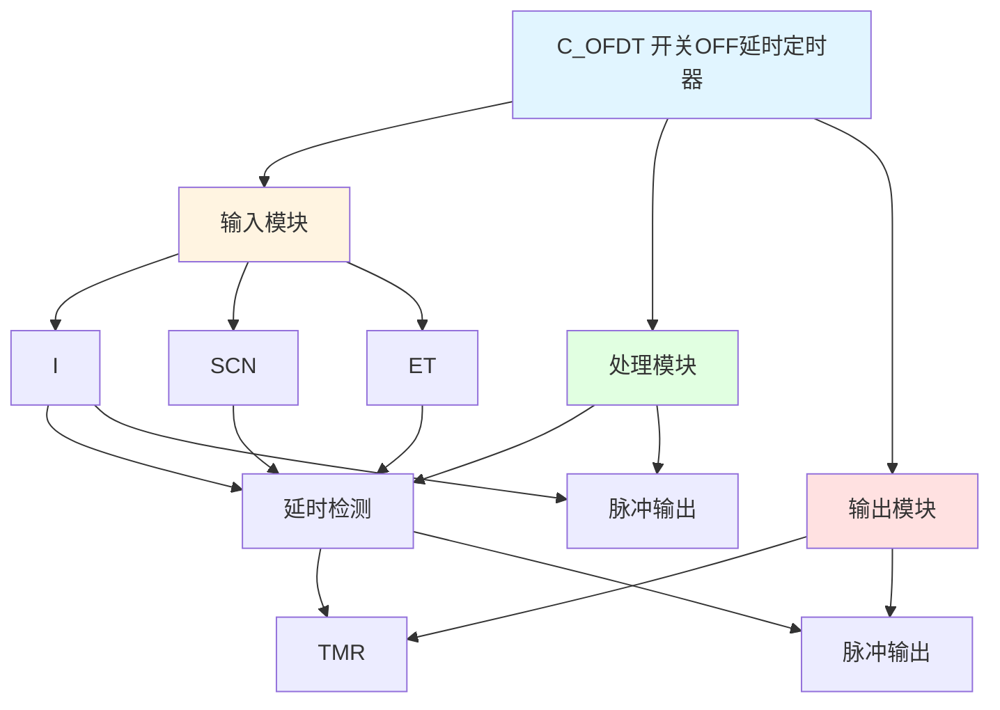

# C_OFDT 功能块分析报告

## 基本信息

| 项目 | 内容 |
|------|------|
| 功能块名称 | C_OFDT |
| 功能描述 | Switch OFF Delay Timer(BOOL type)（开关OFF延时定时器，BOOL类型） |
| 最后修改 | 2015.11.27 |
| 作者 | Shi Chun Liang |
| 页数 | 2页 |

## 功能概述

C_OFDT 是一个开关OFF延时定时器功能块，用于实现输入信号的延时断开功能。当输入信号为FALSE时，延时后输出为FALSE；当输入信号为TRUE时，立即输出TRUE。

## 思维导图

## 流程路径描述

### 延时路径：
开始 → I = FALSE → 延时检测 → 输出TMR = TRUE
**功能**: 输入信号延时断开

### 脉冲输出路径：
开始 → TMR = TRUE → 输出脉冲
**功能**: 延时后输出脉冲

## 逐帧功能分析

### Rung 8: 延时检测

**功能描述**: 检测输入信号的延时状态

**输入条件**:
| 信号名称 | 信号描述 | 信号类型 | 触发值 |
|----------|----------|----------|--------|
| I | 输入 | BOOL | TRUE/FALSE |
| SCN | 扫描定时器 | DINT | 扫描时间 |
| ET | 脉冲扩展次数 | DINT | 设定值 |

**输出功能**:
| 信号名称 | 信号描述 | 信号类型 |
|----------|----------|----------|
| TMR | 延时定时器记忆 | BOOL |

**触发逻辑**:
- IF I = FALSE AND TMR < ET THEN TMR = TMR + 1
- IF I = TRUE THEN TMR = 0

**功能实现**: 
使用CMP和ADD功能块，当输入I为FALSE且TMR小于ET时，TMR递增；当I为TRUE时，TMR复位为0。

### Rung 10: 脉冲输出

**功能描述**: 输出脉冲信号

**输入条件**:
| 信号名称 | 信号描述 | 信号类型 | 触发值 |
|----------|----------|----------|--------|
| TMR | 延时定时器记忆 | BOOL | 数值 |
| Scan Tm | 扫描周期时间 | DINT | 设定值 |

**输出功能**:
| 信号名称 | 信号描述 | 信号类型 |
|----------|----------|----------|
| 脉冲输出 | 脉冲输出 | BOOL |

**触发逻辑**:
- IF TMR = Scan Tm THEN 脉冲输出 = TRUE
- ELSE 脉冲输出 = FALSE

**功能实现**: 
使用CMP功能块比较TMR和Scan Tm，当TMR等于Scan Tm时，输出脉冲信号。

### Rung 11: 定时器复位

**功能描述**: 复位定时器

**输入条件**:
| 信号名称 | 信号描述 | 信号类型 | 触发值 |
|----------|----------|----------|--------|
| Pls Ext Tm | 脉冲扩展次数 | DINT | 设定值 |

**输出功能**:
| 信号名称 | 信号描述 | 信号类型 |
|----------|----------|----------|
| TMR | 延时定时器记忆 | BOOL |

**触发逻辑**:
- TMR = Pls Ext Tm

**功能实现**: 
使用MOVE功能块，将Pls Ext Tm输出到TMR，复位定时器。

## 触发条件总结

### 延时条件
- **延时计数**: I = FALSE AND TMR < ET
- **复位**: I = TRUE

### 脉冲条件
- **脉冲输出**: TMR = Scan Tm

## 实现功能总结

### 主要功能
1. **延时检测**: 检测输入信号的延时状态
2. **脉冲输出**: 延时完成后输出脉冲
3. **定时器复位**: 复位定时器

## 关键信号说明

| 信号名称 | 信号描述 | 信号类型 | 用途 |
|----------|----------|----------|------|
| I | 输入 | BOOL | 输入信号 |
| SCN | 扫描定时器 | DINT | 扫描时间 |
| ET | 脉冲扩展次数 | DINT | 扩展次数 |
| TMR | 延时定时器记忆 | BOOL | 定时器记忆 |
| 脉冲输出 | 脉冲输出 | BOOL | 脉冲输出 |
| Scan Tm | 扫描周期时间 | DINT | 扫描周期 |
| Pls Ext Tm | 脉冲扩展次数 | DINT | 扩展次数 |

## 调试技巧

### 调试步骤
1. 检查I信号，确认输入状态
2. 检查SCN和ET值，确认延时设置
3. 监控TMR值，观察延时计数
4. 监控脉冲输出，观察脉冲状态

### 常见问题
1. **延时不工作**: 检查I信号和ET值
2. **脉冲不输出**: 检查TMR和Scan Tm值
3. **不复位**: 检查复位信号

### 监控信号列表
- I（输入）
- SCN（扫描定时器）
- ET（脉冲扩展次数）
- TMR（延时定时器记忆）
- 脉冲输出（脉冲输出）
- Scan Tm（扫描周期时间）
- Pls Ext Tm（脉冲扩展次数）
