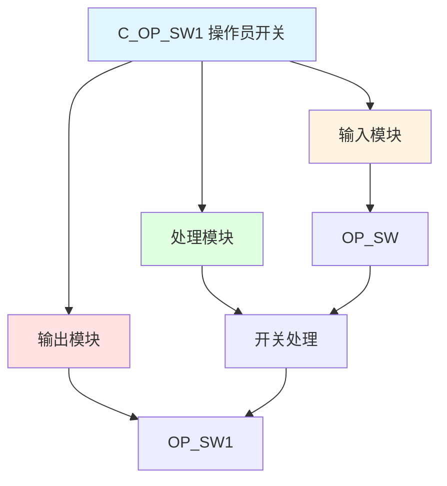

# C_OP_SW1 功能块分析报告

## 基本信息

| 项目 | 内容 |
|------|------|
| 功能块名称 | C_OP_SW1 |
| 功能描述 | Operator Switch 1（操作员开关1） |
| 最后修改 | 2015.12.11 |
| 作者 | Shi Chun Liang |
| 页数 | 1页 |

## 功能概述

C_OP_SW1 是一个操作员开关功能块，用于处理操作员选择信号。

## 思维导图

## 流程路径描述

### 开关路径：
开始 → OP_SW → 开关处理 → 输出OP_SW1
**功能**: 处理操作员开关信号

## 逐帧功能分析

### Rung 7: 开关处理

**功能描述**: 处理操作员开关信号

**输入条件**:
| 信号名称 | 信号描述 | 信号类型 | 触发值 |
|----------|----------|----------|--------|
| OP_SW | 操作员开关 | BOOL | TRUE/FALSE |

**输出功能**:
| 信号名称 | 信号描述 | 信号类型 |
|----------|----------|----------|
| OP_SW1 | 操作员开关1 | BOOL |

**触发逻辑**:
- OP_SW1 = OP_SW

**功能实现**: 
使用MOVE功能块，将OP_SW输出到OP_SW1。

## 触发条件总结

### 开关条件
- **开关处理**: OP_SW有值

## 实现功能总结

### 主要功能
1. **开关处理**: 处理操作员开关信号

## 关键信号说明

| 信号名称 | 信号描述 | 信号类型 | 用途 |
|----------|----------|----------|------|
| OP_SW | 操作员开关 | BOOL | 操作员开关输入 |
| OP_SW1 | 操作员开关1 | BOOL | 操作员开关输出 |

## 调试技巧

### 调试步骤
1. 检查OP_SW信号，确认操作员开关
2. 监控OP_SW1值，观察开关输出

### 常见问题
1. **开关不工作**: 检查OP_SW信号

### 监控信号列表
- OP_SW（操作员开关）
- OP_SW1（操作员开关1）
