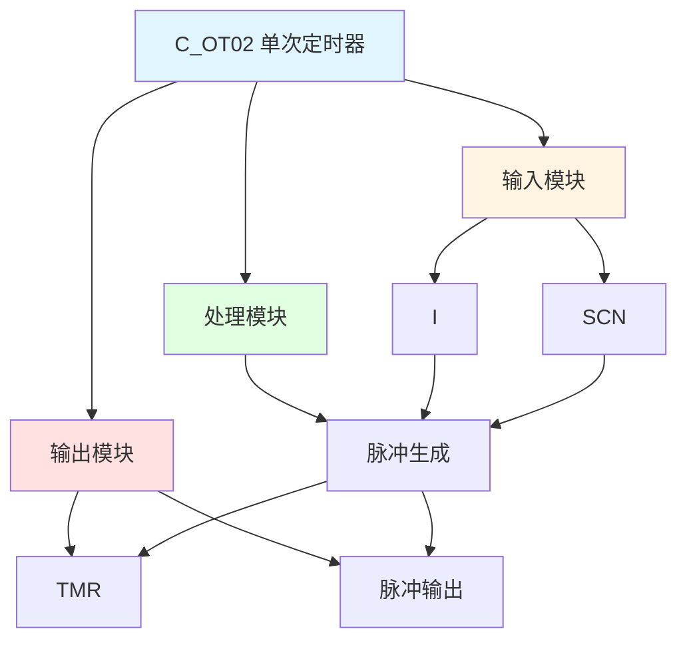

# C_OT02 功能块分析报告

## 基本信息

| 项目 | 内容 |
|------|------|
| 功能块名称 | C_OT02 |
| 功能描述 | One Shot Timer 2（单次定时器2） |
| 最后修改 | 2015.11.27 |
| 作者 | Shi Chun Liang |
| 页数 | 1页 |

## 功能概述

C_OT02 是一个单次定时器功能块，用于产生固定宽度的脉冲信号。

## 思维导图

## 流程路径描述

### 脉冲生成路径：
开始 → I = TRUE → 脉冲生成 → 输出TMR = TRUE → 输出脉冲
**功能**: 产生固定宽度的脉冲

## 逐帧功能分析

### Rung 7: 脉冲生成

**功能描述**: 产生固定宽度的脉冲

**输入条件**:
| 信号名称 | 信号描述 | 信号类型 | 触发值 |
|----------|----------|----------|--------|
| I | 输入 | BOOL | TRUE/FALSE |
| SCN | 扫描定时器 | DINT | 设定值 |

**输出功能**:
| 信号名称 | 信号描述 | 信号类型 |
|----------|----------|----------|
| TMR | 定时器记忆 | BOOL |
| 脉冲输出 | 脉冲输出 | BOOL |

**触发逻辑**:
- IF I = TRUE THEN TMR = TRUE AND 脉冲输出 = TRUE
- IF I = FALSE THEN TMR = FALSE AND 脉冲输出 = FALSE

**功能实现**: 
使用MOVE功能块，根据I的状态设置TMR和脉冲输出。

## 触发条件总结

### 脉冲条件
- **脉冲生成**: I = TRUE

## 实现功能总结

### 主要功能
1. **脉冲生成**: 产生固定宽度的脉冲

## 关键信号说明

| 信号名称 | 信号描述 | 信号类型 | 用途 |
|----------|----------|----------|------|
| I | 输入 | BOOL | 输入信号 |
| SCN | 扫描定时器 | DINT | 扫描时间 |
| TMR | 定时器记忆 | BOOL | 定时器记忆 |
| 脉冲输出 | 脉冲输出 | BOOL | 脉冲输出 |

## 调试技巧

### 调试步骤
1. 检查I信号，确认输入状态
2. 监控TMR和脉冲输出，观察脉冲生成

### 常见问题
1. **脉冲不生成**: 检查I信号

### 监控信号列表
- I（输入）
- SCN（扫描定时器）
- TMR（定时器记忆）
- 脉冲输出（脉冲输出）
