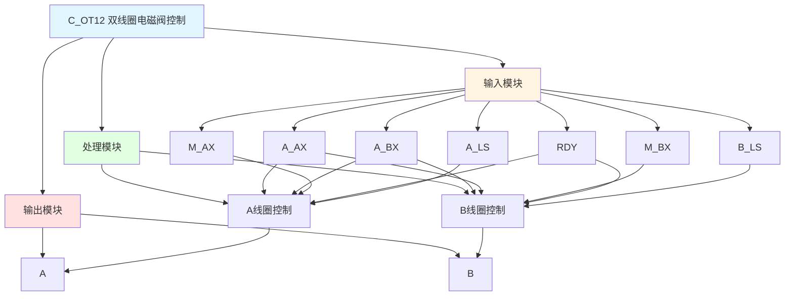

# C_OT12 功能块分析报告

## 基本信息

| 项目 | 内容 |
|------|------|
| 功能块名称 | C_OT12 |
| 功能描述 | Solenoid Valve Excitation Output(Double Coil) with Limiting Detection（双线圈电磁阀励磁输出，带限位检测） |
| 最后修改 | 2016.01.06 |
| 作者 | Shi Chun Liang |
| 页数 | 1页 |

## 功能概述

C_OT12 是一个双线圈电磁阀控制功能块，用于控制双线圈电磁阀的励磁输出，并支持限位检测功能。

## 思维导图

## 流程路径描述

### A线圈控制路径：
开始 → A_AX信号 AND NOT A_BX AND NOT M_BX AND RDY AND NOT A_LS → A输出
**功能**: 控制A线圈励磁

### B线圈控制路径：
开始 → A_BX信号 AND NOT A_AX AND NOT M_AX AND RDY AND NOT B_LS → B输出
**功能**: 控制B线圈励磁

## 逐帧功能分析

### Rung 7: A线圈控制

**功能描述**: 控制A线圈励磁

**输入条件**:
| 信号名称 | 信号描述 | 信号类型 | 触发值 |
|----------|----------|----------|--------|
| A_AX | 自动A命令 | BOOL | TRUE |
| A_BX | 自动B命令 | BOOL | FALSE |
| M_AX | 手动A命令 | BOOL | TRUE |
| M_BX | 手动B命令 | BOOL | FALSE |
| RDY | 准备就绪 | BOOL | TRUE |
| A_LS | A限位开关 | BOOL | FALSE |

**输出功能**:
| 信号名称 | 信号描述 | 信号类型 |
|----------|----------|----------|
| A | A线圈输出 | BOOL |

**触发逻辑**:
- IF (A_AX OR M_AX) AND NOT A_BX AND NOT M_BX AND RDY AND NOT A_LS THEN A = TRUE

**功能实现**: 
当自动或手动A命令有效，且B命令无效，且准备就绪，且A限位未到达时，输出A线圈励磁。

### Rung 8: B线圈控制

**功能描述**: 控制B线圈励磁

**输入条件**:
| 信号名称 | 信号描述 | 信号类型 | 触发值 |
|----------|----------|----------|--------|
| A_BX | 自动B命令 | BOOL | TRUE |
| A_AX | 自动A命令 | BOOL | FALSE |
| M_AX | 手动A命令 | BOOL | FALSE |
| M_BX | 手动B命令 | BOOL | TRUE |
| RDY | 准备就绪 | BOOL | TRUE |
| B_LS | B限位开关 | BOOL | FALSE |

**输出功能**:
| 信号名称 | 信号描述 | 信号类型 |
|----------|----------|----------|
| B | B线圈输出 | BOOL |

**触发逻辑**:
- IF (A_BX OR M_BX) AND NOT A_AX AND NOT M_AX AND RDY AND NOT B_LS THEN B = TRUE

**功能实现**: 
当自动或手动B命令有效，且A命令无效，且准备就绪，且B限位未到达时，输出B线圈励磁。

## 触发条件总结

### 控制条件
- **A线圈励磁**: (A_AX OR M_AX) AND NOT A_BX AND NOT M_BX AND RDY AND NOT A_LS
- **B线圈励磁**: (A_BX OR M_BX) AND NOT A_AX AND NOT M_AX AND RDY AND NOT B_LS

## 实现功能总结

### 主要功能
1. **A线圈控制**: 控制A线圈励磁
2. **B线圈控制**: 控制B线圈励磁
3. **限位检测**: 支持限位检测功能

## 关键信号说明

| 信号名称 | 信号描述 | 信号类型 | 用途 |
|----------|----------|----------|------|
| A_AX | 自动A命令 | BOOL | 自动A控制 |
| A_BX | 自动B命令 | BOOL | 自动B控制 |
| M_AX | 手动A命令 | BOOL | 手动A控制 |
| M_BX | 手动B命令 | BOOL | 手动B控制 |
| RDY | 准备就绪 | BOOL | 准备就绪信号 |
| A_LS | A限位开关 | BOOL | A限位检测 |
| B_LS | B限位开关 | BOOL | B限位检测 |
| A | A线圈输出 | BOOL | A线圈状态 |
| B | B线圈输出 | BOOL | B线圈状态 |

## 调试技巧

### 调试步骤
1. 检查A_AX、A_BX、M_AX、M_BX信号，确认命令状态
2. 检查RDY信号，确认准备就绪状态
3. 检查A_LS、B_LS信号，确认限位状态
4. 监控A、B信号，观察线圈输出

### 常见问题
1. **线圈不励磁**: 检查命令信号和限位信号
2. **线圈互锁失效**: 检查互锁逻辑

### 监控信号列表
- A_AX、A_BX、M_AX、M_BX（命令信号）
- RDY（准备就绪）
- A_LS、B_LS（限位信号）
- A、B（线圈输出）
