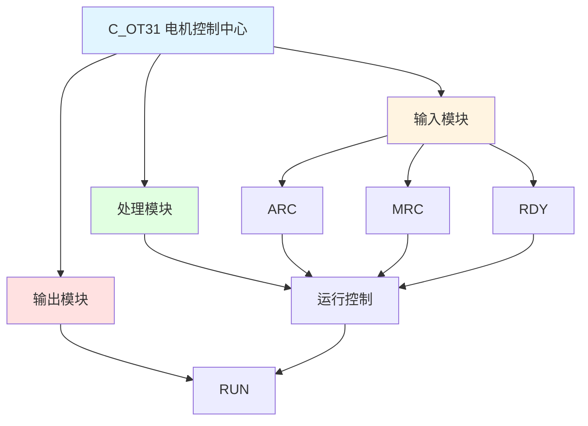

# C_OT31 功能块分析报告

## 基本信息

| 项目 | 内容 |
|------|------|
| 功能块名称 | C_OT31 |
| 功能描述 | Motor Control Center(MCC) Function（电机控制中心功能） |
| 最后修改 | 2016.01.06 |
| 作者 | Shi Chun Liang |
| 页数 | 1页 |

## 功能概述

C_OT31 是一个电机控制中心功能块，用于控制电机的启停。该功能块实现基本的电机运行控制逻辑。

## 思维导图

## 流程路径描述

### 运行控制路径：
开始 → ARC信号 AND RDY信号 → RUN输出
**功能**: 控制电机运行

## 逐帧功能分析

### Rung 7: 运行控制

**功能描述**: 控制电机运行

**输入条件**:
| 信号名称 | 信号描述 | 信号类型 | 触发值 |
|----------|----------|----------|--------|
| ARC | 自动运行命令 | BOOL | TRUE |
| MRC | 手动运行命令 | BOOL | TRUE |
| RDY | 准备就绪 | BOOL | TRUE |

**输出功能**:
| 信号名称 | 信号描述 | 信号类型 |
|----------|----------|----------|
| RUN | 运行输出 | BOOL |

**触发逻辑**:
- IF (ARC = TRUE OR MRC = TRUE) AND RDY = TRUE THEN RUN = TRUE

**功能实现**: 
当自动运行命令或手动运行命令有效，且准备就绪信号有效时，输出运行信号。

## 触发条件总结

### 控制条件
- **运行条件**: (ARC = TRUE OR MRC = TRUE) AND RDY = TRUE

## 实现功能总结

### 主要功能
1. **运行控制**: 控制电机启停

## 关键信号说明

| 信号名称 | 信号描述 | 信号类型 | 用途 |
|----------|----------|----------|------|
| ARC | 自动运行命令 | BOOL | 自动运行控制 |
| MRC | 手动运行命令 | BOOL | 手动运行控制 |
| RDY | 准备就绪 | BOOL | 准备就绪信号 |
| RUN | 运行输出 | BOOL | 运行状态输出 |

## 调试技巧

### 调试步骤
1. 检查ARC和MRC信号，确认运行命令
2. 检查RDY信号，确认准备就绪状态
3. 监控RUN信号，观察运行状态

### 常见问题
1. **电机不运行**: 检查ARC、MRC和RDY信号

### 监控信号列表
- ARC、MRC（运行命令）
- RDY（准备就绪）
- RUN（运行状态）
