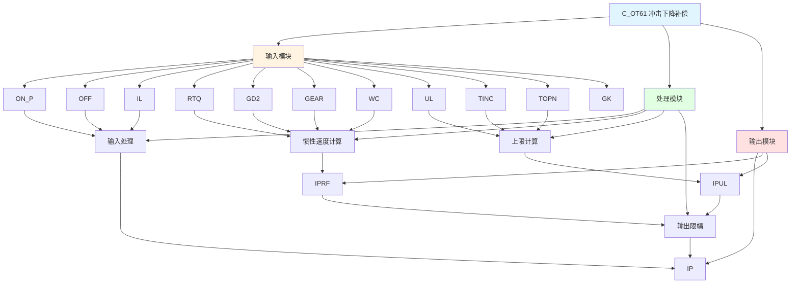

# C_OT61 功能块分析报告

## 基本信息

| 项目 | 内容 |
|------|------|
| 功能块名称 | C_OT61 |
| 功能描述 | Speed Drive for Impact Drop Compensation Function Block（冲击下降补偿速度驱动功能块） |
| 最后修改 | 2017.08.01 |
| 作者 | Gao Yi Ju |
| 页数 | 1页 |

## 功能概述

C_OT61 是一个冲击下降补偿速度驱动功能块，用于计算冲击下降补偿所需的速度参考值。该功能块根据扭矩、GD2（飞轮矩）、齿轮比等参数，计算惯性冲击补偿速度。

**主要应用场景**：
- 冲击负载补偿
- 惯性补偿控制
- 需要考虑负载惯量的速度控制系统

## 思维导图

## 流程路径描述

### 输入处理路径：
开始 → ON_P信号 AND NOT OFF AND IL → IP输出
**功能**: 处理输入使能信号

### 惯性速度计算路径：
开始 → RTQ、GD2、GEAR、WC → 惯性速度计算 → IPRF输出
**功能**: 计算惯性冲击速度

### 输出限幅路径：
开始 → IPRF → 与IPUL比较 → 限幅 → IP输出
**功能**: 限制输出在有效范围内

## 逐帧功能分析

### Rung 7: 输入处理

**功能描述**: 处理输入使能信号

**输入条件**:
| 信号名称 | 信号描述 | 信号类型 | 触发值 |
|----------|----------|----------|--------|
| ON_P | 开启信号 | BOOL | TRUE |
| OFF | 关闭信号 | BOOL | FALSE |
| IL | 联锁信号 | BOOL | TRUE |

**输出功能**:
| 信号名称 | 信号描述 | 信号类型 |
|----------|----------|----------|
| IP | 输入脉冲/使能 | BOOL |

**触发逻辑**:
- IF ON_P = TRUE AND OFF = FALSE AND IL = TRUE THEN IP = TRUE

**功能实现**: 
当开启信号有效、关闭信号无效、联锁信号有效时，输出使能信号。

### Rung 8: 惯性速度计算

**功能描述**: 计算惯性冲击速度

**输入条件**:
| 信号名称 | 信号描述 | 信号类型 | 触发值 |
|----------|----------|----------|--------|
| RTQ | 额定扭矩 | REAL | 设定值 |
| GD2 | 飞轮矩 | REAL | 设定值 |
| GEAR | 齿轮比 | REAL | 设定值 |
| WC | 工作周期 | REAL | 设定值 |

**输出功能**:
| 信号名称 | 信号描述 | 信号类型 |
|----------|----------|----------|
| IPRF | 惯性速度参考 | REAL |

**触发逻辑**:
- IPRF = (RTQ * 1000.0 * GEAR * 4.0) / (GD2 * WC * 2.0 * 3.141592654) * 0.85 * 60.0

**功能实现**: 
使用C_MUL4乘法功能块计算惯性冲击速度，考虑扭矩、齿轮比、飞轮矩和工作周期等因素。

### Rung 9: 上限计算

**功能描述**: 计算惯性速度上限

**输入条件**:
| 信号名称 | 信号描述 | 信号类型 | 触发值 |
|----------|----------|----------|--------|
| UL | 上限 | REAL | 设定值 |
| TINC | 时间增量 | REAL | 设定值 |
| TOPN | 每转脉冲数 | REAL | 设定值 |

**输出功能**:
| 信号名称 | 信号描述 | 信号类型 |
|----------|----------|----------|
| IPUL | 惯性速度上限 | INT |

**触发逻辑**:
- IPUL = INT(UL * TINC / TOPN)

**功能实现**: 
根据上限值、时间增量和每转脉冲数计算惯性速度上限。

### Rung 10: 输出限幅

**功能描述**: 对惯性速度输出进行限幅

**输入条件**:
| 信号名称 | 信号描述 | 信号类型 | 触发值 |
|----------|----------|----------|--------|
| IP | 使能信号 | BOOL | TRUE |
| IPRF | 惯性速度参考 | REAL | 计算值 |
| GK | 增益系数 | REAL | 设定值 |
| TINC | 时间增量 | REAL | 设定值 |
| TOPN | 每转脉冲数 | REAL | 设定值 |
| IPUL | 惯性速度上限 | INT | 计算值 |

**输出功能**:
| 信号名称 | 信号描述 | 信号类型 |
|----------|----------|----------|
| IP | 惯性速度输出 | INT |

**触发逻辑**:
- IF IP = TRUE THEN IP = LIMIT(IPRF * GK * TINC / TOPN, 0, IPUL)

**功能实现**: 
当使能有效时，将惯性速度参考乘以增益系数并转换为整数，限制在0到IPUL范围内。

## 触发条件总结

### 使能条件
- **输入使能**: ON_P = TRUE AND OFF = FALSE AND IL = TRUE

### 计算条件
- **惯性速度计算**: 基于扭矩、GD2、齿轮比、工作周期
- **输出限幅**: 限制在0到IPUL范围内

## 实现功能总结

### 主要功能
1. **输入处理**: 处理使能信号
2. **惯性速度计算**: 根据扭矩和惯量计算冲击补偿速度
3. **上限计算**: 计算输出上限
4. **输出限幅**: 限制输出在有效范围内

## 关键信号说明

| 信号名称 | 信号描述 | 信号类型 | 用途 |
|----------|----------|----------|------|
| ON_P | 开启信号 | BOOL | 使能控制 |
| OFF | 关闭信号 | BOOL | 禁止控制 |
| IL | 联锁信号 | BOOL | 联锁保护 |
| RTQ | 额定扭矩 | REAL | 扭矩参数 |
| GD2 | 飞轮矩 | REAL | 惯量参数 |
| GEAR | 齿轮比 | REAL | 传动比 |
| WC | 工作周期 | REAL | 周期参数 |
| UL | 上限 | REAL | 输出上限 |
| TINC | 时间增量 | REAL | 时间参数 |
| TOPN | 每转脉冲数 | REAL | 编码器参数 |
| GK | 增益系数 | REAL | 增益调整 |
| IP | 惯性速度输出 | INT | 最终输出 |

## 调试技巧

### 调试步骤
1. 检查ON_P、OFF、IL信号，确认使能条件满足
2. 检查RTQ、GD2、GEAR、WC值，确认参数设置正确
3. 监控IPRF值，观察惯性速度计算结果
4. 监控IP值，观察最终输出

### 常见问题
1. **无输出**: 检查使能信号
2. **输出过大/过小**: 检查GD2和GK参数
3. **输出被限幅**: 检查UL和IPUL值

### 监控信号列表
- ON_P、OFF、IL（控制信号）
- RTQ、GD2、GEAR、WC（参数）
- IPRF、IPUL、IP（输出）
