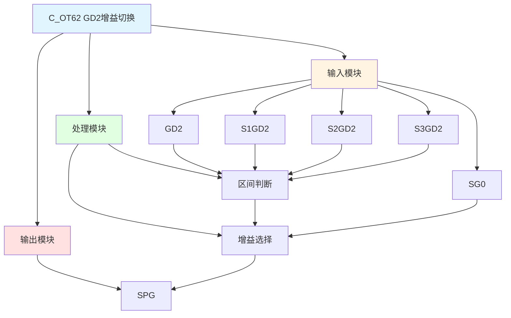

# C_OT62 功能块分析报告

## 基本信息

| 项目 | 内容 |
|------|------|
| 功能块名称 | C_OT62 |
| 功能描述 | Speed Gain Exchange By GD2 Function Block（根据GD2切换速度增益功能块） |
| 最后修改 | 2016.04.13 |
| 作者 | Gao Weidi |
| 页数 | 1页 |

## 功能概述

C_OT62 是一个根据GD2（飞轮矩）值切换速度增益的功能块。该功能块根据GD2值与预设的阈值比较，自动选择对应的速度增益值输出。这在需要根据负载惯量自动调整增益的应用场景中非常有用。

**主要应用场景**：
- 变负载传动系统
- 需要根据惯量自动调整增益的场合
- 多工况自动切换系统

## 思维导图

## 流程路径描述

### 区间判断路径：
开始 → GD2与阈值比较 → 确定GD2所在区间 → 选择对应增益
**功能**: 根据GD2值判断所属区间

### 增益选择路径：
开始 → 区间选择信号 → 选择对应增益值 → 输出SPG
**功能**: 输出对应区间的速度增益

## 逐帧功能分析

### Rung 7: 区间0判断

**功能描述**: 判断GD2是否在区间0

**输入条件**:
| 信号名称 | 信号描述 | 信号类型 | 触发值 |
|----------|----------|----------|--------|
| SG0 | 区间0选择 | BOOL | TRUE |
| GD2 | 飞轮矩 | REAL | 数值 |
| S1GD2 | 区间1阈值 | REAL | 设定值 |

**输出功能**:
| 信号名称 | 信号描述 | 信号类型 |
|----------|----------|----------|
| SEL0 | 选择0 | BOOL |

**触发逻辑**:
- IF SG0 = TRUE OR GD2 <= S1GD2 THEN SEL0 = TRUE

**功能实现**: 
当SG0信号有效或GD2小于等于区间1阈值时，选择区间0。

### Rung 8: 区间1判断

**功能描述**: 判断GD2是否在区间1

**输入条件**:
| 信号名称 | 信号描述 | 信号类型 | 触发值 |
|----------|----------|----------|--------|
| GD2 | 飞轮矩 | REAL | 数值 |
| S1GD2 | 区间1阈值 | REAL | 设定值 |
| S2GD2 | 区间2阈值 | REAL | 设定值 |
| SEL0 | 选择0 | BOOL | FALSE |

**输出功能**:
| 信号名称 | 信号描述 | 信号类型 |
|----------|----------|----------|
| SEL1 | 选择1 | BOOL |

**触发逻辑**:
- IF GD2 <= S2GD2 AND NOT SEL0 THEN SEL1 = TRUE

**功能实现**: 
当GD2小于等于区间2阈值且不在区间0时，选择区间1。

### Rung 9: 区间2判断

**功能描述**: 判断GD2是否在区间2

**输入条件**:
| 信号名称 | 信号描述 | 信号类型 | 触发值 |
|----------|----------|----------|--------|
| GD2 | 飞轮矩 | REAL | 数值 |
| S2GD2 | 区间2阈值 | REAL | 设定值 |
| S3GD2 | 区间3阈值 | REAL | 设定值 |
| SEL0 | 选择0 | BOOL | FALSE |
| SEL1 | 选择1 | BOOL | FALSE |

**输出功能**:
| 信号名称 | 信号描述 | 信号类型 |
|----------|----------|----------|
| SEL2 | 选择2 | BOOL |

**触发逻辑**:
- IF GD2 <= S3GD2 AND NOT SEL0 AND NOT SEL1 THEN SEL2 = TRUE

**功能实现**: 
当GD2小于等于区间3阈值且不在区间0和1时，选择区间2。

### Rung 10: 区间3判断

**功能描述**: 判断GD2是否在区间3

**输入条件**:
| 信号名称 | 信号描述 | 信号类型 | 触发值 |
|----------|----------|----------|--------|
| SEL0 | 选择0 | BOOL | FALSE |
| SEL1 | 选择1 | BOOL | FALSE |
| SEL2 | 选择2 | BOOL | FALSE |

**输出功能**:
| 信号名称 | 信号描述 | 信号类型 |
|----------|----------|----------|
| SEL3 | 选择3 | BOOL |

**触发逻辑**:
- IF NOT SEL0 AND NOT SEL1 AND NOT SEL2 THEN SEL3 = TRUE

**功能实现**: 
当不在区间0、1、2时，选择区间3（GD2 > S3GD2）。

### Rung 11: 增益选择输出

**功能描述**: 根据区间选择输出对应增益

**输入条件**:
| 信号名称 | 信号描述 | 信号类型 | 触发值 |
|----------|----------|----------|--------|
| SEL0 | 选择0 | BOOL | TRUE |
| SEL1 | 选择1 | BOOL | TRUE |
| SEL2 | 选择2 | BOOL | TRUE |
| SEL3 | 选择3 | BOOL | TRUE |

**输出功能**:
| 信号名称 | 信号描述 | 信号类型 |
|----------|----------|----------|
| SPG | 速度增益 | INT |

**触发逻辑**:
- IF SEL0 THEN SPG = 0
- IF SEL1 THEN SPG = 1
- IF SEL2 THEN SPG = 2
- IF SEL3 THEN SPG = 3

**功能实现**: 
使用C_NSWI选择功能块，根据区间选择信号输出对应的增益值（0~3）。

## 触发条件总结

### 区间判断条件
| 区间 | 条件 | 输出增益 |
|------|------|----------|
| 区间0 | SG0=TRUE OR GD2 <= S1GD2 | SPG = 0 |
| 区间1 | S1GD2 < GD2 <= S2GD2 | SPG = 1 |
| 区间2 | S2GD2 < GD2 <= S3GD2 | SPG = 2 |
| 区间3 | GD2 > S3GD2 | SPG = 3 |

## 实现功能总结

### 主要功能
1. **区间判断**: 根据GD2值判断所属区间
2. **增益选择**: 根据区间输出对应的速度增益值
3. **手动选择**: 支持通过SG0信号强制选择区间0

## 关键信号说明

| 信号名称 | 信号描述 | 信号类型 | 用途 |
|----------|----------|----------|------|
| GD2 | 飞轮矩 | REAL | 负载惯量输入 |
| SG0 | 区间0选择 | BOOL | 手动选择区间0 |
| S1GD2 | 区间1阈值 | REAL | 区间1阈值设定 |
| S2GD2 | 区间2阈值 | REAL | 区间2阈值设定 |
| S3GD2 | 区间3阈值 | REAL | 区间3阈值设定 |
| SPG | 速度增益 | INT | 增益输出（0~3） |

## 调试技巧

### 调试步骤
1. 检查GD2值，确认输入正常
2. 检查S1GD2、S2GD2、S3GD2值，确认阈值设置正确
3. 监控SEL0~SEL3信号，确认区间判断正确
4. 监控SPG值，观察增益输出

### 常见问题
1. **增益选择不正确**: 检查GD2值和阈值设置
2. **区间判断错误**: 确保阈值递增设置（S1GD2 < S2GD2 < S3GD2）

### 监控信号列表
- GD2（飞轮矩）
- S1GD2、S2GD2、S3GD2（阈值）
- SEL0~SEL3（区间选择）
- SPG（增益输出）
