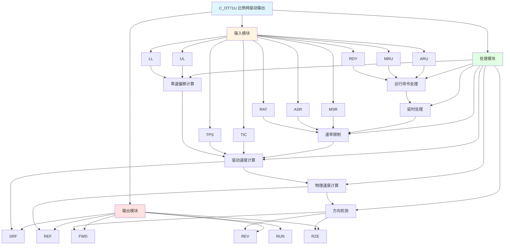

# C_OT71U 功能块分析报告

## 基本信息

| 项目 | 内容 |
|------|------|
| 功能块名称 | C_OT71U |
| 功能描述 | Proportional Valve Drive Output(6400~32000 Counts)（比例阀驱动输出，6400~32000计数） |
| 最后修改 | 2015.12.23 |
| 作者 | Shi Chun Liang |
| 页数 | 1页 |

## 功能概述

C_OT71U 是一个比例阀驱动输出功能块，用于将速度参考值转换为比例阀控制所需的计数输出（6400~32000）。该功能块支持自动/手动运行模式、速率限制、零速偏移计算和方向检测。

**主要应用场景**：
- 液压比例阀控制
- 电液伺服系统
- 需要精确流量控制的场合

## 思维导图

## 流程路径描述

### 运行命令路径：
开始 → ARU/MRU信号 AND RDY → RUN输出
**功能**: 处理运行命令

### 速度参考路径：
开始 → MSR/ASR选择 → 速率限制 → 驱动速度计算 → SRF输出
**功能**: 计算驱动速度参考

### 方向检测路径：
开始 → REF值 → 与0比较 → FWD/REV输出
**功能**: 检测运动方向

## 逐帧功能分析

### Rung 7: 运行命令处理

**功能描述**: 处理自动/手动运行命令

**输入条件**:
| 信号名称 | 信号描述 | 信号类型 | 触发值 |
|----------|----------|----------|--------|
| ARU | 自动运行 | BOOL | TRUE |
| MRU | 手动运行 | BOOL | TRUE |
| RDY | 准备就绪 | BOOL | TRUE |
| RZE | 反向零速 | BOOL | FALSE |

**输出功能**:
| 信号名称 | 信号描述 | 信号类型 |
|----------|----------|----------|
| RUN | 运行 | BOOL |

**触发逻辑**:
- IF (ARU OR MRU) AND RDY AND NOT RZE THEN RUN = TRUE

**功能实现**: 
当自动或手动运行命令有效，且准备就绪，且无反向零速时，输出运行信号。

### Rung 8: 延时处理

**功能描述**: 运行命令延时处理

**输入条件**:
| 信号名称 | 信号描述 | 信号类型 | 触发值 |
|----------|----------|----------|--------|
| RUN | 运行 | BOOL | TRUE |
| LKT | 锁定时间 | DINT | 设定值 |
| SCN | 扫描时间 | INT | 设定值 |

**输出功能**:
| 信号名称 | 信号描述 | 信号类型 |
|----------|----------|----------|
| RDT | 延时运行 | BOOL |

**触发逻辑**:
- IF RUN延时LKT时间 THEN RDT = TRUE

**功能实现**: 
使用C_ODT延时功能块，在运行命令有效后延时LKT时间，产生延时运行信号。

### Rung 9: 速度参考速率限制

**功能描述**: 对速度参考进行速率限制

**输入条件**:
| 信号名称 | 信号描述 | 信号类型 | 触发值 |
|----------|----------|----------|--------|
| MSR | 手动速度参考 | REAL | 数值 |
| ASR | 自动速度参考 | REAL | 数值 |
| RAT | 速率限制值 | REAL | 设定值 |
| RDT | 延时运行 | BOOL | TRUE |
| MRU | 手动运行 | BOOL | TRUE/FALSE |
| ARU | 自动运行 | BOOL | TRUE/FALSE |

**输出功能**:
| 信号名称 | 信号描述 | 信号类型 |
|----------|----------|----------|
| SpdRef | 速度参考 | REAL |

**触发逻辑**:
- IF MRU THEN SpdRef = MSR（经速率限制）
- IF ARU THEN SpdRef = ASR（经速率限制）

**功能实现**: 
使用C_NSW3R选择功能块选择手动或自动速度参考，然后使用C_DLM速率限制功能块限制速度变化率。

### Rung 10: 零速偏移计算

**功能描述**: 计算零速增量值

**输入条件**:
| 信号名称 | 信号描述 | 信号类型 | 触发值 |
|----------|----------|----------|--------|
| LL | 下限 | INT | 设定值 |
| UL | 上限 | INT | 设定值 |

**输出功能**:
| 信号名称 | 信号描述 | 信号类型 |
|----------|----------|----------|
| ZeSpdInc | 零速增量 | REAL |

**触发逻辑**:
- ZeSpdInc = (LL / 2 + UL / 2)

**功能实现**: 
计算上限和下限的中点值，作为零速偏移量。这是为了确保零速时输出在量程中点。

### Rung 11: 驱动速度计算

**功能描述**: 计算驱动速度参考

**输入条件**:
| 信号名称 | 信号描述 | 信号类型 | 触发值 |
|----------|----------|----------|--------|
| SpdRef | 速度参考 | REAL | 数值 |
| TIC | 时间增量系数 | REAL | 设定值 |
| TPS | 时间比例系数 | REAL | 设定值 |
| RUN | 运行 | BOOL | TRUE |
| ZeSpdInc | 零速增量 | REAL | 计算值 |
| UL | 上限 | INT | 设定值 |
| LL | 下限 | INT | 设定值 |

**输出功能**:
| 信号名称 | 信号描述 | 信号类型 |
|----------|----------|----------|
| SRF | 驱动速度参考 | INT |

**触发逻辑**:
- SRF = LIMIT(SpdRef * TIC / TPS + ZeSpdInc, LL, UL)

**功能实现**: 
将速度参考按比例转换为驱动计数，加上零速偏移，并进行限幅处理。

### Rung 12: 物理速度计算

**功能描述**: 计算物理速度参考

**输入条件**:
| 信号名称 | 信号描述 | 信号类型 | 触发值 |
|----------|----------|----------|--------|
| SRF | 驱动速度参考 | INT | 数值 |
| ZeSpdInc | 零速增量 | REAL | 计算值 |
| TPS | 时间比例系数 | REAL | 设定值 |
| TIC | 时间增量系数 | REAL | 设定值 |

**输出功能**:
| 信号名称 | 信号描述 | 信号类型 |
|----------|----------|----------|
| REF | 物理速度参考 | REAL |

**触发逻辑**:
- REF = (SRF - ZeSpdInc) * TPS / TIC

**功能实现**: 
将驱动速度参考转换为物理速度参考，用于显示和监控。

### Rung 13: 方向检测

**功能描述**: 检测运动方向

**输入条件**:
| 信号名称 | 信号描述 | 信号类型 | 触发值 |
|----------|----------|----------|--------|
| REF | 物理速度参考 | REAL | 数值 |

**输出功能**:
| 信号名称 | 信号描述 | 信号类型 |
|----------|----------|----------|
| FWD | 正向 | BOOL |
| REV | 反向 | BOOL |
| RZE | 反向零速 | BOOL |

**触发逻辑**:
- IF REF > 0 THEN FWD = TRUE
- IF REF < 0 THEN REV = TRUE
- IF REF = 0 THEN RZE = TRUE

**功能实现**: 
使用CMP比较器检测REF与0的关系，判断运动方向。

## 触发条件总结

### 运行条件
- **自动运行**: ARU = TRUE AND RDY = TRUE AND RZE = FALSE
- **手动运行**: MRU = TRUE AND RDY = TRUE AND RZE = FALSE

### 方向判断
| 条件 | FWD | REV | RZE |
|------|-----|-----|-----|
| REF > 0 | TRUE | FALSE | FALSE |
| REF < 0 | FALSE | TRUE | FALSE |
| REF = 0 | FALSE | FALSE | TRUE |

## 实现功能总结

### 主要功能
1. **运行命令处理**: 处理自动/手动运行命令
2. **速率限制**: 限制速度变化率
3. **零速偏移**: 计算零速时的输出偏移
4. **驱动速度计算**: 将速度参考转换为驱动计数
5. **物理速度计算**: 将驱动计数转换为物理速度
6. **方向检测**: 检测运动方向

## 关键信号说明

| 信号名称 | 信号描述 | 信号类型 | 用途 |
|----------|----------|----------|------|
| ARU | 自动运行 | BOOL | 自动运行命令 |
| MRU | 手动运行 | BOOL | 手动运行命令 |
| RDY | 准备就绪 | BOOL | 准备就绪信号 |
| MSR | 手动速度参考 | REAL | 手动速度设定 |
| ASR | 自动速度参考 | REAL | 自动速度设定 |
| RAT | 速率限制值 | REAL | 速率限制设定 |
| TIC | 时间增量系数 | REAL | 时间转换系数 |
| TPS | 时间比例系数 | REAL | 时间比例系数 |
| UL | 上限 | INT | 输出上限（32000） |
| LL | 下限 | INT | 输出下限（6400） |
| SRF | 驱动速度参考 | INT | 驱动计数输出 |
| REF | 物理速度参考 | REAL | 物理速度输出 |
| RUN | 运行 | BOOL | 运行状态 |
| FWD | 正向 | BOOL | 正向状态 |
| REV | 反向 | BOOL | 反向状态 |

## 调试技巧

### 调试步骤
1. 检查ARU/MRU信号，确认运行命令正常
2. 检查RDY信号，确认准备就绪
3. 检查MSR/ASR值，确认速度参考正常
4. 监控SRF值，观察驱动计数输出
5. 监控REF值，观察物理速度输出
6. 监控FWD/REV信号，确认方向检测正确

### 常见问题
1. **无输出**: 检查RDY信号和运行命令
2. **输出不变化**: 检查速率限制值RAT
3. **方向检测错误**: 检查REF值计算

### 监控信号列表
- ARU、MRU、RDY（控制信号）
- MSR、ASR（速度参考）
- SRF、REF（输出）
- FWD、REV、RZE（方向状态）
