# C_PDSI 功能块分析报告

## 基本信息

| 项目 | 内容 |
|------|------|
| 功能块名称 | C_PDSI |
| 功能描述 | Position Detect and Zeroing by Magnetostrictive Position Sensor（通过磁致伸缩位置传感器进行位置检测和归零） |
| 最后修改 | 2015.12.18 |
| 作者 | Shi Chun Liang |
| 页数 | 3页 |

## 功能概述

C_PDSI 是一个位置检测和归零功能块，用于通过磁致伸缩位置传感器进行位置检测和归零。该功能块支持归零记忆回读、归零启动、计数器偏差计算、当前位置计算和归零状态检测等功能。

## 思维导图

```mermaid
graph TD
    A[C_PDSI 位置检测归零] --> B[输入模块]
    A --> C[处理模块]
    A --> D[输出模块]
    
    B --> B1[SMI]
    B --> B2[CMI]
    B --> B3[DMI]
    B --> B4[ZON]
    B --> B5[SPS]
    B --> B6[MPR]
    B --> B7[Ze Stt Pls]
    B --> B8[ZCT]
    B --> B9[SET]
    B --> B10[INC]
    B --> B11[CNT]
    
    C --> C1[归零记忆回读]
    C --> C2[归零启动]
    C --> C3[归零数据保存]
    C --> C4[计数器偏差计算]
    C --> C5[当前位置计算]
    C --> C6[归零状态检测]
    
    D --> D1[SMO]
    D --> D2[CMO]
    D --> D3[DMO]
    D --> D4[ZIL]
    D --> D5[Ze On Pls]
    D --> D6[Ze Stt Pls]
    D --> D7[ZSK]
    D --> D8[DEV]
    D --> D9[POS]
    D --> D10[RUN]
    D --> D11[Zer Suc]
    D --> D12[SUC]
    D --> D13[SUT]
    D --> D14[ERT]
    
    style A fill:#e1f5ff
    style B fill:#fff4e1
    style C fill:#e1ffe1
    style D fill:#ffe1e1
```

## 流程路径描述

### 归零记忆回读路径：
开始 → SMI/CMI/DMI → 输出SMO/CMO/DMO
**功能**: 回读归零记忆

### 归零启动路径：
开始 → ZON → 上升沿检测 → ZIL → Ze On Pls
**功能**: 启动归零

### 归零数据保存路径：
开始 → Ze Stt Pls → 保存ZCT和SET → 输出CMO和DMO
**功能**: 保存归零数据

### 当前位置计算路径：
开始 → DEV * INC + DMO → POS
**功能**: 计算当前位置

### 归零状态检测路径：
开始 → Ze Stt Pls → 延时 → RUN → Zer Suc → SUC/SUT/ERT
**功能**: 检测归零状态

## 逐帧功能分析

### Rung 8: 归零记忆回读

**功能描述**: 回读归零成功记忆、计数记忆和归零数据记忆

**输入条件**:
| 信号名称 | 信号描述 | 信号类型 | 触发值 |
|----------|----------|----------|--------|
| SMI | 归零成功记忆（回输入） | BOOL | TRUE/FALSE |
| CMI | 计数记忆（回输入） | DINT | 数值 |
| DMI | 归零数据记忆（回输入） | REAL | 数值 |

**输出功能**:
| 信号名称 | 信号描述 | 信号类型 |
|----------|----------|----------|
| SMO | 归零成功记忆 | BOOL |
| CMO | 计数记忆 | DINT |
| DMO | 归零数据记忆 | REAL |

**触发逻辑**:
- SMO = SMI
- CMO = CMI
- DMO = DMI

**功能实现**: 
使用MOVE功能块，将输入的归零成功记忆、计数记忆和归零数据记忆回读到输出。

### Rung 10: 归零启动

**功能描述**: 检测归零定时信号的上升沿，产生归零联锁和归零ON脉冲

**输入条件**:
| 信号名称 | 信号描述 | 信号类型 | 触发值 |
|----------|----------|----------|--------|
| ZON | 归零定时 | BOOL | 上升沿 |
| SPS | 传感器电源就绪 | BOOL | TRUE |
| MPR | I/O模块电源就绪 | BOOL | TRUE |
| Ze Stt Pls | 归零启动脉冲 | BOOL | TRUE |

**输出功能**:
| 信号名称 | 信号描述 | 信号类型 |
|----------|----------|----------|
| ZIL | 归零联锁 | BOOL |
| Ze On Pls | 归零ON脉冲 | BOOL |

**触发逻辑**:
- IF ZON上升沿 AND SPS = TRUE AND MPR = TRUE AND Ze Stt Pls = TRUE THEN ZIL = TRUE AND Ze On Pls = TRUE

**功能实现**: 
使用RTRIG功能块检测ZON的上升沿，当检测到上升沿且SPS、MPR、Ze Stt Pls都为TRUE时，产生ZIL和Ze On Pls信号。

### Rung 12: 归零数据保存

**功能描述**: 保存归零传感器计数器和归零数据

**输入条件**:
| 信号名称 | 信号描述 | 信号类型 | 触发值 |
|----------|----------|----------|--------|
| Ze Stt Pls | 归零启动脉冲 | BOOL | TRUE |
| ZCT | 归零传感器计数器 | DINT | 数值 |
| SET | 归零数据 | REAL | 数值 |
| INC | 增量（每mm、度等的计数） | REAL | 数值 |

**输出功能**:
| 信号名称 | 信号描述 | 信号类型 |
|----------|----------|----------|
| CMO | 计数记忆 | DINT |
| DMO | 归零数据记忆 | REAL |
| ZSK | 传感器归零行程 | REAL |

**触发逻辑**:
- IF Ze Stt Pls = TRUE THEN CMO = ZCT AND DMO = SET AND ZSK = ZCT * INC

**功能实现**: 
使用MOVE功能块，当Ze Stt Pls为TRUE时，保存ZCT到CMO，保存SET到DMO。使用DINT_TO_REAL功能块将ZCT转换为实数，然后使用MUL功能块乘以INC，得到传感器归零行程ZSK。

### Rung 14: 计数器偏差计算

**功能描述**: 计算计数器偏差

**输入条件**:
| 信号名称 | 信号描述 | 信号类型 | 触发值 |
|----------|----------|----------|--------|
| CNT | 传感器计数器 | DINT | 数值 |
| CMO | 计数记忆 | DINT | 数值 |

**输出功能**:
| 信号名称 | 信号描述 | 信号类型 |
|----------|----------|----------|
| DEV | 计数器偏差 | DINT |

**触发逻辑**:
- DEV = CNT - CMO

**功能实现**: 
使用SUB功能块计算CNT减去CMO，得到计数器偏差DEV。

### Rung 16: 当前位置计算

**功能描述**: 计算当前位置

**输入条件**:
| 信号名称 | 信号描述 | 信号类型 | 触发值 |
|----------|----------|----------|--------|
| DEV | 计数器偏差 | DINT | 数值 |
| INC | 增量（每mm、度等的计数） | REAL | 数值 |
| DMO | 归零数据记忆 | REAL | 数值 |

**输出功能**:
| 信号名称 | 信号描述 | 信号类型 |
|----------|----------|----------|
| POS | 实际位置 | REAL |

**触发逻辑**:
- POS = DEV * INC + DMO

**功能实现**: 
使用DINT_TO_REAL功能块将DEV转换为实数，然后使用MUL功能块乘以INC，最后使用ADD功能块加上DMO，得到实际位置POS。

### Rung 19: 归零状态检测

**功能描述**: 检测归零状态

**输入条件**:
| 信号名称 | 信号描述 | 信号类型 | 触发值 |
|----------|----------|----------|--------|
| Ze Stt Pls | 归零启动脉冲 | BOOL | TRUE |
| MPR | I/O模块电源就绪 | BOOL | TRUE |
| SPS | 传感器电源就绪 | BOOL | TRUE |
| Ze On Pls | 归零ON脉冲 | BOOL | TRUE |
| SMO | 归零成功记忆 | BOOL | TRUE |

**输出功能**:
| 信号名称 | 信号描述 | 信号类型 |
|----------|----------|----------|
| RUN | 归零运行 | BOOL |
| Zer Suc | 归零成功标志 | BOOL |
| SUC | 归零成功 | BOOL |
| SUT | 归零成功+定时器 | BOOL |
| ERT | 归零错误+定时器 | BOOL |

**触发逻辑**:
- IF Ze Stt Pls = TRUE AND MPR = TRUE AND SPS = TRUE AND Ze On Pls = TRUE AND SMO = TRUE THEN Zer Suc = TRUE
- IF Zer Suc = TRUE AND MPR = TRUE AND SPS = TRUE THEN SUC = TRUE
- IF RUN = TRUE AND SUC = TRUE THEN SUT = TRUE
- IF RUN = TRUE AND SUC = FALSE THEN ERT = TRUE

**功能实现**: 
使用C_OFDT功能块检测归零运行状态，使用逻辑运算检测归零成功和错误状态。

## 触发条件总结

### 归零条件
- **归零启动**: ZON上升沿 AND SPS = TRUE AND MPR = TRUE AND Ze Stt Pls = TRUE
- **归零成功**: Ze On Pls = TRUE AND MPR = TRUE AND SPS = TRUE AND SMO = TRUE

## 实现功能总结

### 主要功能
1. **归零记忆回读**: 回读归零成功记忆、计数记忆和归零数据记忆
2. **归零启动**: 启动归零过程
3. **归零数据保存**: 保存归零传感器计数器和归零数据
4. **计数器偏差计算**: 计算计数器偏差
5. **当前位置计算**: 计算实际位置
6. **归零状态检测**: 检测归零状态

## 关键信号说明

| 信号名称 | 信号描述 | 信号类型 | 用途 |
|----------|----------|----------|------|
| SMI | 归零成功记忆（回输入） | BOOL | 归零成功记忆回读 |
| CMI | 计数记忆（回输入） | DINT | 计数记忆回读 |
| DMI | 归零数据记忆（回输入） | REAL | 归零数据记忆回读 |
| ZON | 归零定时 | BOOL | 归零定时信号 |
| SPS | 传感器电源就绪 | BOOL | 传感器电源状态 |
| MPR | I/O模块电源就绪 | BOOL | I/O模块电源状态 |
| Ze Stt Pls | 归零启动脉冲 | BOOL | 归零启动脉冲 |
| ZCT | 归零传感器计数器 | DINT | 归零传感器计数 |
| SET | 归零数据 | REAL | 归零时实际位置 |
| INC | 增量（每mm、度等的计数） | REAL | 位置增量 |
| CNT | 传感器计数器 | DINT | 传感器计数 |
| POS | 实际位置 | REAL | 实际位置 |
| RUN | 归零运行 | BOOL | 归零运行状态 |
| Zer Suc | 归零成功标志 | BOOL | 归零成功标志 |
| SUC | 归零成功 | BOOL | 归零成功 |
| SUT | 归零成功+定时器 | BOOL | 归零成功+定时器 |
| ERT | 归零错误+定时器 | BOOL | 归零错误+定时器 |

## 调试技巧

### 调试步骤
1. 检查SPS和MPR信号，确认电源就绪
2. 监控ZON和Ze Stt Pls信号，观察归零启动
3. 监控ZCT和CNT信号，观察计数器状态
4. 监控POS信号，观察实际位置计算
5. 检查RUN、Zer Suc、SUC、SUT、ERT信号，确认归零状态

### 常见问题
1. **归零不启动**: 检查ZON、SPS、MPR、Ze Stt Pls信号
2. **位置计算不正确**: 检查DEV、INC、DMO值
3. **归零状态不正确**: 检查SMO、Ze On Pls信号

### 监控信号列表
- SPS、MPR（电源就绪）
- ZON、Ze Stt Pls（归零启动）
- ZCT、CNT（计数器）
- POS（实际位置）
- RUN、Zer Suc、SUC、SUT、ERT（归零状态）
