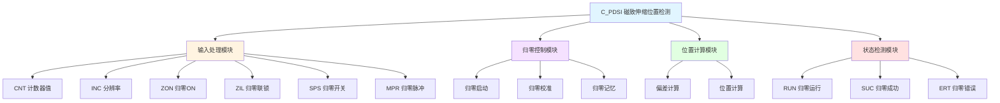

# C_PDSI 功能块分析报告

## 基本信息

| 项目 | 内容 |
|------|------|
| 功能块名称 | C_PDSI |
| 功能描述 | Position Detect and Zeroing by Magnetostrictive Position Sensor（磁致伸缩位置传感器位置检测与归零） |
| 最后修改 | 2015.12.18 |
| 作者 | ShiChunLiang |
| 页数 | 1页（9个程序段） |

## 功能概述

C_PDSI是一个磁致伸缩位置传感器位置检测与归零功能块，用于处理磁致伸缩位置传感器的信号，实现位置检测和自动归零功能。

### 应用场景
- **液压缸位置检测**：检测液压缸的活塞位置
- **阀门位置控制**：检测调节阀的开度位置
- **线性位置测量**：测量直线运动部件的位置
- **自动归零**：实现传感器的自动校零

### 功能特点
1. **位置检测**：检测磁致伸缩传感器的位置信号
2. **自动归零**：支持自动归零功能
3. **归零记忆**：记忆归零参数
4. **偏差计算**：计算计数器偏差
5. **状态检测**：检测归零状态

## 思维导图

## 流程路径描述

### 归零流程：
开始 → 归零启动 → 归零校准 → 计数器设置 → 归零成功
**功能**: 执行传感器归零操作

### 位置计算流程：
开始 → 读取计数器 → 计算偏差 → 计算位置 → 输出位置
**功能**: 计算当前位置值

## 逐帧功能分析

### Rung 1: 归零记忆回读

**功能描述**: 回读归零记忆参数

**输入条件**:
| 信号名称 | 信号描述 | 信号类型 |
|----------|----------|----------|
| SMI | 归零记忆输入 | BOOL |
| CMI | 计数器记忆输入 | DINT |
| DMI | 数据记忆输入 | REAL |

**输出功能**:
| 信号名称 | 信号描述 | 信号类型 |
|----------|----------|----------|
| SMO | 归零记忆输出 | BOOL |
| CMO | 计数器记忆输出 | DINT |
| DMO | 数据记忆输出 | REAL |

**触发逻辑**:
- SMO = SMI
- CMO = CMI
- DMO = DMI

**功能实现**: 
使用MOVE指令将记忆值传递到输出。

### Rung 2: 归零启动

**功能描述**: 启动归零操作

**输入条件**:
| 信号名称 | 信号描述 | 信号类型 | 触发值 |
|----------|----------|----------|--------|
| ZON | 归零ON | BOOL | TRUE |
| ZIL | 归零联锁 | BOOL | TRUE |
| SPS | 归零开关 | BOOL | TRUE |
| MPR | 归零脉冲 | BOOL | TRUE |

**输出功能**:
| 信号名称 | 信号描述 | 信号类型 |
|----------|----------|----------|
| ZeOnPls | 归零ON脉冲 | BOOL |
| ZeSttPls | 归零启动脉冲 | BOOL |

**触发逻辑**:
- 使用C_RTRIG检测ZON上升沿
- ZeOnPls = ZON上升沿 AND ZIL
- ZeSttPls = ZeOnPls AND SPS AND MPR

### Rung 3: 归零校准

**功能描述**: 执行归零校准操作

**输入条件**:
| 信号名称 | 信号描述 | 信号类型 | 触发值 |
|----------|----------|----------|--------|
| ZeSttPls | 归零启动脉冲 | BOOL | TRUE |
| ZCT | 归零计数器 | DINT | 数值 |
| INC | 分辨率 | REAL | 设定值 |
| SET | 设定值 | REAL | 设定值 |

**输出功能**:
| 信号名称 | 信号描述 | 信号类型 |
|----------|----------|----------|
| CMO | 计数器记忆输出 | DINT |
| ZSK | 归零偏差 | REAL |
| DMO | 数据记忆输出 | REAL |

**触发逻辑**:
- CMO = ZCT
- ZSK = ZCT × INC
- DMO = SET

**功能实现**: 
1. 使用MOVE_DINT保存归零计数器值
2. 使用DINT_TO_REAL和MUL_REAL计算归零偏差
3. 使用MOVE_REAL保存设定值

### Rung 4: 计数器偏差计算

**功能描述**: 计算当前计数器与归零点的偏差

**输入条件**:
| 信号名称 | 信号描述 | 信号类型 | 触发值 |
|----------|----------|----------|--------|
| CNT | 当前计数器值 | DINT | 数值 |
| CMO | 归零计数器值 | DINT | 数值 |

**输出功能**:
| 信号名称 | 信号描述 | 信号类型 |
|----------|----------|----------|
| DEV | 偏差值 | DINT |

**触发逻辑**:
- DEV = CNT - CMO

**功能实现**: 
使用SUB_DINT计算当前计数器与归零点的偏差。

### Rung 5: 当前位置计算

**功能描述**: 计算当前位置值

**输入条件**:
| 信号名称 | 信号描述 | 信号类型 | 触发值 |
|----------|----------|----------|--------|
| DEV | 偏差值 | DINT | 数值 |
| INC | 分辨率 | REAL | 设定值 |
| DMO | 数据记忆 | REAL | 数值 |

**输出功能**:
| 信号名称 | 信号描述 | 信号类型 |
|----------|----------|----------|
| POS | 当前位置 | REAL |

**触发逻辑**:
- POS = DEV × INC + DMO

**功能实现**: 
1. 使用DINT_TO_REAL将DEV转换为实数
2. 使用MUL_REAL乘以分辨率
3. 使用ADD_REAL加上数据记忆值

### Rung 6: 归零运行检测

**功能描述**: 检测归零运行状态

**输入条件**:
| 信号名称 | 信号描述 | 信号类型 | 触发值 |
|----------|----------|----------|--------|
| ZeSttPls | 归零启动脉冲 | BOOL | TRUE |
| SCN | 扫描次数 | INT | 数值 |

**输出功能**:
| 信号名称 | 信号描述 | 信号类型 |
|----------|----------|----------|
| RUN | 归零运行 | BOOL |

**触发逻辑**:
- 使用C_OFDT延时3000个扫描周期

**功能实现**: 
调用C_OFDT功能块，归零启动后延时3秒复位RUN。

### Rung 7: 归零成功检测

**功能描述**: 检测归零是否成功

**输入条件**:
| 信号名称 | 信号描述 | 信号类型 | 触发值 |
|----------|----------|----------|--------|
| ZeOnPls | 归零ON脉冲 | BOOL | TRUE |
| MPR | 归零脉冲 | BOOL | TRUE |
| SPS | 归零开关 | BOOL | TRUE |
| SMO | 归零记忆 | BOOL | TRUE |

**输出功能**:
| 信号名称 | 信号描述 | 信号类型 |
|----------|----------|----------|
| SMO | 归零记忆输出 | BOOL |
| SUC | 归零成功 | BOOL |

**触发逻辑**:
- SMO = ZeOnPls AND MPR AND SPS（自保持）
- SUC = SMO AND MPR AND SPS

### Rung 8: 归零成功计时

**功能描述**: 归零成功后的计时

**输入条件**:
| 信号名称 | 信号描述 | 信号类型 | 触发值 |
|----------|----------|----------|--------|
| RUN | 归零运行 | BOOL | FALSE |
| SUC | 归零成功 | BOOL | TRUE |

**输出功能**:
| 信号名称 | 信号描述 | 信号类型 |
|----------|----------|----------|
| SUT | 成功计时 | BOOL |

**触发逻辑**:
- SUT = NOT RUN AND SUC

### Rung 9: 归零错误检测

**功能描述**: 检测归零是否错误

**输入条件**:
| 信号名称 | 信号描述 | 信号类型 | 触发值 |
|----------|----------|----------|--------|
| RUN | 归零运行 | BOOL | FALSE |
| SUT | 成功计时 | BOOL | FALSE |

**输出功能**:
| 信号名称 | 信号描述 | 信号类型 |
|----------|----------|----------|
| ERT | 错误计时 | BOOL |

**触发逻辑**:
- ERT = NOT RUN AND NOT SUT

## 触发条件总结

### 归零启动条件
- **ZON上升沿**: 归零ON信号上升沿
- **ZIL = TRUE**: 归零联锁正常
- **SPS = TRUE**: 归零开关正常
- **MPR = TRUE**: 归零脉冲正常

### 归零成功条件
- **SMO = TRUE**: 归零记忆有效
- **MPR = TRUE**: 归零脉冲正常
- **SPS = TRUE**: 归零开关正常

### 归零错误条件
- **RUN = FALSE**: 归零运行结束
- **SUT = FALSE**: 成功计时无效

## 实现功能总结

### 主要功能
1. **位置检测**: 检测磁致伸缩传感器的位置信号
2. **自动归零**: 支持自动归零功能
3. **归零记忆**: 记忆归零参数
4. **偏差计算**: 计算当前位置与归零点的偏差
5. **状态检测**: 检测归零成功/失败状态

### 计算公式
| 参数 | 公式 | 说明 |
|------|------|------|
| DEV | CNT - CMO | 计数器偏差 |
| POS | DEV × INC + DMO | 当前位置 |

## 关键信号说明

| 信号名称 | 信号描述 | 信号类型 | 用途 |
|----------|----------|----------|------|
| CNT | 计数器值 | DINT | 传感器计数器输入 |
| INC | 分辨率 | REAL | 传感器分辨率 |
| ZON | 归零ON | BOOL | 归零启动信号 |
| ZIL | 归零联锁 | BOOL | 归零联锁信号 |
| SPS | 归零开关 | BOOL | 归零开关信号 |
| MPR | 归零脉冲 | BOOL | 归零脉冲信号 |
| POS | 当前位置 | REAL | 位置输出 |
| RUN | 归零运行 | BOOL | 归零运行状态 |
| SUC | 归零成功 | BOOL | 成功状态 |
| ERT | 归零错误 | BOOL | 错误状态 |

## 调试技巧

### 调试步骤
1. 检查CNT计数器输入是否正常
2. 验证INC分辨率设置是否正确
3. 测试归零功能是否正常
4. 检查位置输出是否准确

### 常见问题
1. **归零不成功**: 检查ZIL、SPS、MPR信号
2. **位置不准确**: 检查INC分辨率设置
3. **归零超时**: 检查归零开关和脉冲信号

### 监控信号列表
- CNT（计数器值）
- POS（当前位置）
- RUN（归零运行）
- SUC（归零成功）
- ERT（归零错误）
