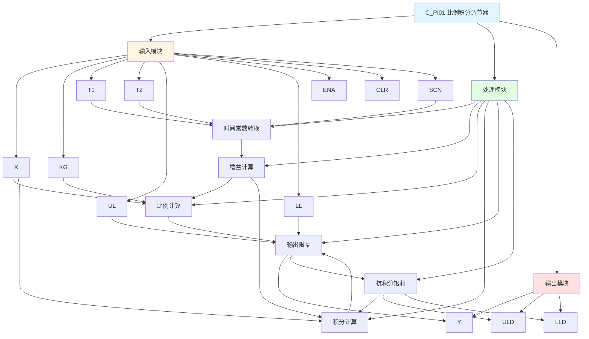

# C_PI01 功能块分析报告

## 基本信息

| 项目 | 内容 |
|------|------|
| 功能块名称 | C_PI01 |
| 功能描述 | Proportional & Integral Regulator（比例积分调节器） |
| 最后修改 | 2015.12.16 |
| 作者 | Shi Chun Liang |
| 页数 | 1页 |

## 功能概述

C_PI01 是一个比例积分调节器功能块，用于实现PI控制算法。该功能块根据输入偏差和时间常数，计算比例和积分输出，并支持输出限幅和抗积分饱和功能。

## 思维导图

## 流程路径描述

### PI计算路径：
开始 → 时间常数转换 → 增益计算 → 比例计算 + 积分计算 → 输出限幅 → 输出Y
**功能**: 实现PI控制算法

### 抗积分饱和路径：
开始 → 输出达到限幅 → 停止积分 → 防止饱和
**功能**: 防止积分饱和

## 逐帧功能分析

### Rung 7: 时间常数转换

**功能描述**: 将扫描时间和时间常数转换为实际值

**输入条件**:
| 信号名称 | 信号描述 | 信号类型 | 触发值 |
|----------|----------|----------|--------|
| SCN | 扫描时间 | INT | 设定值 |
| T1 | 时间常数1 | DINT | 设定值 |
| T2 | 时间常数2 | DINT | 设定值 |

**输出功能**:
| 信号名称 | 信号描述 | 信号类型 |
|----------|----------|----------|
| Ts | 扫描周期 | REAL |
| TmConst1 | 时间常数1 | REAL |
| TmConst2 | 时间常数2 | REAL |

**触发逻辑**:
- Ts = SCN / 1000.0 (限制在0.001~0.15之间)
- TmConst1 = T1 / 1000.0
- TmConst2 = T2 / 1000.0

**功能实现**: 
将整数扫描时间和时间常数转换为实数值，并对扫描周期进行限幅。

### Rung 8: 使能检测

**功能描述**: 检测使能信号

**输入条件**:
| 信号名称 | 信号描述 | 信号类型 | 触发值 |
|----------|----------|----------|--------|
| ENA | 使能信号 | BOOL | TRUE/FALSE |

**输出功能**:
| 信号名称 | 信号描述 | 信号类型 |
|----------|----------|----------|
| 跳转标志 | - | BOOL |

**触发逻辑**:
- IF ENA = FALSE THEN 跳转到DisEnd

**功能实现**: 
当使能信号为FALSE时，跳过PI计算，直接跳转到结束处理。

### Rung 9: 增益计算

**功能描述**: 计算比例增益和积分增益

**输入条件**:
| 信号名称 | 信号描述 | 信号类型 | 触发值 |
|----------|----------|----------|--------|
| TmConst1 | 时间常数1 | REAL | 数值 |
| TmConst2 | 时间常数2 | REAL | 数值 |

**输出功能**:
| 信号名称 | 信号描述 | 信号类型 |
|----------|----------|----------|
| Kp | 比例增益 | REAL |
| Ki | 积分增益 | REAL |

**触发逻辑**:
- IF TmConst1 = 0 THEN Kp = TmConst2, Ki = 0
- ELSE Kp = TmConst2 / TmConst1, Ki = 1.0 / TmConst1

**功能实现**: 
根据时间常数计算比例增益和积分增益。

### Rung 10: 比例计算

**功能描述**: 计算比例输出

**输入条件**:
| 信号名称 | 信号描述 | 信号类型 | 触发值 |
|----------|----------|----------|--------|
| X | 输入偏差 | REAL | 数值 |
| KG | 增益系数 | REAL | 设定值 |
| Kp | 比例增益 | REAL | 计算值 |

**输出功能**:
| 信号名称 | 信号描述 | 信号类型 |
|----------|----------|----------|
| PropTem | 比例输出 | REAL |

**触发逻辑**:
- PropTem = X * KG * Kp

**功能实现**: 
计算比例输出。

### Rung 11: 积分计算

**功能描述**: 计算积分输出

**输入条件**:
| 信号名称 | 信号描述 | 信号类型 | 触发值 |
|----------|----------|----------|--------|
| X | 输入偏差 | REAL | 数值 |
| KG | 增益系数 | REAL | 设定值 |
| Ki | 积分增益 | REAL | 计算值 |
| Ts | 扫描周期 | REAL | 计算值 |
| LMD | 抗积分饱和标志 | BOOL | TRUE/FALSE |

**输出功能**:
| 信号名称 | 信号描述 | 信号类型 |
|----------|----------|----------|
| IntTem | 积分输出 | REAL |

**触发逻辑**:
- IF LMD = FALSE THEN IntTem = IntTem + X * KG * Ki * Ts

**功能实现**: 
计算积分输出，当抗积分饱和标志有效时停止积分。

### Rung 12: 输出计算

**功能描述**: 计算最终输出

**输入条件**:
| 信号名称 | 信号描述 | 信号类型 | 触发值 |
|----------|----------|----------|--------|
| PropTem | 比例输出 | REAL | 计算值 |
| IntTem | 积分输出 | REAL | 计算值 |
| UL | 输出上限 | REAL | 设定值 |
| LL | 输出下限 | REAL | 设定值 |

**输出功能**:
| 信号名称 | 信号描述 | 信号类型 |
|----------|----------|----------|
| Y | 输出 | REAL |

**触发逻辑**:
- Y = LIMIT(PropTem + IntTem, LL, UL)

**功能实现**: 
将比例输出和积分输出相加，并进行限幅处理。

### Rung 13: 清零处理

**功能描述**: 清零PI调节器

**输入条件**:
| 信号名称 | 信号描述 | 信号类型 | 触发值 |
|----------|----------|----------|--------|
| CLR | 清零信号 | BOOL | TRUE |

**输出功能**:
| 信号名称 | 信号描述 | 信号类型 |
|----------|----------|----------|
| IntTem | 积分输出 | REAL |
| PICalRsu | PI计算结果 | REAL |
| Y | 输出 | REAL |

**触发逻辑**:
- IF CLR = TRUE THEN IntTem = 0, PICalRsu = 0, Y = 0

**功能实现**: 
当清零信号有效时，将所有输出清零。

### Rung 14-15: 输出限幅检测

**功能描述**: 检测输出是否达到限幅

**输入条件**:
| 信号名称 | 信号描述 | 信号类型 | 触发值 |
|----------|----------|----------|--------|
| PICalRsu | PI计算结果 | REAL | 计算值 |
| UL | 输出上限 | REAL | 设定值 |
| LL | 输出下限 | REAL | 设定值 |
| KpNotZe | 比例增益非零 | BOOL | TRUE |

**输出功能**:
| 信号名称 | 信号描述 | 信号类型 |
|----------|----------|----------|
| ULD | 上限检测 | BOOL |
| LLD | 下限检测 | BOOL |
| LMD | 抗积分饱和标志 | BOOL |

**触发逻辑**:
- IF PICalRsu >= UL THEN ULD = TRUE
- IF PICalRsu <= LL THEN LLD = TRUE
- IF ULD = TRUE AND KpNotZe = TRUE THEN LMD = TRUE
- IF LLD = TRUE THEN LMD = TRUE

**功能实现**: 
检测输出是否达到限幅，产生抗积分饱和标志。

## 触发条件总结

### 控制条件
- **使能条件**: ENA = TRUE
- **清零条件**: CLR = TRUE

### 计算条件
- **比例计算**: Kp != 0
- **积分计算**: LMD = FALSE

## 实现功能总结

### 主要功能
1. **比例计算**: 计算比例输出
2. **积分计算**: 计算积分输出
3. **输出限幅**: 限制输出范围
4. **抗积分饱和**: 防止积分饱和

## 关键信号说明

| 信号名称 | 信号描述 | 信号类型 | 用途 |
|----------|----------|----------|------|
| X | 输入偏差 | REAL | 控制偏差输入 |
| KG | 增益系数 | REAL | 增益调整 |
| T1 | 时间常数1 | DINT | 比例时间常数 |
| T2 | 时间常数2 | DINT | 积分时间常数 |
| UL | 输出上限 | REAL | 输出上限设定 |
| LL | 输出下限 | REAL | 输出下限设定 |
| ENA | 使能信号 | BOOL | 使能控制 |
| CLR | 清零信号 | BOOL | 清零控制 |
| Y | 输出 | REAL | PI输出 |
| ULD | 上限检测 | BOOL | 上限检测 |
| LLD | 下限检测 | BOOL | 下限检测 |

## 调试技巧

### 调试步骤
1. 检查X值，确认输入偏差正常
2. 检查KG、T1、T2值，确认增益和时间常数设置
3. 检查UL、LL值，确认输出限幅设置
4. 监控Y值，观察PI输出
5. 监控ULD、LLD信号，确认限幅状态

### 常见问题
1. **输出不稳定**: 检查增益和时间常数设置
2. **输出饱和**: 检查UL、LL值设置和抗积分饱和功能
3. **输出为0**: 检查ENA和CLR信号

### 监控信号列表
- X（输入偏差）
- Y（输出）
- ULD、LLD（限幅检测）
- ENA、CLR（控制信号）
