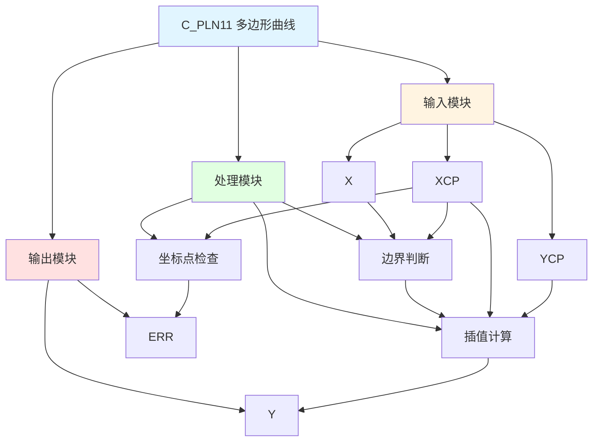

# C_PLN11 功能块分析报告

## 基本信息

| 项目 | 内容 |
|------|------|
| 功能块名称 | C_PLN11 |
| 功能描述 | Polygon Curve(11 Coordinate Points)（多边形曲线，11个坐标点） |
| 最后修改 | 2016.03.14 |
| 作者 | Shi Chun Liang |
| 页数 | 1页 |

## 功能概述

C_PLN11 是一个多边形曲线功能块，用于根据11个坐标点进行线性插值计算。该功能块检查X坐标点是否单调递增，并根据输入X值在坐标点之间进行线性插值。

## 思维导图

## 流程路径描述

### 坐标点检查路径：
开始 → 检查X坐标点单调递增 → ERR输出
**功能**: 验证坐标点有效性

### 插值计算路径：
开始 → X输入 → 边界判断 → 插值计算 → Y输出
**功能**: 计算插值结果

## 逐帧功能分析

### 坐标点检查

**功能描述**: 检查X坐标点是否单调递增

**输入条件**:
| 信号名称 | 信号描述 | 信号类型 | 触发值 |
|----------|----------|----------|--------|
| XCP | X坐标点数组 | REAL | 11个点 |

**输出功能**:
| 信号名称 | 信号描述 | 信号类型 |
|----------|----------|----------|
| ERR | 错误标志 | BOOL |

**触发逻辑**:
- IF XCP[i] >= XCP[i+1] FOR ANY i THEN ERR = TRUE

**功能实现**: 
遍历所有X坐标点，检查是否单调递增。如果发现任何相邻两点不满足单调递增，则设置错误标志。

### 边界判断与插值计算

**功能描述**: 根据输入X值进行边界判断和插值计算

**输入条件**:
| 信号名称 | 信号描述 | 信号类型 | 触发值 |
|----------|----------|----------|--------|
| X | 输入值 | REAL | 数值 |
| XCP | X坐标点数组 | REAL | 11个点 |
| YCP | Y坐标点数组 | REAL | 11个点 |
| ERR | 错误标志 | BOOL | FALSE |

**输出功能**:
| 信号名称 | 信号描述 | 信号类型 |
|----------|----------|----------|
| Y | 输出值 | REAL |

**触发逻辑**:
- IF X <= XCP[0] THEN Y = YCP[0]
- IF X >= XCP[10] THEN Y = YCP[10]
- IF XCP[i] <= X <= XCP[i+1] THEN Y = YCP[i] + (X - XCP[i]) * ((YCP[i+1] - YCP[i]) / (XCP[i+1] - XCP[i]))

**功能实现**: 
首先判断X值是否在边界外，如果在边界外则输出边界值。如果在边界内，则找到X所在的区间，使用线性插值公式计算Y值。

## 触发条件总结

### 计算条件
- **坐标点有效**: X坐标点单调递增
- **边界外**: X <= XCP[0] OR X >= XCP[10]
- **边界内**: XCP[i] <= X <= XCP[i+1]

## 实现功能总结

### 主要功能
1. **坐标点检查**: 检查X坐标点是否单调递增
2. **边界判断**: 判断输入值是否在边界外
3. **线性插值**: 在坐标点之间进行线性插值

## 关键信号说明

| 信号名称 | 信号描述 | 信号类型 | 用途 |
|----------|----------|----------|------|
| X | 输入值 | REAL | 输入X值 |
| XCP | X坐标点数组 | REAL | X坐标点 |
| YCP | Y坐标点数组 | REAL | Y坐标点 |
| Y | 输出值 | REAL | 插值输出 |
| ERR | 错误标志 | BOOL | 坐标点错误标志 |

## 调试技巧

### 调试步骤
1. 检查XCP数组，确认X坐标点单调递增
2. 检查ERR标志，确认坐标点有效
3. 检查X值，确认输入正常
4. 监控Y值，观察插值结果

### 常见问题
1. **ERR标志常亮**: 检查XCP数组是否单调递增
2. **插值结果不正确**: 检查X值和坐标点设置

### 监控信号列表
- X（输入值）
- XCP、YCP（坐标点）
- Y（输出）
- ERR（错误标志）
