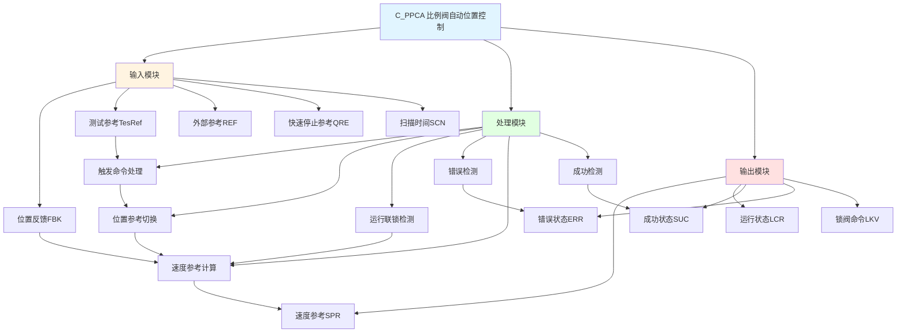

# C_PPCA 功能块分析报告

## 基本信息

| 项目 | 内容 |
|------|------|
| 功能块名称 | C_PPCA |
| 功能描述 | Proportional Valve Automatic Position Control(PPC)（比例阀自动位置控制） |
| 最后修改 | 2015.12.02 |
| 作者 | Shi Chun Liang |
| 页数 | 多页 |

## 功能概述

C_PPCA 是一个比例阀自动位置控制功能块，用于实现比例阀的自动位置控制。该功能块集成了测试模式、快速停止模式、手动干预后自动触发、位置参考切换、运行联锁、错误检测、速度参考计算等功能，是一个复杂的闭环位置控制器。

**主要应用场景**：
- 液压比例阀位置控制
- 伺服阀位置控制
- 需要精确位置控制的执行机构

## 思维导图

## 流程路径描述

### 触发命令路径：
开始 → 测试命令/快速停止/外部触发/手动干预 → 位置参考切换 → PPcPad信号
**功能**: 处理各种触发命令并切换位置参考

### 运行控制路径：
开始 → PPcPad AND PPcRIL → PPcRun → 速度参考输出
**功能**: 控制PPC运行状态

### 错误检测路径：
开始 → 超时/位置值错误/位置偏差错误/停滞错误 → ERR输出
**功能**: 检测各种错误状态

### 成功检测路径：
开始 → 位置偏差 <= 成功精度范围 → 延时确认 → SUC输出
**功能**: 检测位置控制成功状态

## 逐帧功能分析

### Rung 7: 扫描时间转换

**功能描述**: 将扫描时间转换为实际值并进行限幅

**输入条件**:
| 信号名称 | 信号描述 | 信号类型 | 触发值 |
|----------|----------|----------|--------|
| SCN | 扫描时间 | INT | 设定值 |

**输出功能**:
| 信号名称 | 信号描述 | 信号类型 |
|----------|----------|----------|
| Ts | 扫描周期 | REAL |

**触发逻辑**:
- Ts = LIMIT(SCN / 1000.0, 0.001, 0.15)

**功能实现**: 
将整数扫描时间转换为实数值，并限制在0.001~0.15秒范围内。

### Rung 8-9: 测试触发命令

**功能描述**: 检测测试命令的上升沿

**输入条件**:
| 信号名称 | 信号描述 | 信号类型 | 触发值 |
|----------|----------|----------|--------|
| TesCmd | 测试命令 | BOOL | 上升沿 |

**输出功能**:
| 信号名称 | 信号描述 | 信号类型 |
|----------|----------|----------|
| TesPad | 测试触发 | BOOL |

**触发逻辑**:
- TesPad = TesCmd上升沿

**功能实现**: 
使用R_TRIG上升沿检测功能块检测测试命令的上升沿，产生测试触发信号。

### Rung 10-11: 快速停止触发命令

**功能描述**: 检测快速停止命令的上升沿

**输入条件**:
| 信号名称 | 信号描述 | 信号类型 | 触发值 |
|----------|----------|----------|--------|
| QST | 快速停止命令 | BOOL | 上升沿 |

**输出功能**:
| 信号名称 | 信号描述 | 信号类型 |
|----------|----------|----------|
| QStpPad | 快速停止触发 | BOOL |

**触发逻辑**:
- QStpPad = QST上升沿

**功能实现**: 
使用R_TRIG上升沿检测功能块检测快速停止命令的上升沿，产生快速停止触发信号。

### Rung 12: 外部触发命令

**功能描述**: 处理外部触发命令

**输入条件**:
| 信号名称 | 信号描述 | 信号类型 | 触发值 |
|----------|----------|----------|--------|
| PAD | 外部触发 | BOOL | TRUE |
| QST | 快速停止 | BOOL | FALSE |

**输出功能**:
| 信号名称 | 信号描述 | 信号类型 |
|----------|----------|----------|
| ExtPad | 外部触发有效 | BOOL |

**触发逻辑**:
- IF PAD = TRUE AND QST = FALSE THEN ExtPad = TRUE

**功能实现**: 
当外部触发有效且快速停止无效时，产生外部触发有效信号。

### Rung 13: 手动干预后自动触发

**功能描述**: 检测手动干预后的自动触发

**输入条件**:
| 信号名称 | 信号描述 | 信号类型 | 触发值 |
|----------|----------|----------|--------|
| AUX | 辅助信号 | BOOL | TRUE |
| UDT.MivExeFlg | 手动干预执行标志 | INT | 1 |

**输出功能**:
| 信号名称 | 信号描述 | 信号类型 |
|----------|----------|----------|
| ManPad | 手动触发 | BOOL |

**触发逻辑**:
- IF AUX = TRUE AND UDT.MivExeFlg = 1 THEN ManPad = TRUE (延时1000ms)

**功能实现**: 
使用C_ODT延时功能块，在手动干预后延时1000ms产生手动触发信号。

### Rung 14: 位置参考切换

**功能描述**: 根据触发源切换位置参考

**输入条件**:
| 信号名称 | 信号描述 | 信号类型 | 触发值 |
|----------|----------|----------|--------|
| TesPad | 测试触发 | BOOL | TRUE |
| ManPad | 手动触发 | BOOL | TRUE |
| ExtPad | 外部触发 | BOOL | TRUE |
| QStpPad | 快速停止触发 | BOOL | TRUE |
| TesRef | 测试参考 | REAL | 数值 |
| FBK | 反馈值 | REAL | 数值 |
| REF | 外部参考 | REAL | 数值 |
| QRE | 快速停止参考 | REAL | 数值 |

**输出功能**:
| 信号名称 | 信号描述 | 信号类型 |
|----------|----------|----------|
| PosRef | 位置参考 | REAL |
| PPcPad | PPC触发 | BOOL |

**触发逻辑**:
- IF TesPad THEN PosRef = TesRef
- IF ManPad THEN PosRef = FBK
- IF ExtPad THEN PosRef = REF
- IF QStpPad THEN PosRef = QRE

**功能实现**: 
根据不同的触发源选择相应的位置参考值，实现位置参考的灵活切换。

### Rung 15: 关闭方向检测

**功能描述**: 检测关闭方向

**输入条件**:
| 信号名称 | 信号描述 | 信号类型 | 触发值 |
|----------|----------|----------|--------|
| FBK | 反馈值 | REAL | 数值 |
| PosRef | 位置参考 | REAL | 数值 |

**输出功能**:
| 信号名称 | 信号描述 | 信号类型 |
|----------|----------|----------|
| ClsDirDet | 关闭方向检测 | BOOL |

**触发逻辑**:
- IF FBK >= PosRef THEN ClsDirDet = TRUE

**功能实现**: 
使用GE比较器检测反馈值是否大于等于位置参考，判断是否为关闭方向。

### Rung 16: 运行联锁条件

**功能描述**: 检测PPC运行联锁条件

**输入条件**:
| 信号名称 | 信号描述 | 信号类型 | 触发值 |
|----------|----------|----------|--------|
| CSI | 关闭启动联锁 | BOOL | TRUE/FALSE |
| CRI | 关闭运行联锁 | BOOL | TRUE/FALSE |
| OSI | 打开启动联锁 | BOOL | TRUE/FALSE |
| ORI | 打开运行联锁 | BOOL | TRUE/FALSE |
| AUX | 辅助信号 | BOOL | TRUE |
| ClsDirDet | 关闭方向检测 | BOOL | TRUE/FALSE |
| PPcRun | PPC运行 | BOOL | FALSE |

**输出功能**:
| 信号名称 | 信号描述 | 信号类型 |
|----------|----------|----------|
| PPcRIL | PPC运行联锁 | BOOL |

**触发逻辑**:
- 关闭方向: CSI AND CRI AND AUX AND ClsDirDet
- 打开方向: OSI AND ORI AND AUX AND NOT ClsDirDet
- PPcRIL = (关闭条件 OR 打开条件) AND NOT PPcRun

**功能实现**: 
根据方向检测和联锁信号，判断PPC是否允许运行。

### Rung 17: PPC禁止

**功能描述**: 检测PPC禁止条件

**输入条件**:
| 信号名称 | 信号描述 | 信号类型 | 触发值 |
|----------|----------|----------|--------|
| PosRef | 位置参考 | REAL | 数值 |
| FBK | 反馈值 | REAL | 数值 |
| UDT.SucAcrRng | 成功精度范围 | REAL | 设定值 |
| UDT.InhSucRng | 禁止成功范围标志 | INT | 1 |
| PPcRun | PPC运行 | BOOL | FALSE |

**输出功能**:
| 信号名称 | 信号描述 | 信号类型 |
|----------|----------|----------|
| PPcInh | PPC禁止 | BOOL |

**触发逻辑**:
- IF ABS(PosRef - FBK) <= UDT.SucAcrRng AND UDT.InhSucRng = 1 AND NOT PPcRun THEN PPcInh = TRUE

**功能实现**: 
当位置偏差在成功范围内且禁止成功范围标志有效时，禁止PPC启动。

### Rung 18: PPC运行

**功能描述**: 控制PPC运行状态

**输入条件**:
| 信号名称 | 信号描述 | 信号类型 | 触发值 |
|----------|----------|----------|--------|
| PPcPad | PPC触发 | BOOL | TRUE |
| PPcRIL | PPC运行联锁 | BOOL | TRUE |

**输出功能**:
| 信号名称 | 信号描述 | 信号类型 |
|----------|----------|----------|
| PPcRun | PPC运行 | BOOL |

**触发逻辑**:
- IF PPcPad = TRUE AND PPcRIL = TRUE THEN PPcRun = TRUE (自锁)

**功能实现**: 
当触发有效且联锁条件满足时，启动PPC运行并自锁。

### Rung 19-24: 预处理模式

**功能描述**: 根据控制模式进行预处理

**输入条件**:
| 信号名称 | 信号描述 | 信号类型 | 触发值 |
|----------|----------|----------|--------|
| UDT.CtsCtlSel | 连续控制选择 | INT | 0/1 |
| UDT.MivExeFlg | 手动干预执行标志 | INT | 1 |
| UDT.LckValUse | 锁阀使用标志 | INT | 1 |

**输出功能**:
| 信号名称 | 信号描述 | 信号类型 |
|----------|----------|----------|
| IRN | 正常积分参考 | REAL |
| IRV | 振动积分参考 | REAL |
| SRP | 速率限制位置 | REAL |

**触发逻辑**:
- 模式0(非连续控制): IRN = 0, IRV = 0, SRP = 速率限制后的FBK
- 模式1(连续控制): 根据IntClrInh标志处理积分清零

**功能实现**: 
根据控制模式选择预处理方式，为后续速度参考计算做准备。

### Rung 25-28: 超时错误检测

**功能描述**: 检测PPC超时错误

**输入条件**:
| 信号名称 | 信号描述 | 信号类型 | 触发值 |
|----------|----------|----------|--------|
| PPcRun | PPC运行 | BOOL | TRUE |
| ExeFlg | 执行标志 | BOOL | FALSE |
| PPcPad | PPC触发 | BOOL | FALSE |
| UDT.ErrDtTm[0] | 错误延时时间0 | DINT | 设定值 |
| SCN | 扫描时间 | INT | 设定值 |

**输出功能**:
| 信号名称 | 信号描述 | 信号类型 |
|----------|----------|----------|
| OvtErr | 超时错误 | BOOL |

**触发逻辑**:
- IF PPcRun = TRUE AND ExeFlg = FALSE AND NOT PPcPad AND 延时到达 THEN OvtErr = TRUE

**功能实现**: 
使用C_ODT延时功能块检测PPC运行超时错误。

### Rung 29-31: 位置值错误检测

**功能描述**: 检测PPC位置值错误

**输入条件**:
| 信号名称 | 信号描述 | 信号类型 | 触发值 |
|----------|----------|----------|--------|
| FBK | 反馈值 | REAL | 数值 |
| UDT.MinStkSet | 最小行程设定 | REAL | 设定值 |
| UDT.MaxStkSet | 最大行程设定 | REAL | 设定值 |
| PPcRun | PPC运行 | BOOL | TRUE |

**输出功能**:
| 信号名称 | 信号描述 | 信号类型 |
|----------|----------|----------|
| PsvErr | 位置值错误 | BOOL |
| PsvErrCont | 位置值错误持续 | BOOL |

**触发逻辑**:
- IF FBK < UDT.MinStkSet OR FBK > UDT.MaxStkSet THEN PsvErr = TRUE
- IF PsvErr延时到达 THEN PsvErrCont = TRUE

**功能实现**: 
检测反馈值是否在有效范围内，超出范围则产生位置值错误。

### Rung 32-34: 位置偏差错误检测

**功能描述**: 检测PPC位置偏差错误

**输入条件**:
| 信号名称 | 信号描述 | 信号类型 | 触发值 |
|----------|----------|----------|--------|
| FBK | 反馈值 | REAL | 数值 |
| PosFbkPrv | 上次反馈值 | REAL | 数值 |
| Ts | 扫描周期 | REAL | 计算值 |
| UDT.TraMaxDev | 跟踪最大偏差 | REAL | 设定值 |
| PPcRun | PPC运行 | BOOL | TRUE |

**输出功能**:
| 信号名称 | 信号描述 | 信号类型 |
|----------|----------|----------|
| PdvErr | 位置偏差错误 | BOOL |
| PdvErrCont | 位置偏差错误持续 | BOOL |

**触发逻辑**:
- AbsSpdDet = ABS(FBK - PosFbkPrv) / Ts
- IF AbsSpdDet > UDT.TraMaxDev THEN PdvErr = TRUE
- IF PdvErr延时到达 THEN PdvErrCont = TRUE

**功能实现**: 
计算反馈值的变化速度，检测是否超过最大跟踪偏差。

### Rung 35-36: 停滞错误检测

**功能描述**: 检测PPC停滞错误

**输入条件**:
| 信号名称 | 信号描述 | 信号类型 | 触发值 |
|----------|----------|----------|--------|
| SPR | 速度参考 | REAL | 数值 |
| AbsSpdDet | 绝对速度检测 | REAL | 计算值 |
| UDT.StaDetSpd | 停滞检测速度 | REAL | 设定值 |
| UDT.StaDetRat | 停滞检测比率 | REAL | 设定值 |
| UDT.ErrDtTm[3] | 错误延时时间3 | DINT | 设定值 |

**输出功能**:
| 信号名称 | 信号描述 | 信号类型 |
|----------|----------|----------|
| StaErr | 停滞错误 | BOOL |
| StaErrCont | 停滞错误持续 | BOOL |

**触发逻辑**:
- IF ABS(SPR) < UDT.StaDetSpd THEN StaErr = TRUE
- IF AbsSpdDet < ABS(SPR) * UDT.StaDetRat AND StaErr AND 延时到达 THEN StaErrCont = TRUE

**功能实现**: 
检测速度参考较大但实际速度较小的情况，判断是否停滞。

### Rung 37: OK状态检测

**功能描述**: 检测PPC OK状态

**输入条件**:
| 信号名称 | 信号描述 | 信号类型 | 触发值 |
|----------|----------|----------|--------|
| OvtErr | 超时错误 | BOOL | FALSE |
| PsvErr | 位置值错误 | BOOL | FALSE |
| PdvErr | 位置偏差错误 | BOOL | FALSE |
| StaErrCont | 停滞错误持续 | BOOL | FALSE |

**输出功能**:
| 信号名称 | 信号描述 | 信号类型 |
|----------|----------|----------|
| PPcOK | PPC OK | BOOL |

**触发逻辑**:
- IF NOT OvtErr AND NOT PsvErr AND NOT PdvErr AND NOT StaErrCont THEN PPcOK = TRUE

**功能实现**: 
当所有错误都无效时，输出PPC OK状态。

### Rung 38: 位置偏差计算

**功能描述**: 计算位置偏差

**输入条件**:
| 信号名称 | 信号描述 | 信号类型 | 触发值 |
|----------|----------|----------|--------|
| PosRef | 位置参考 | REAL | 数值 |
| FBK | 反馈值 | REAL | 数值 |
| PPcOK | PPC OK | BOOL | TRUE |

**输出功能**:
| 信号名称 | 信号描述 | 信号类型 |
|----------|----------|----------|
| PosDev | 位置偏差 | REAL |

**触发逻辑**:
- IF PPcOK THEN PosDev = PosRef - FBK

**功能实现**: 
计算位置参考与反馈值的偏差，用于速度参考计算。

### Rung 39-40: 成功状态检测

**功能描述**: 检测PPC成功状态

**输入条件**:
| 信号名称 | 信号描述 | 信号类型 | 触发值 |
|----------|----------|----------|--------|
| PosRef | 位置参考 | REAL | 数值 |
| FBK | 反馈值 | REAL | 数值 |
| UDT.SucAcrRng | 成功精度范围 | REAL | 设定值 |
| UDT.SucDetTm | 成功检测时间 | DINT | 设定值 |
| ExeFlg | 执行标志 | BOOL | FALSE |
| PPcRun | PPC运行 | BOOL | TRUE |

**输出功能**:
| 信号名称 | 信号描述 | 信号类型 |
|----------|----------|----------|
| PPcFsh | PPC完成 | BOOL |
| PPcSuc | PPC成功 | BOOL |

**触发逻辑**:
- IF ABS(PosRef - FBK) <= UDT.SucAcrRng AND NOT ExeFlg THEN PPcFsh = TRUE
- IF PPcFsh AND PPcRun AND 延时到达 THEN PPcSuc = TRUE

**功能实现**: 
当位置偏差在成功精度范围内并持续一定时间后，输出成功状态。

### Rung 41: 运行状态复位

**功能描述**: 错误或完成时复位运行状态

**输入条件**:
| 信号名称 | 信号描述 | 信号类型 | 触发值 |
|----------|----------|----------|--------|
| OvtErr | 超时错误 | BOOL | TRUE |
| PsvErrCont | 位置值错误持续 | BOOL | TRUE |
| PdvErrCont | 位置偏差错误持续 | BOOL | TRUE |
| StaErrCont | 停滞错误持续 | BOOL | TRUE |
| PPcSuc | PPC成功 | BOOL | TRUE |

**输出功能**:
| 信号名称 | 信号描述 | 信号类型 |
|----------|----------|----------|
| PPcRun | PPC运行 | BOOL |

**触发逻辑**:
- IF OvtErr OR PsvErrCont OR PdvErrCont OR StaErrCont OR PPcSuc THEN PPcRun = FALSE

**功能实现**: 
当发生错误或成功完成时，复位PPC运行状态。

### Rung 42-58: 速度参考计算

**功能描述**: 计算最终速度参考

**输入条件**:
| 信号名称 | 信号描述 | 信号类型 | 触发值 |
|----------|----------|----------|--------|
| PosDev | 位置偏差 | REAL | 数值 |
| UDT.PropGnNor | 正常比例增益 | REAL | 设定值 |
| UDT.IntGnNor | 正常积分增益 | REAL | 设定值 |
| UDT.SpdRefUlv | 速度参考上限 | REAL | 设定值 |
| UDT.SpdRefLlv | 速度参考下限 | REAL | 设定值 |
| SRV | 振动速度参考 | REAL | 计算值 |
| IRH | 滞后积分参考 | REAL | 计算值 |

**输出功能**:
| 信号名称 | 信号描述 | 信号类型 |
|----------|----------|----------|
| SPR | 速度参考 | REAL |
| SRN | 正常速度参考 | REAL |
| SRV | 振动速度参考 | REAL |

**触发逻辑**:
- PRN = PosDev * UDT.PropGnNor (比例参考)
- IRN = IRN + PosDev * UDT.IntGnNor * Ts (积分参考)
- SRN = LIMIT(PRN + IRN, UDT.SpdRefLlv, UDT.SpdRefUlv)
- SPR = SRN * UDT.AntGnVib + SRV + IRH

**功能实现**: 
通过比例积分算法计算速度参考，并叠加振动控制和滞后补偿。

## 触发条件总结

### 控制条件
- **测试触发**: TesCmd上升沿
- **快速停止触发**: QST上升沿
- **外部触发**: PAD = TRUE AND QST = FALSE
- **手动触发**: AUX = TRUE AND UDT.MivExeFlg = 1

### 运行条件
- **运行联锁**: PPcPad = TRUE AND PPcRIL = TRUE
- **速度输出使能**: PPcRun = TRUE AND NOT PPcFsh AND EXV = TRUE

### 错误条件
- **超时错误**: 运行时间超过设定值
- **位置值错误**: FBK超出有效范围
- **位置偏差错误**: 跟踪速度超过最大偏差
- **停滞错误**: 速度参考大但实际速度小

## 实现功能总结

### 主要功能
1. **触发命令处理**: 处理测试、快速停止、外部触发、手动干预等命令
2. **位置参考切换**: 根据触发源切换位置参考
3. **运行联锁检测**: 检测运行联锁条件
4. **错误检测**: 检测超时、位置值、位置偏差、停滞等错误
5. **速度参考计算**: 通过PI算法计算速度参考
6. **成功检测**: 检测位置控制成功状态
7. **振动控制**: 支持振动抑制控制
8. **滞后补偿**: 支持滞后补偿控制

## 关键信号说明

| 信号名称 | 信号描述 | 信号类型 | 用途 |
|----------|----------|----------|------|
| FBK | 反馈值 | REAL | 位置反馈输入 |
| PosRef | 位置参考 | REAL | 位置参考值 |
| PosDev | 位置偏差 | REAL | 位置偏差计算 |
| SPR | 速度参考 | REAL | 最终速度参考输出 |
| PPcRun | PPC运行 | BOOL | PPC运行状态 |
| PPcSuc | PPC成功 | BOOL | PPC成功状态 |
| ERR | 错误 | BOOL | 错误状态 |
| LKV | 锁阀命令 | BOOL | 锁阀输出 |

## 调试技巧

### 调试步骤
1. 检查FBK值，确认位置反馈正常
2. 检查PosRef值，确认位置参考正确
3. 检查联锁信号，确认运行条件满足
4. 监控SPR值，观察速度参考输出
5. 监控错误信号，确认无错误状态

### 常见问题
1. **PPC不运行**: 检查联锁条件和触发信号
2. **位置控制不精确**: 检查增益参数设置
3. **频繁报错**: 检查错误检测参数设置

### 监控信号列表
- FBK、PosRef、PosDev（位置相关）
- SPR、SRN、SRV（速度相关）
- PPcRun、PPcSuc、ERR（状态相关）
- OvtErr、PsvErr、PdvErr、StaErr（错误相关）
