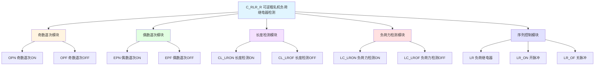

# C_RLR_R 功能块分析报告

## 基本信息

| 项目 | 内容 |
|------|------|
| 功能块名称 | C_RLR_R |
| 功能描述 | Rougher Load Relay Detect (Reversible)（可逆粗轧机负荷继电器检测） |
| 最后修改 | 2017.07.26 Rev.0 |
| 作者 | WangZhaoYang |
| 页数 | 约6页（30+个程序段） |

## 功能概述

C_RLR_R是一个可逆粗轧机负荷继电器检测功能块，用于检测轧机的负荷状态。该功能块支持奇数道次和偶数道次的负荷检测，并通过长度和负荷力两种方式进行负荷继电器的开关检测。

### 应用场景
- **可逆轧机控制**：用于可逆式粗轧机的负荷检测
- **道次跟踪**：跟踪奇数和偶数道次的负荷状态
- **负荷保护**：保护轧机设备免受过载损坏
- **自动化控制**：为轧机自动化控制提供负荷信号

### 功能特点
1. **双向检测**：支持奇数道次和偶数道次的负荷检测
2. **双重检测方式**：通过长度和负荷力两种方式检测
3. **联锁保护**：包含启动联锁和运行联锁
4. **延时滤波**：对负荷信号进行延时滤波处理
5. **状态记忆**：记忆负荷继电器的开关状态

## 思维导图

## 流程路径描述

### 奇数道次ON跟踪路径：
开始 → 检测材料进入 → 启动联锁 → 运行联锁 → 长度计数 → 负荷继电器ON
**功能**: 跟踪奇数道次的负荷继电器ON状态

### 偶数道次ON跟踪路径：
开始 → 检测材料进入 → 启动联锁 → 运行联锁 → 长度计数 → 负荷继电器ON
**功能**: 跟踪偶数道次的负荷继电器ON状态

### 负荷力检测路径：
开始 → 检测总负荷力 → 比较阈值 → 延时滤波 → 输出负荷状态
**功能**: 通过负荷力检测负荷继电器状态

## 逐帧功能分析

### Rung 1-7: 奇数道次ON跟踪

**功能描述**: 跟踪奇数道次的负荷继电器ON状态

**输入条件**:
| 信号名称 | 信号描述 | 信号类型 |
|----------|----------|----------|
| FLG.ED_ME | 材料检测 | BOOL |
| FLG.E_R | E方向反转 | BOOL |
| FLG.M_R | M方向反转 | BOOL |
| UTB.OPN_TUSE | ON跟踪使用 | BOOL |
| OPN_ST | ON启动 | BOOL |

**输出功能**:
| 信号名称 | 信号描述 | 信号类型 |
|----------|----------|----------|
| OPN_RIL | ON运行联锁 | BOOL |
| OPN_SIL | ON启动联锁 | BOOL |
| OPN_RN | ON运行 | BOOL |
| OPN_CNT | ON计数 | REAL |
| OPN_M | ON米数 | REAL |
| OPN_PMT | ON预匹配 | BOOL |
| OPN_LR | ON负荷继电器 | BOOL |

### Rung 8-14: 奇数道次OFF跟踪

**功能描述**: 跟踪奇数道次的负荷继电器OFF状态

**输出功能**:
| 信号名称 | 信号描述 | 信号类型 |
|----------|----------|----------|
| OPF_RIL | OFF运行联锁 | BOOL |
| OPF_SIL | OFF启动联锁 | BOOL |
| OPF_RN | OFF运行 | BOOL |
| OPF_CNT | OFF计数 | REAL |
| OPF_M | OFF米数 | REAL |
| OPF_PMT | OFF预匹配 | BOOL |
| OPF_LR | OFF负荷继电器 | BOOL |

### Rung 15-21: 偶数道次ON跟踪

**功能描述**: 跟踪偶数道次的负荷继电器ON状态

**输出功能**:
| 信号名称 | 信号描述 | 信号类型 |
|----------|----------|----------|
| EPN_RIL | ON运行联锁 | BOOL |
| EPN_SIL | ON启动联锁 | BOOL |
| EPN_RN | ON运行 | BOOL |
| EPN_CNT | ON计数 | REAL |
| EPN_M | ON米数 | REAL |
| EPN_PMT | ON预匹配 | BOOL |
| EPN_LR | ON负荷继电器 | BOOL |

### Rung 22-28: 偶数道次OFF跟踪

**功能描述**: 跟踪偶数道次的负荷继电器OFF状态

**输出功能**:
| 信号名称 | 信号描述 | 信号类型 |
|----------|----------|----------|
| EPF_RIL | OFF运行联锁 | BOOL |
| EPF_SIL | OFF启动联锁 | BOOL |
| EPF_RN | OFF运行 | BOOL |
| EPF_CNT | OFF计数 | REAL |
| EPF_M | OFF米数 | REAL |
| EPF_PMT | OFF预匹配 | BOOL |
| EPF_LR | OFF负荷继电器 | BOOL |

### Rung 29-30: 长度检测

**功能描述**: 通过长度检测负荷继电器状态

**输出功能**:
| 信号名称 | 信号描述 | 信号类型 |
|----------|----------|----------|
| CL_LRON | 长度检测ON | BOOL |
| CL_LROF | 长度检测OFF | BOOL |

### Rung 31-34: 负荷力检测

**功能描述**: 通过负荷力检测负荷继电器状态

**输入条件**:
| 信号名称 | 信号描述 | 信号类型 |
|----------|----------|----------|
| SUM_F | 总负荷力 | REAL |
| TBL.ON_F | ON阈值 | REAL |
| TBL.OF_F | OFF阈值 | REAL |

**输出功能**:
| 信号名称 | 信号描述 | 信号类型 |
|----------|----------|----------|
| LC_LRON | 负荷力检测ON | BOOL |
| LC_LROF | 负荷力检测OFF | BOOL |

### Rung 35-40: 负荷继电器序列控制

**功能描述**: 控制负荷继电器的开关序列

**输出功能**:
| 信号名称 | 信号描述 | 信号类型 |
|----------|----------|----------|
| LR_ON | LR开命令 | BOOL |
| LR_OF | LR关命令 | BOOL |
| LR | 负荷继电器状态 | BOOL |
| LR_M | LR记忆 | BOOL |
| LR_ONP | LR开脉冲 | BOOL |
| LR_OFP | LR关脉冲 | BOOL |
| LR_ONS | LR开单次 | BOOL |
| LR_OFS | LR关单次 | BOOL |

## 触发条件总结

### 道次检测条件
- **奇数道次ON**: FLG.E_F方向，材料进入
- **奇数道次OFF**: FLG.E_F方向，材料离开
- **偶数道次ON**: FLG.D_R方向，材料进入
- **偶数道次OFF**: FLG.D_R方向，材料离开

### 负荷力检测条件
- **ON检测**: SUM_F ≥ TBL.ON_F
- **OFF检测**: SUM_F < TBL.OF_F

### LR输出条件
- **LR ON**: LC_LRON OR CL_LRON
- **LR OFF**: LC_LROF OR CL_LROF

## 实现功能总结

### 主要功能
1. **道次跟踪**: 跟踪奇数和偶数道次的负荷状态
2. **长度检测**: 通过材料长度检测负荷状态
3. **负荷力检测**: 通过总负荷力检测负荷状态
4. **序列控制**: 控制负荷继电器的开关序列
5. **脉冲输出**: 提供开关脉冲信号

### 检测方式对比
| 检测方式 | 触发条件 | 特点 |
|----------|----------|------|
| 长度检测 | 材料长度计数 | 基于位置 |
| 负荷力检测 | 总负荷力阈值 | 基于力 |

## 关键信号说明

| 信号名称 | 信号描述 | 信号类型 | 用途 |
|----------|----------|----------|------|
| FLG.ED_ME | 材料检测 | BOOL | 材料存在检测 |
| FLG.E_R/M_R | 方向信号 | BOOL | 轧制方向 |
| SUM_F | 总负荷力 | REAL | 负荷力输入 |
| TBL.ON_F/OF_F | 阈值设定 | REAL | 负荷力阈值 |
| OPN/OPF/EPN/EPF_LR | 道次LR | BOOL | 各道次LR状态 |
| LR | 负荷继电器 | BOOL | 最终LR输出 |

## 调试技巧

### 调试步骤
1. 检查方向信号FLG.E_R/M_R是否正确
2. 验证长度计数是否准确
3. 检查负荷力阈值设置
4. 监控LR输出状态

### 常见问题
1. **LR不动作**: 检查联锁信号
2. **方向错误**: 检查方向信号设置
3. **长度不准**: 检查计数器参数

### 监控信号列表
- LR（负荷继电器状态）
- OPN_LR/EPN_LR（道次ON状态）
- OPF_LR/EPF_LR（道次OFF状态）
- SUM_F（总负荷力）
