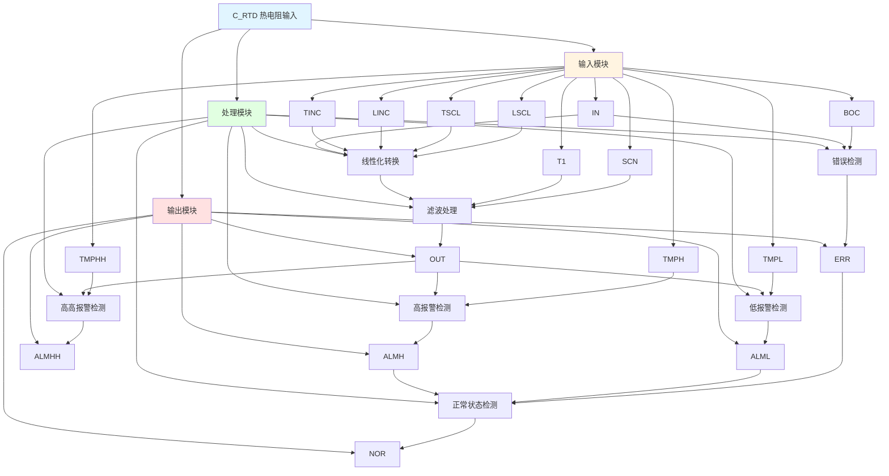

# C_RTD 功能块分析报告

## 基本信息

| 项目 | 内容 |
|------|------|
| 功能块名称 | C_RTD |
| 功能描述 | RTD Input（热电阻输入） |
| 最后修改 | 2016.01.06 |
| 作者 | Gao Weidi |
| 页数 | 1页 |

## 功能概述

C_RTD 是一个热电阻输入处理功能块，用于处理热电阻温度传感器的输入信号。该功能块包含错误检测、温度转换、滤波处理和报警检测功能，支持线性化处理。

## 思维导图

## 流程路径描述

### 错误检测路径：
开始 → IN > BOC → 错误标志 → ERR输出
**功能**: 检测传感器断线错误

### 线性化转换路径：
开始 → IN输入 → 线性化计算 → 滤波处理 → OUT输出
**功能**: 将输入值按线性关系转换为温度值

### 报警检测路径：
开始 → OUT值 → 与阈值比较 → 报警输出
**功能**: 检测温度报警状态

## 逐帧功能分析

### Rung 7: 错误检测使能

**功能描述**: 错误检测使能控制

**输入条件**:
| 信号名称 | 信号描述 | 信号类型 | 触发值 |
|----------|----------|----------|--------|
| BOC | 断线检测阈值 | INT | 设定值 |
| TINC | 温度增量系数 | REAL | 设定值 |

**输出功能**:
| 信号名称 | 信号描述 | 信号类型 |
|----------|----------|----------|
| ERR_CHK | 错误检测使能 | BOOL |

**触发逻辑**:
- IF BOC <= TINC THEN ERR_CHK = TRUE

**功能实现**: 
比较断线检测阈值和温度增量系数，控制错误检测使能。

### Rung 8: 错误检测

**功能描述**: 检测传感器断线错误

**输入条件**:
| 信号名称 | 信号描述 | 信号类型 | 触发值 |
|----------|----------|----------|--------|
| IN | 输入值 | INT | 数值 |
| BOC | 断线检测阈值 | INT | 设定值 |
| ERR_CHK | 错误检测使能 | BOOL | TRUE |

**输出功能**:
| 信号名称 | 信号描述 | 信号类型 |
|----------|----------|----------|
| ERR | 错误标志 | BOOL |

**触发逻辑**:
- IF IN > BOC AND ERR_CHK = TRUE THEN ERR = TRUE

**功能实现**: 
当输入值超过断线检测阈值且错误检测使能时，产生错误标志。

### Rung 9: 线性化转换

**功能描述**: 将输入值按线性关系转换为温度值

**输入条件**:
| 信号名称 | 信号描述 | 信号类型 | 触发值 |
|----------|----------|----------|--------|
| IN | 输入值 | INT | 数值 |
| TINC | 温度增量系数 | REAL | 设定值 |
| LINC | 线性增量系数 | REAL | 设定值 |
| TSCL | 温度缩放上限 | REAL | 设定值 |
| LSCL | 线性缩放下限 | REAL | 设定值 |

**输出功能**:
| 信号名称 | 信号描述 | 信号类型 |
|----------|----------|----------|
| OUT_TEMP | 温度值 | REAL |

**触发逻辑**:
- OUT_TEMP = (IN - LINC) * (TSCL - LSCL) / (TINC - LINC) + LSCL

**功能实现**: 
通过线性化公式将输入值转换为温度值。

### Rung 10: 滤波处理

**功能描述**: 对温度值进行滤波处理

**输入条件**:
| 信号名称 | 信号描述 | 信号类型 | 触发值 |
|----------|----------|----------|--------|
| OUT_TEMP | 温度值 | REAL | 数值 |
| T1 | 滤波时间常数 | DINT | 设定值 |
| SCN | 扫描时间 | INT | 设定值 |
| ERR | 错误标志 | BOOL | FALSE |

**输出功能**:
| 信号名称 | 信号描述 | 信号类型 |
|----------|----------|----------|
| OUT | 输出温度 | REAL |

**触发逻辑**:
- IF ERR = FALSE THEN OUT = C_LDLG(OUT_TEMP, T1)

**功能实现**: 
调用C_LDLG超前/滞后滤波器功能块，对温度值进行滤波处理。

### Rung 11-14: 报警检测

**功能描述**: 检测温度报警状态

**输入条件**:
| 信号名称 | 信号描述 | 信号类型 | 触发值 |
|----------|----------|----------|--------|
| OUT | 输出温度 | REAL | 数值 |
| TMPH | 高报警阈值 | REAL | 设定值 |
| TMPHH | 高高报警阈值 | REAL | 设定值 |
| TMPL | 低报警阈值 | REAL | 设定值 |

**输出功能**:
| 信号名称 | 信号描述 | 信号类型 |
|----------|----------|----------|
| ALMH | 高报警 | BOOL |
| ALMHH | 高高报警 | BOOL |
| ALML | 低报警 | BOOL |
| NOR | 正常状态 | BOOL |

**触发逻辑**:
- IF OUT <= TMPH THEN ALMH = TRUE
- IF OUT <= TMPHH THEN ALMHH = TRUE
- IF OUT >= TMPL THEN ALML = TRUE
- IF ALMH = TRUE AND ALML = TRUE AND ERR = FALSE THEN NOR = TRUE

**功能实现**: 
使用比较器检测温度报警状态，并输出正常状态。

## 触发条件总结

### 检测条件
- **错误检测**: IN > BOC
- **高报警**: OUT <= TMPH
- **高高报警**: OUT <= TMPHH
- **低报警**: OUT >= TMPL
- **正常状态**: ALMH = TRUE AND ALML = TRUE AND ERR = FALSE

## 实现功能总结

### 主要功能
1. **错误检测**: 检测传感器断线错误
2. **线性化转换**: 将输入值按线性关系转换为温度值
3. **滤波处理**: 对温度值进行滤波处理
4. **高报警检测**: 检测温度高报警
5. **高高报警检测**: 检测温度高高报警
6. **低报警检测**: 检测温度低报警
7. **正常状态检测**: 检测温度正常状态

## 关键信号说明

| 信号名称 | 信号描述 | 信号类型 | 用途 |
|----------|----------|----------|------|
| IN | 输入值 | INT | RTD输入值 |
| BOC | 断线检测阈值 | INT | 断线检测 |
| TINC | 温度增量系数 | REAL | 线性化参数 |
| LINC | 线性增量系数 | REAL | 线性化参数 |
| TSCL | 温度缩放上限 | REAL | 线性化参数 |
| LSCL | 线性缩放下限 | REAL | 线性化参数 |
| T1 | 滤波时间常数 | DINT | 滤波参数 |
| OUT | 输出温度 | REAL | 温度输出 |
| ERR | 错误标志 | BOOL | 错误状态 |
| ALMH | 高报警 | BOOL | 高报警状态 |
| ALMHH | 高高报警 | BOOL | 高高报警状态 |
| ALML | 低报警 | BOOL | 低报警状态 |
| NOR | 正常状态 | BOOL | 正常状态 |

## 调试技巧

### 调试步骤
1. 检查IN值，确认RTD输入正常
2. 检查BOC值，确认断线检测阈值设置
3. 检查TINC、LINC、TSCL、LSCL值，确认线性化参数设置
4. 监控OUT值，观察温度输出
5. 检查TMPH、TMPHH、TMPL值，确认报警阈值设置
6. 监控ERR、ALMH、ALMHH、ALML、NOR信号，确认报警状态

### 常见问题
1. **错误标志常亮**: 检查BOC值和IN值
2. **温度输出不准确**: 检查线性化参数设置
3. **报警不工作**: 检查报警阈值设置

### 监控信号列表
- IN（输入值）
- OUT（温度输出）
- ERR（错误标志）
- ALMH、ALMHH、ALML（报警状态）
- NOR（正常状态）
