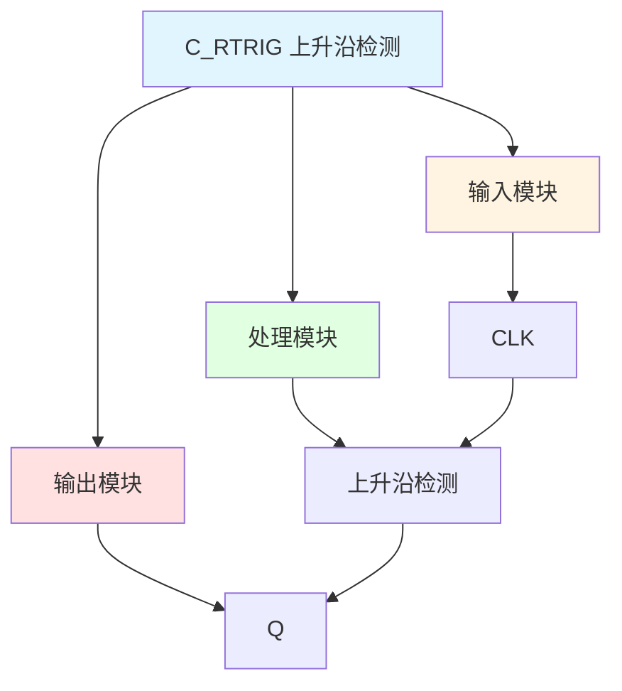

# C_RTRIG 功能块分析报告

## 基本信息

| 项目 | 内容 |
|------|------|
| 功能块名称 | C_RTRIG |
| 功能描述 | Rise Edge Detect（上升沿检测） |
| 最后修改 | 2017.09.15 |
| 作者 | Hu Jing Qi |
| 页数 | 1页 |

## 功能概述

C_RTRIG 是一个上升沿检测功能块，用于检测输入信号的上升沿并产生脉冲输出。

## 思维导图

## 流程路径描述

### 上升沿检测路径：
开始 → CLK信号 → 上升沿检测 → Q输出
**功能**: 检测输入信号的上升沿

## 逐帧功能分析

### 上升沿检测

**功能描述**: 检测输入信号的上升沿

**输入条件**:
| 信号名称 | 信号描述 | 信号类型 | 触发值 |
|----------|----------|----------|--------|
| CLK | 时钟输入 | BOOL | 上升沿 |

**输出功能**:
| 信号名称 | 信号描述 | 信号类型 |
|----------|----------|----------|
| Q | 输出脉冲 | BOOL |

**触发逻辑**:
- Q = CLK AND STATE
- STATE = NOT CLK

**功能实现**: 
当CLK从FALSE变为TRUE时，Q输出一个扫描周期的TRUE脉冲。

## 触发条件总结

### 检测条件
- **上升沿检测**: CLK从FALSE变为TRUE

## 实现功能总结

### 主要功能
1. **上升沿检测**: 检测输入信号的上升沿并产生脉冲输出

## 关键信号说明

| 信号名称 | 信号描述 | 信号类型 | 用途 |
|----------|----------|----------|------|
| CLK | 时钟输入 | BOOL | 输入信号 |
| Q | 输出脉冲 | BOOL | 上升沿脉冲输出 |
| STATE | 状态变量 | BOOL | 内部状态 |

## 调试技巧

### 调试步骤
1. 检查CLK信号，确认输入正常
2. 监控Q信号，观察上升沿检测

### 常见问题
1. **无脉冲输出**: 检查CLK信号是否有上升沿

### 监控信号列表
- CLK（时钟输入）
- Q（输出脉冲）
