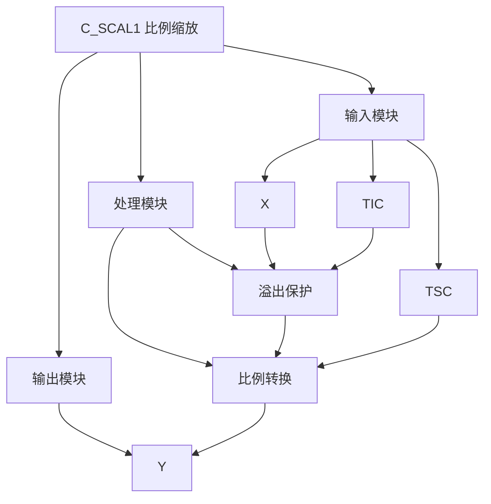

# C\_SCAL1 功能块分析报告

## 基本信息

| 项目    | 内容                       |
| ----- | ------------------------ |
| 功能块名称 | C\_SCAL1                 |
| 功能描述  | Scaling Function（比例缩放功能） |
| 最后修改  | 2015.12.11               |
| 作者    | Shi Chun Liang           |
| 页数    | 1页                       |

## 功能概述

C\_SCAL1 是一个比例缩放功能块，用于将整数值按照设定比例转换为实数值输出。该功能块包含溢出保护功能。

## 思维导图

## 流程路径描述

### 溢出保护路径：

开始 → 检查TIC是否为0 → 溢出保护 → 输出Y=0
**功能**: 防止除零错误

### 比例转换路径：

开始 → X转换为实数 → 乘以TSC → 除以TIC → 输出Y
**功能**: 将整数值按比例转换为实数值

## 逐帧功能分析

### Rung 7: 溢出保护与比例转换

**功能描述**: 检查TIC是否为0，并执行比例转换

**输入条件**:

| 信号名称 | 信号描述   | 信号类型 | 触发值 |
| ---- | ------ | ---- | --- |
| X    | 输入值    | INT  | 数值  |
| TSC  | 目标缩放系数 | REAL | 设定值 |
| TIC  | 目标整数系数 | REAL | 设定值 |

**输出功能**:

| 信号名称 | 信号描述 | 信号类型 |
| ---- | ---- | ---- |
| Y    | 输出   | REAL |

**触发逻辑**:

- IF ABS(TIC) < 0.00001 THEN Y = 0.0
- ELSE Y = INT\_TO\_REAL(X) \* TSC / TIC

**功能实现**:
首先使用ABS和CMP功能块检测TIC是否接近0，如果接近0则输出Y=0.0，防止除零错误。否则将整数X转换为实数，乘以TSC，除以TIC，得到输出Y。

## 触发条件总结

### 转换条件

- **溢出保护**: ABS(TIC) < 0.00001
- **正常转换**: ABS(TIC) >= 0.00001

## 实现功能总结

### 主要功能

1. **溢出保护**: 防止除零错误
2. **比例转换**: 将整数值按比例转换为实数值

## 关键信号说明

| 信号名称 | 信号描述   | 信号类型 | 用途    |
| ---- | ------ | ---- | ----- |
| X    | 输入值    | INT  | 整数输入值 |
| TSC  | 目标缩放系数 | REAL | 缩放系数  |
| TIC  | 目标整数系数 | REAL | 整数系数  |
| Y    | 输出     | REAL | 实数输出值 |

## 调试技巧

### 调试步骤

1. 检查X值，确认输入正常
2. 检查TSC值，确认缩放系数设置
3. 检查TIC值，确认整数系数设置
4. 监控Y值，观察转换结果

### 常见问题

1. **输出为0**: 检查TIC是否为0
2. **转换不准确**: 检查TSC和TIC值设置

### 监控信号列表

- X（输入值）
- TSC、TIC（缩放系数）
- Y（输出）

