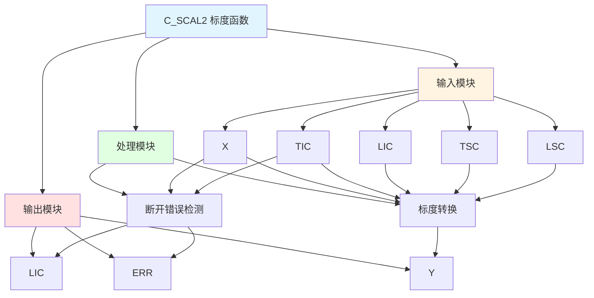

# C_SCAL2 功能块分析报告

## 基本信息

| 项目 | 内容 |
|------|------|
| 功能块名称 | C_SCAL2 |
| 功能描述 | Scaling Function（标度函数） |
| 最后修改 | 2015.12.11 |
| 作者 | Shi Chun Liang |
| 页数 | 3页 |

## 功能概述

C_SCAL2 是一个标度函数功能块，用于将输入值从一个标度范围转换到另一个标度范围。该功能块支持断开错误检测（1mA = 1600）和标度转换。

## 思维导图

## 流程路径描述

### 断开错误检测路径：
开始 → X < 1600 → 输出LIC和ERR
**功能**: 检测断开错误

### 标度转换路径：
开始 → (X - LIC) * (TSC - LSC) / (TIC - LIC) + LSC → 输出Y
**功能**: 标度转换

## 逐帧功能分析

### Rung 8: 断开错误检测

**功能描述**: 检测输入值是否低于断开错误阈值

**输入条件**:
| 信号名称 | 信号描述 | 信号类型 | 触发值 |
|----------|----------|----------|--------|
| X | 输入 | INT | 数值 |
| 1600 | 断开错误阈值 | INT | 1600 |

**输出功能**:
| 信号名称 | 信号描述 | 信号类型 |
|----------|----------|----------|
| LIC | 输入低增量值 | REAL |
| ERR | 断开错误 | BOOL |

**触发逻辑**:
- IF X < 1600 THEN LIC = X AND ERR = TRUE
- ELSE LIC = 1600.0 AND ERR = FALSE

**功能实现**: 
使用LT功能块比较X和1600，当X小于1600时，使用MOVE功能块将X转换为实数并输出到LIC，同时设置ERR为TRUE。否则，LIC为1600.0，ERR为FALSE。

### Rung 10: 标度转换

**功能描述**: 将输入值从一个标度范围转换到另一个标度范围

**输入条件**:
| 信号名称 | 信号描述 | 信号类型 | 触发值 |
|----------|----------|----------|--------|
| X | 输入 | INT | 数值 |
| TIC | 输入顶增量值 | INT | 数值 |
| LIC | 输入低增量值 | REAL | 数值 |
| TSC | 输入顶标度值 | REAL | 数值 |
| LSC | 输入低标度值 | REAL | 数值 |
| ERR | 断开错误 | BOOL | TRUE/FALSE |

**输出功能**:
| 信号名称 | 信号描述 | 信号类型 |
|----------|----------|----------|
| Y | 输出 | REAL |

**触发逻辑**:
- IF ERR = TRUE THEN Y = 0.0
- ELSE Y = (X - LIC) * (TSC - LSC) / (TIC - LIC) + LSC

**功能实现**: 
使用INT_TO_REAL功能块将X转换为实数，使用SUB功能块计算X减去LIC，使用C_MULD功能块计算(X - LIC) * (TSC - LSC) / (TIC - LIC)，最后使用ADD功能块加上LSC，得到输出Y。当ERR为TRUE时，Y为0.0。

## 触发条件总结

### 错误检测条件
- **断开错误**: X < 1600

### 标度转换条件
- **正常转换**: ERR = FALSE
- **错误输出**: ERR = TRUE

## 实现功能总结

### 主要功能
1. **断开错误检测**: 检测输入值是否低于断开错误阈值
2. **标度转换**: 将输入值从一个标度范围转换到另一个标度范围

## 关键信号说明

| 信号名称 | 信号描述 | 信号类型 | 用途 |
|----------|----------|----------|------|
| X | 输入 | INT | 输入值 |
| TIC | 输入顶增量值 | INT | 输入顶增量值 |
| LIC | 输入低增量值 | REAL | 输入低增量值 |
| TSC | 输入顶标度值 | REAL | 输入顶标度值 |
| LSC | 输入低标度值 | REAL | 输入低标度值 |
| ERR | 断开错误 | BOOL | 断开错误标志 |
| Y | 输出 | REAL | 标度转换输出 |

## 调试技巧

### 调试步骤
1. 检查X值，确认输入正常
2. 监控ERR信号，观察断开错误检测
3. 监控LIC值，观察输入低增量值
4. 监控Y值，观察标度转换输出

### 常见问题
1. **断开错误不检测**: 检查X值是否低于1600
2. **标度转换不正确**: 检查TIC、LIC、TSC、LSC值设置

### 监控信号列表
- X（输入）
- TIC（输入顶增量值）
- LIC（输入低增量值）
- TSC（输入顶标度值）
- LSC（输入低标度值）
- ERR（断开错误）
- Y（输出）
