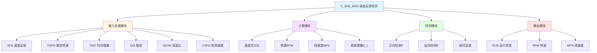

# C_SFB_MSD 功能块分析报告

## 基本信息

| 项目 | 内容 |
|------|------|
| 功能块名称 | C_SFB_MSD |
| 功能描述 | Speed Feedback Detection（速度反馈检测-多速传动） |
| 最后修改 | 2016.01.05 |
| 作者 | GaoWeidi |
| 页数 | 1页（9个程序段） |

> **注意**：源代码文件中的功能名称注释为"C_SFB"，文件名为C_SFB_MSD，表示多速传动版本。

## 功能概述

C_SFB_MSD是一个速度反馈检测功能块，用于检测多速传动设备的运行状态。与C_SFB_DC相比，该版本增加了时间增量参数TINC，支持更灵活的速度计算。

### 应用场景
- **多速传动监控**：监控多速电机运行状态
- **速度检测**：检测电机是否达到设定速度
- **运行判断**：判断设备是否正在运行
- **速度计算**：计算线速度和距离增量

### 功能特点
1. **时间增量支持**：支持可配置的时间增量参数
2. **速度百分比计算**：计算实际速度与额定速度的百分比
3. **线速度计算**：根据转速计算线速度
4. **距离增量计算**：计算每个扫描周期的距离增量
5. **运行状态检测**：检测设备是否正在运行

## 思维导图

## 流程路径描述

### 速度计算路径：
开始 → 读取SFB → 计算SPDX → 计算RPM → 计算MPS → 计算D_L
**功能**: 计算速度相关的各个参数

### 运行检测路径：
开始 → 比较SPDX与CSPD → 输出F/R → 延时滤波 → 输出RUN
**功能**: 检测设备是否正在运行

## 逐帧功能分析

### Rung 1: 速度百分比计算

**功能描述**: 计算实际速度与额定速度的百分比

**输入条件**:
| 信号名称 | 信号描述 | 信号类型 | 触发值 |
|----------|----------|----------|--------|
| SFB | 速度反馈 | INT | 数值 |
| TOPN | 额定转速 | REAL | 设定值 |
| TINC | 时间增量 | REAL | 设定值 |

**输出功能**:
| 信号名称 | 信号描述 | 信号类型 |
|----------|----------|----------|
| SPDX | 速度百分比 | REAL |
| RPM | 转速 | REAL |

**触发逻辑**:
- SPDX = (SFB / TINC) × 100.0
- RPM = SFB × TOPN

**功能实现**: 
1. 使用INT_TO_REAL将SFB转换为实数
2. 使用DIV_REAL除以TINC
3. 使用MUL_REAL乘以100得到百分比
4. 使用MUL_REAL计算RPM

### Rung 2: 线速度计算

**功能描述**: 根据转速计算线速度

**输入条件**:
| 信号名称 | 信号描述 | 信号类型 | 触发值 |
|----------|----------|----------|--------|
| RPM | 转速 | REAL | 数值 |
| DIA | 辊径 | REAL | 设定值 |
| GEAR | 减速比 | REAL | 设定值 |
| K | 系数 | REAL | 设定值 |

**输出功能**:
| 信号名称 | 信号描述 | 信号类型 |
|----------|----------|----------|
| MPS | 线速度(m/s) | REAL |

**触发逻辑**:
- MPS = (RPM × DIA × GEAR × K) / 60.0

**功能实现**: 
调用C_MUL4进行四值乘法，然后除以60得到线速度。

### Rung 3: 距离增量计算

**功能描述**: 计算每个扫描周期的距离增量

**输入条件**:
| 信号名称 | 信号描述 | 信号类型 | 触发值 |
|----------|----------|----------|--------|
| SCN | 扫描次数 | INT | 数值 |
| MPS | 线速度 | REAL | 数值 |

**输出功能**:
| 信号名称 | 信号描述 | 信号类型 |
|----------|----------|----------|
| D_L | 距离增量(mm) | REAL |

**触发逻辑**:
- D_L = MPS × (SCN限幅) / 1000.0

### Rung 4-5: 正向检测

**功能描述**: 检测速度是否超过正向阈值

**输入条件**:
| 信号名称 | 信号描述 | 信号类型 | 触发值 |
|----------|----------|----------|--------|
| SPDX | 速度百分比 | REAL | 数值 |
| CSPD | 检测速度阈值 | REAL | 设定值 |

**输出功能**:
| 信号名称 | 信号描述 | 信号类型 |
|----------|----------|----------|
| F | 正向标志 | BOOL |
| F_TOF | 正向延时 | BOOL |

**触发逻辑**:
- IF SPDX ≥ CSPD THEN F = TRUE
- 使用TOF延时500ms

### Rung 6-7: 反向检测

**功能描述**: 检测速度是否低于反向阈值

**输出功能**:
| 信号名称 | 信号描述 | 信号类型 |
|----------|----------|----------|
| R | 反向标志 | BOOL |
| R_TOF | 反向延时 | BOOL |

**触发逻辑**:
- IF SPDX ≤ (1/CSPD) THEN R = TRUE
- 使用TOF延时500ms

### Rung 8: 运行状态输出

**功能描述**: 输出运行状态

**输出功能**:
| 信号名称 | 信号描述 | 信号类型 |
|----------|----------|----------|
| RUN | 运行状态 | BOOL |

**触发逻辑**:
- RUN = F_TOF AND NOT R_TOF

## 触发条件总结

### 正向检测条件
- **SPDX ≥ CSPD**: 速度超过正向阈值
- **延时500ms**: TOF断电延时

### 反向检测条件
- **SPDX ≤ 1/CSPD**: 速度低于反向阈值
- **延时500ms**: TOF断电延时

### 运行输出条件
- **F_TOF = TRUE AND R_TOF = FALSE**: 正向运行中

## 实现功能总结

### 主要功能
1. **速度百分比计算**: 计算实际速度与额定速度的百分比
2. **线速度计算**: 根据转速计算线速度
3. **距离增量计算**: 计算每个扫描周期的距离增量
4. **运行状态检测**: 检测设备是否正在运行

### 与C_SFB_DC对比
| 功能块 | SFB类型 | 时间参数 | 特点 |
|--------|---------|----------|------|
| C_SFB_DC | REAL | 固定 | 直流传动 |
| **C_SFB_MSD** | **INT** | **TINC可配置** | **多速传动** |

### 计算公式
| 参数 | 公式 | 说明 |
|------|------|------|
| SPDX | (SFB/TINC)×100 | 速度百分比 |
| RPM | SFB×TOPN | 转速 |
| MPS | (RPM×DIA×GEAR×K)/60 | 线速度 |
| D_L | MPS×SCN/1000 | 距离增量 |

## 关键信号说明

| 信号名称 | 信号描述 | 信号类型 | 用途 |
|----------|----------|----------|------|
| SFB | 速度反馈 | INT | 速度输入 |
| TOPN | 额定转速 | REAL | 额定值 |
| TINC | 时间增量 | REAL | 时间参数 |
| DIA | 辊径 | REAL | 机械参数 |
| GEAR | 减速比 | REAL | 机械参数 |
| K | 系数 | REAL | 计算系数 |
| CSPD | 检测速度 | REAL | 检测阈值 |
| SPDX | 速度百分比 | REAL | 计算结果 |
| RPM | 转速 | REAL | 输出转速 |
| MPS | 线速度 | REAL | 输出线速度 |
| D_L | 距离增量 | REAL | 输出距离 |
| RUN | 运行状态 | BOOL | 运行输出 |

## 调试技巧

### 调试步骤
1. 检查SFB输入是否正常
2. 验证TOPN、TINC、DIA、GEAR参数设置
3. 监控SPDX计算是否正确
4. 检查RUN输出状态

### 常见问题
1. **RUN不输出**: 检查CSPD阈值设置
2. **速度不准**: 检查DIA、GEAR和K参数
3. **TINC影响**: 确认TINC参数设置正确

### 监控信号列表
- SFB（速度反馈）
- SPDX（速度百分比）
- MPS（线速度）
- RUN（运行状态）
