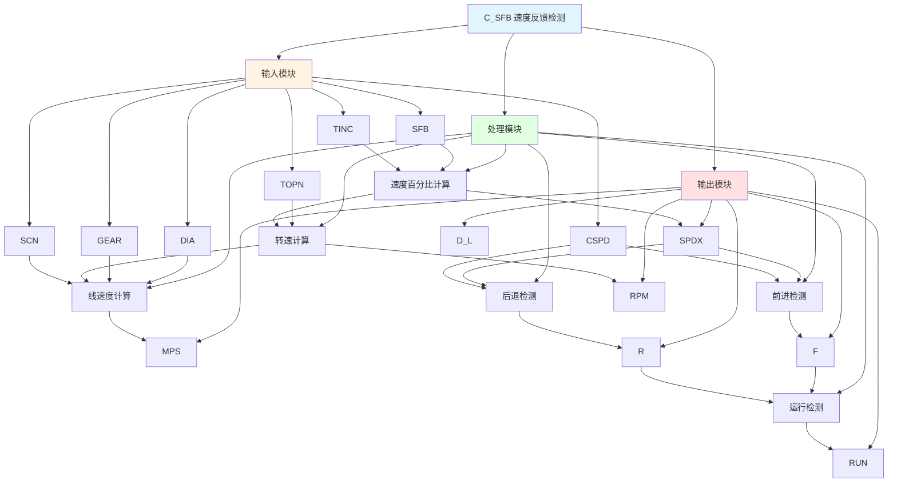

# C_SFB 功能块分析报告

## 基本信息

| 项目 | 内容 |
|------|------|
| 功能块名称 | C_SFB |
| 功能描述 | Speed Feedback Detection（速度反馈检测） |
| 最后修改 | 2016.01.05 |
| 作者 | Gao Weidi |
| 页数 | 1页 |

## 功能概述

C_SFB 是一个速度反馈检测功能块，用于检测设备的速度反馈信号。该功能块计算速度百分比、转速(RPM)、线速度(MPS)，并检测前进和后退运行状态。

## 思维导图

## 流程路径描述

### 速度计算路径：
开始 → SFB输入 → 速度百分比计算 → 转速计算 → 线速度计算
**功能**: 计算速度相关参数

### 前进检测路径：
开始 → SPDX >= CSPD → 延时检测 → 前进状态
**功能**: 检测前进运行状态

### 后退检测路径：
开始 → SPDX <= 1/CSPD → 延时检测 → 后退状态
**功能**: 检测后退运行状态

## 逐帧功能分析

### Rung 7: 速度百分比计算

**功能描述**: 计算速度百分比

**输入条件**:
| 信号名称 | 信号描述 | 信号类型 | 触发值 |
|----------|----------|----------|--------|
| SFB | 速度反馈值 | INT | 数值 |
| TINC | 时间增量 | REAL | 设定值 |

**输出功能**:
| 信号名称 | 信号描述 | 信号类型 |
|----------|----------|----------|
| SPDX | 速度百分比 | REAL |

**触发逻辑**:
- SPDX = SFB / TINC * 100.0

**功能实现**: 
将速度反馈值SFB除以时间增量TINC，再乘以100，得到速度百分比SPDX。

### Rung 8: 转速计算

**功能描述**: 计算转速(RPM)

**输入条件**:
| 信号名称 | 信号描述 | 信号类型 | 触发值 |
|----------|----------|----------|--------|
| RPM | 速度百分比 | REAL | 数值 |
| DIA | 直径 | REAL | 设定值 |
| GEAR | 齿轮比 | REAL | 设定值 |
| TOPN | 每转脉冲数 | REAL | 设定值 |

**输出功能**:
| 信号名称 | 信号描述 | 信号类型 |
|----------|----------|----------|
| RPM | 转速 | REAL |

**触发逻辑**:
- RPM = SPDX * DIA * GEAR * 3.1415926 / 60.0

**功能实现**: 
使用C_MUL4功能块计算转速，考虑直径、齿轮比和圆周率。

### Rung 9: 线速度计算

**功能描述**: 计算线速度(MPS)

**输入条件**:
| 信号名称 | 信号描述 | 信号类型 | 触发值 |
|----------|----------|----------|--------|
| SCN | 扫描时间 | INT | 设定值 |
| MPS | 转速 | REAL | 数值 |

**输出功能**:
| 信号名称 | 信号描述 | 信号类型 |
|----------|----------|----------|
| MPS | 线速度 | REAL |
| D_L | 距离增量 | REAL |

**触发逻辑**:
- D_L = MPS * SCN / 1000.0

**功能实现**: 
根据转速和扫描时间计算线速度和距离增量。

### Rung 10: 前进检测

**功能描述**: 检测前进运行状态

**输入条件**:
| 信号名称 | 信号描述 | 信号类型 | 触发值 |
|----------|----------|----------|--------|
| SPDX | 速度百分比 | REAL | 数值 |
| CSPD | 检测速度阈值 | REAL | 设定值 |

**输出功能**:
| 信号名称 | 信号描述 | 信号类型 |
|----------|----------|----------|
| F | 前进检测 | BOOL |

**触发逻辑**:
- IF SPDX >= CSPD THEN F = TRUE

**功能实现**: 
使用GE比较器检测速度是否大于等于阈值，产生前进检测信号。

### Rung 11: 前进延时检测

**功能描述**: 前进检测延时确认

**输入条件**:
| 信号名称 | 信号描述 | 信号类型 | 触发值 |
|----------|----------|----------|--------|
| F | 前进检测 | BOOL | TRUE |

**输出功能**:
| 信号名称 | 信号描述 | 信号类型 |
|----------|----------|----------|
| F_TOF | 前进延时检测 | BOOL |

**触发逻辑**:
- F上升沿后延时500ms确认

**功能实现**: 
使用TOF断开延时定时器，延时500ms确认前进状态。

### Rung 12-13: 后退检测

**功能描述**: 检测后退运行状态

**输入条件**:
| 信号名称 | 信号描述 | 信号类型 | 触发值 |
|----------|----------|----------|--------|
| SPDX | 速度百分比 | REAL | 数值 |
| CSPD | 检测速度阈值 | REAL | 设定值 |

**输出功能**:
| 信号名称 | 信号描述 | 信号类型 |
|----------|----------|----------|
| R | 后退检测 | BOOL |

**触发逻辑**:
- IF SPDX <= 1/CSPD THEN R = TRUE

**功能实现**: 
使用LE比较器检测速度是否小于等于阈值的倒数，产生后退检测信号。

### Rung 14: 运行检测

**功能描述**: 检测设备运行状态

**输入条件**:
| 信号名称 | 信号描述 | 信号类型 | 触发值 |
|----------|----------|----------|--------|
| F_TOF | 前进延时检测 | BOOL | TRUE |
| R_TOF | 后退延时检测 | BOOL | TRUE |

**输出功能**:
| 信号名称 | 信号描述 | 信号类型 |
|----------|----------|----------|
| RUN | 运行状态 | BOOL |

**触发逻辑**:
- IF F_TOF = TRUE OR R_TOF = TRUE THEN RUN = TRUE

**功能实现**: 
前进或后退任一状态有效时，输出运行状态信号。

## 触发条件总结

### 检测条件
- **前进检测**: SPDX >= CSPD
- **后退检测**: SPDX <= 1/CSPD
- **运行检测**: F_TOF = TRUE OR R_TOF = TRUE

## 实现功能总结

### 主要功能
1. **速度百分比计算**: 计算速度百分比
2. **转速计算**: 计算设备转速
3. **线速度计算**: 计算线速度
4. **前进检测**: 检测前进运行状态
5. **后退检测**: 检测后退运行状态
6. **运行检测**: 检测设备运行状态

## 关键信号说明

| 信号名称 | 信号描述 | 信号类型 | 用途 |
|----------|----------|----------|------|
| SFB | 速度反馈值 | INT | 速度反馈输入 |
| TINC | 时间增量 | REAL | 时间增量设定 |
| CSPD | 检测速度阈值 | REAL | 速度检测阈值 |
| SPDX | 速度百分比 | REAL | 速度百分比输出 |
| RPM | 转速 | REAL | 转速输出 |
| MPS | 线速度 | REAL | 线速度输出 |
| F | 前进检测 | BOOL | 前进状态 |
| R | 后退检测 | BOOL | 后退状态 |
| RUN | 运行状态 | BOOL | 运行状态 |

## 调试技巧

### 调试步骤
1. 检查SFB值，确认速度反馈正常
2. 检查TINC值，确认时间增量设置
3. 监控SPDX值，观察速度百分比
4. 检查CSPD值，确认检测阈值设置
5. 监控F、R、RUN信号，确认运行状态

### 常见问题
1. **速度计算不正确**: 检查TINC和TOPN值
2. **前进/后退检测不工作**: 检查CSPD值设置
3. **运行状态不正确**: 检查F_TOF和R_TOF信号

### 监控信号列表
- SFB（速度反馈）
- SPDX（速度百分比）
- RPM（转速）
- MPS（线速度）
- F、R、RUN（运行状态）
