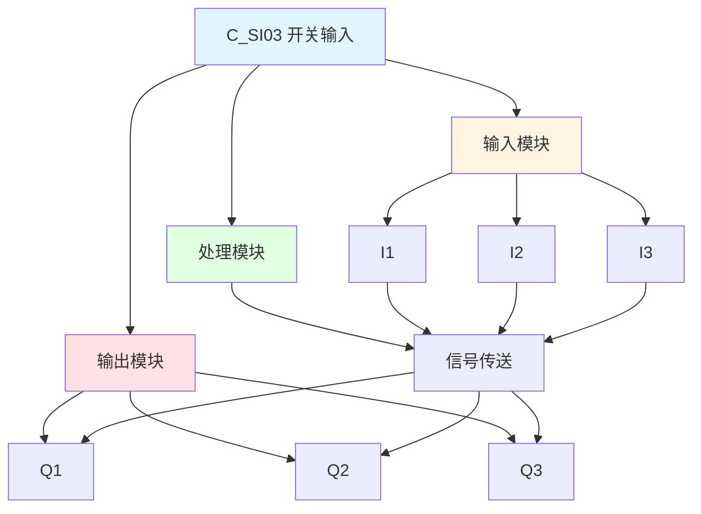

# C_SI03 功能块分析报告

## 基本信息

| 项目 | 内容 |
|------|------|
| 功能块名称 | C_SI03 |
| 功能描述 | Switch Input(BOOL type)（开关输入，布尔类型） |
| 最后修改 | 2015.11.26 |
| 作者 | Shi Chun Liang |
| 页数 | 1页 |

## 功能概述

C_SI03 是一个开关输入功能块，用于处理三个布尔类型的输入信号。该功能块直接将输入信号传递到输出，常用于信号隔离或接口标准化。

**主要应用场景**：
- 信号隔离
- 接口标准化
- 信号分配
- 输入信号处理

## 思维导图

## 流程路径描述

### 信号传送路径：
开始 → I1信号 → Q1输出
开始 → I2信号 → Q2输出
开始 → I3信号 → Q3输出
**功能**: 直接传送输入信号

## 逐帧功能分析

### Rung 7: 信号传送

**功能描述**: 将输入信号直接传送到输出

**输入条件**:
| 信号名称 | 信号描述 | 信号类型 | 触发值 |
|----------|----------|----------|--------|
| I1 | 输入1 | BOOL | TRUE/FALSE |
| I2 | 输入2 | BOOL | TRUE/FALSE |
| I3 | 输入3 | BOOL | TRUE/FALSE |

**输出功能**:
| 信号名称 | 信号描述 | 信号类型 |
|----------|----------|----------|
| Q1 | 输出1 | BOOL |
| Q2 | 输出2 | BOOL |
| Q3 | 输出3 | BOOL |

**触发逻辑**:
- Q1 = I1
- Q2 = I2
- Q3 = I3

**功能实现**: 
直接将输入信号传送到对应的输出。

## 触发条件总结

### 传送逻辑
| 输入 | 输出 |
|------|------|
| I1 | Q1 |
| I2 | Q2 |
| I3 | Q3 |

## 实现功能总结

### 主要功能
1. **信号传送**: 直接传送输入信号到输出
2. **信号隔离**: 提供信号隔离功能

## 关键信号说明

| 信号名称 | 信号描述 | 信号类型 | 用途 |
|----------|----------|----------|------|
| I1 | 输入1 | BOOL | 输入信号1 |
| I2 | 输入2 | BOOL | 输入信号2 |
| I3 | 输入3 | BOOL | 输入信号3 |
| Q1 | 输出1 | BOOL | 输出信号1 |
| Q2 | 输出2 | BOOL | 输出信号2 |
| Q3 | 输出3 | BOOL | 输出信号3 |

## 调试技巧

### 调试步骤
1. 检查I1、I2、I3信号，确认输入正常
2. 监控Q1、Q2、Q3信号，观察输出是否正确

### 常见问题
1. **输出不跟随输入**: 检查信号连接

### 监控信号列表
- I1、I2、I3（输入信号）
- Q1、Q2、Q3（输出信号）
