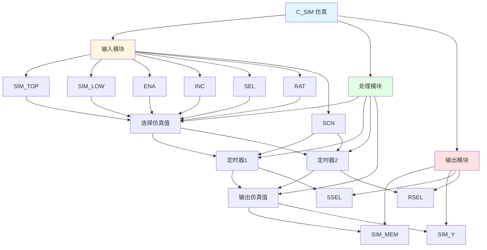

# C_SIM 功能块分析报告

## 基本信息

| 项目 | 内容 |
|------|------|
| 功能块名称 | C_SIM |
| 功能描述 | Simulation（仿真） |
| 最后修改 | - |
| 作者 | - |
| 页数 | 1页 |

## 功能概述

C_SIM 是一个仿真功能块，用于生成仿真输出信号。该功能块支持两个输入仿真值，通过定时器在两个值之间切换，生成仿真输出。

## 思维导图

## 流程路径描述

### 仿真值选择路径：
开始 → SIM_TOP/SIM_LOW → 选择仿真值 → 输出SIM_MEM
**功能**: 选择仿真值

### 定时器1路径：
开始 → SIM_MEM ≥ SIM_TOP → TON定时器 → 输出SSEL
**功能**: 检测仿真值是否达到上限

### 定时器2路径：
开始 → SIM_MEM ≤ SIM_LOW → TON定时器 → 输出RSEL
**功能**: 检测仿真值是否达到下限

### 仿真输出路径：
开始 → SIM_MEM → 输出SIM_Y
**功能**: 输出仿真值

## 逐帧功能分析

### Rung 1: 选择仿真值

**功能描述**: 根据选择信号选择仿真值

**输入条件**:
| 信号名称 | 信号描述 | 信号类型 | 触发值 |
|----------|----------|----------|--------|
| SIM_TOP | 输入仿真1 | REAL | 数值 |
| SIM_LOW | 输入仿真2 | REAL | 数值 |
| ENA | 使能 | BOOL | TRUE/FALSE |
| INC | 增量 | REAL | 数值 |
| SEL | 选择 | BOOL | TRUE/FALSE |
| RAT | 变化率（每秒） | REAL | 数值 |
| ZE | 零 | BOOL | TRUE/FALSE |
| SCN | 扫描时间 | TIME | 设定值 |

**输出功能**:
| 信号名称 | 信号描述 | 信号类型 |
|----------|----------|----------|
| SIM_MEM | 仿真记忆 | REAL |
| SIM_Y | 仿真输出 | REAL |

**触发逻辑**:
- IF ENA = TRUE THEN SIM_MEM根据SEL、INC、RAT、SCN等参数计算
- ELSE SIM_MEM保持不变
- SIM_Y = SIM_MEM

**功能实现**: 
使用C_NSWR功能块根据ENA信号选择输入值，使用C_DLM功能块根据INC、RAT、SCN等参数计算仿真值，最后输出到SIM_MEM和SIM_Y。

### Rung 2: 定时器1

**功能描述**: 检测仿真值是否达到上限

**输入条件**:
| 信号名称 | 信号描述 | 信号类型 | 触发值 |
|----------|----------|----------|--------|
| SIM_MEM | 仿真记忆 | REAL | 数值 |
| SIM_TOP | 输入仿真1 | REAL | 数值 |
| SCN | 扫描时间 | TIME | 500ms |

**输出功能**:
| 信号名称 | 信号描述 | 信号类型 |
|----------|----------|----------|
| SSEL | 选择仿真1 | BOOL |

**触发逻辑**:
- IF SIM_MEM >= SIM_TOP且持续500ms THEN SSEL = TRUE

**功能实现**: 
使用GE功能块比较SIM_MEM和SIM_TOP，当SIM_MEM大于等于SIM_TOP时，使用TON定时器延时500ms，输出SSEL为TRUE。

### Rung 3: 定时器2

**功能描述**: 检测仿真值是否达到下限

**输入条件**:
| 信号名称 | 信号描述 | 信号类型 | 触发值 |
|----------|----------|----------|--------|
| SIM_MEM | 仿真记忆 | REAL | 数值 |
| SIM_LOW | 输入仿真2 | REAL | 数值 |
| SCN | 扫描时间 | TIME | 500ms |

**输出功能**:
| 信号名称 | 信号描述 | 信号类型 |
|----------|----------|----------|
| RSEL | 选择仿真2 | BOOL |

**触发逻辑**:
- IF SIM_MEM <= SIM_LOW且持续500ms THEN RSEL = TRUE

**功能实现**: 
使用LE功能块比较SIM_MEM和SIM_LOW，当SIM_MEM小于等于SIM_LOW时，使用TON定时器延时500ms，输出RSEL为TRUE。

### Rung 4: 输出仿真值

**功能描述**: 输出仿真值

**输入条件**:
| 信号名称 | 信号描述 | 信号类型 | 触发值 |
|----------|----------|----------|--------|
| SIM_MEM | 仿真记忆 | REAL | 数值 |

**输出功能**:
| 信号名称 | 信号描述 | 信号类型 |
|----------|----------|----------|
| SIM_Y | 仿真输出 | REAL |

**触发逻辑**:
- SIM_Y = SIM_MEM

**功能实现**: 
使用MOVE功能块，将SIM_MEM输出到SIM_Y。

## 触发条件总结

### 仿真条件
- **仿真使能**: ENA = TRUE
- **仿真禁用**: ENA = FALSE

### 定时条件
- **上限检测**: SIM_MEM >= SIM_TOP且持续500ms
- **下限检测**: SIM_MEM <= SIM_LOW且持续500ms

## 实现功能总结

### 主要功能
1. **仿真值选择**: 根据选择信号选择仿真值
2. **定时器控制**: 检测仿真值是否达到上限或下限
3. **仿真输出**: 输出仿真值

## 关键信号说明

| 信号名称 | 信号描述 | 信号类型 | 用途 |
|----------|----------|----------|------|
| SIM_TOP | 输入仿真1 | REAL | 仿真上限值 |
| SIM_LOW | 输入仿真2 | REAL | 仿真下限值 |
| ENA | 使能 | BOOL | 仿真使能 |
| INC | 增量 | REAL | 仿真增量 |
| SEL | 选择 | BOOL | 仿真选择 |
| RAT | 变化率（每秒） | REAL | 仿真变化率 |
| ZE | 零 | BOOL | 零标志 |
| SCN | 扫描时间 | TIME | 扫描时间 |
| SIM_MEM | 仿真记忆 | REAL | 仿真记忆值 |
| SIM_Y | 仿真输出 | REAL | 仿真输出值 |
| SSEL | 选择仿真1 | BOOL | 选择仿真上限 |
| RSEL | 选择仿真2 | BOOL | 选择仿真下限 |

## 调试技巧

### 调试步骤
1. 检查SIM_TOP和SIM_LOW值，确认仿真范围设置正确
2. 检查ENA信号，确认仿真使能状态
3. 监控SIM_MEM值，观察仿真值变化
4. 监控SIM_Y值，观察仿真输出
5. 检查SSEL和RSEL信号，确认定时器工作

### 常见问题
1. **仿真不工作**: 检查ENA信号
2. **仿真值不变化**: 检查INC、RAT、SCN值设置
3. **定时器不工作**: 检查SIM_MEM、SIM_TOP、SIM_LOW值

### 监控信号列表
- SIM_TOP、SIM_LOW（仿真范围）
- ENA（使能）
- SIM_MEM（仿真记忆）
- SIM_Y（仿真输出）
- SSEL、RSEL（定时器输出）
- SCN（扫描时间）
