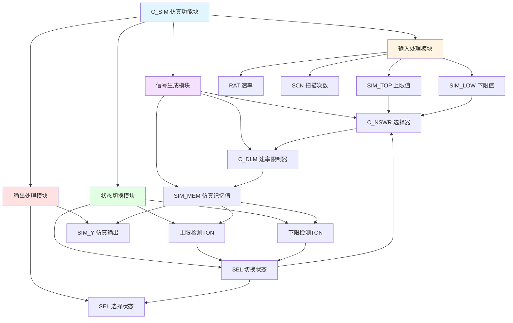

# C_SIM 功能块分析报告

## 基本信息

| 项目 | 内容 |
|------|------|
| 功能块名称 | C_SIM |
| 功能描述 | Simulation Function Block（仿真功能块） |
| 最后修改 | 未标注 |
| 作者 | 未标注 |
| 页数 | 1页（4个程序段） |

## 功能概述

C_SIM是一个仿真功能块，用于生成仿真信号。该功能块通过速率限制器产生斜坡信号，并根据信号值自动切换选择状态，实现仿真测试功能。

### 应用场景
- **仿真测试**：在没有实际设备时进行测试
- **信号发生器**：生成周期性变化的仿真信号
- **自动测试**：自动切换高低状态进行测试
- **调试辅助**：辅助调试控制系统

### 功能特点
1. **速率限制**：使用C_DLM产生斜坡信号
2. **自动切换**：达到上下限后自动切换方向
3. **延时保护**：使用TON延时防止频繁切换
4. **选择输出**：输出选择状态和仿真值

## 思维导图



## 流程路径描述

### 信号生成路径：
开始 → 选择SIM_TOP或SIM_LOW → 速率限制 → 输出SIM_MEM
**功能**: 根据SEL状态生成斜坡信号

### 状态切换路径：
开始 → 检测上限 → 延时 → 复位SEL → 检测下限 → 延时 → 置位SEL
**功能**: 自动切换选择状态

## 逐帧功能分析

### Rung 1: 信号生成

**功能描述**: 根据SEL状态选择上限或下限，并通过速率限制器生成仿真信号

**输入条件**:
| 信号名称 | 信号描述 | 信号类型 | 触发值 |
|----------|----------|----------|--------|
| SIM_TOP | 上限值 | REAL | 设定值 |
| SIM_LOW | 下限值 | REAL | 设定值 |
| SEL | 选择状态 | BOOL | TRUE/FALSE |
| RAT | 速率 | REAL | 设定值 |
| SCN | 扫描次数 | INT | 数值 |

**输出功能**:
| 信号名称 | 信号描述 | 信号类型 |
|----------|----------|----------|
| SIM_MEM | 仿真记忆值 | REAL |

**触发逻辑**:
- 调用C_NSWR选择SIM_TOP（SEL=TRUE）或SIM_LOW（SEL=FALSE）
- 调用C_DLM进行速率限制，输出SIM_MEM

**功能实现**: 
1. 调用C_NSWR根据SEL选择目标值
2. 调用C_DLM按RAT速率限制变化
3. 输出SIM_MEM

### Rung 2: 上限检测与SEL复位

**功能描述**: 检测是否达到上限，延时后复位SEL

**输入条件**:
| 信号名称 | 信号描述 | 信号类型 | 触发值 |
|----------|----------|----------|--------|
| SIM_MEM | 仿真记忆值 | REAL | ≥SIM_TOP |
| SIM_TOP | 上限值 | REAL | 设定值 |

**输出功能**:
| 信号名称 | 信号描述 | 信号类型 |
|----------|----------|----------|
| SEL | 选择状态 | BOOL |

**触发逻辑**:
- IF SIM_MEM ≥ SIM_TOP THEN 启动TON延时
- IF TON延时2秒到达 THEN RESET SEL

**功能实现**: 
1. 使用GE_REAL检测SIM_MEM是否达到SIM_TOP
2. 使用TON延时2000ms
3. 使用RESETCOIL复位SEL

### Rung 3: 下限检测与SEL置位

**功能描述**: 检测是否达到下限，延时后置位SEL

**输入条件**:
| 信号名称 | 信号描述 | 信号类型 | 触发值 |
|----------|----------|----------|--------|
| SIM_MEM | 仿真记忆值 | REAL | ≤SIM_LOW |
| SIM_LOW | 下限值 | REAL | 设定值 |

**输出功能**:
| 信号名称 | 信号描述 | 信号类型 |
|----------|----------|----------|
| SEL | 选择状态 | BOOL |

**触发逻辑**:
- IF SIM_MEM ≤ SIM_LOW THEN 启动TON延时
- IF TON延时2秒到达 THEN SET SEL

**功能实现**: 
1. 使用LE_REAL检测SIM_MEM是否达到SIM_LOW
2. 使用TON延时2000ms
3. 使用SETCOIL置位SEL

### Rung 4: 输出传输

**功能描述**: 将仿真记忆值输出到SIM_Y

**输入条件**:
| 信号名称 | 信号描述 | 信号类型 | 触发值 |
|----------|----------|----------|--------|
| SIM_MEM | 仿真记忆值 | REAL | 数值 |

**输出功能**:
| 信号名称 | 信号描述 | 信号类型 |
|----------|----------|----------|
| SIM_Y | 仿真输出 | REAL |

**触发逻辑**:
- SIM_Y = SIM_MEM

**功能实现**: 
使用MOVE_REAL将SIM_MEM传输到SIM_Y输出。

## 触发条件总结

### 上限触发
- **SIM_MEM ≥ SIM_TOP**: 达到上限
- **延时2秒**: TON延时到达
- **SEL复位**: SEL = FALSE

### 下限触发
- **SIM_MEM ≤ SIM_LOW**: 达到下限
- **延时2秒**: TON延时到达
- **SEL置位**: SEL = TRUE

## 实现功能总结

### 主要功能
1. **斜坡信号生成**: 产生平滑变化的仿真信号
2. **自动切换**: 达到上下限后自动切换方向
3. **延时保护**: 防止频繁切换
4. **周期振荡**: 实现周期性变化的仿真信号

### 工作流程
```
SEL=TRUE → 向上限变化 → 达到上限 → 延时 → SEL=FALSE
SEL=FALSE → 向下限变化 → 达到下限 → 延时 → SEL=TRUE
循环...
```

## 关键信号说明

| 信号名称 | 信号描述 | 信号类型 | 用途 |
|----------|----------|----------|------|
| SIM_TOP | 上限值 | REAL | 仿真上限 |
| SIM_LOW | 下限值 | REAL | 仿真下限 |
| RAT | 速率 | REAL | 变化速率 |
| SCN | 扫描次数 | INT | 时间基准 |
| SEL | 选择状态 | BOOL | 方向选择 |
| SIM_MEM | 仿真记忆值 | REAL | 内部记忆值 |
| SIM_Y | 仿真输出 | REAL | 输出值 |

## 调试技巧

### 调试步骤
1. 检查SIM_TOP和SIM_LOW设置是否正确
2. 验证RAT速率设置
3. 监控SIM_MEM变化
4. 检查SEL切换是否正常
5. 验证SIM_Y输出

### 常见问题
1. **信号不变化**: 检查RAT速率设置
2. **不切换方向**: 检查TON延时和比较器
3. **切换太快**: 检查延时时间设置
4. **范围不正确**: 检查SIM_TOP和SIM_LOW设置

### 监控信号列表
- SIM_MEM（仿真记忆值）
- SIM_Y（仿真输出）
- SEL（选择状态）
- SIM_TOP/SIM_LOW（上下限）
