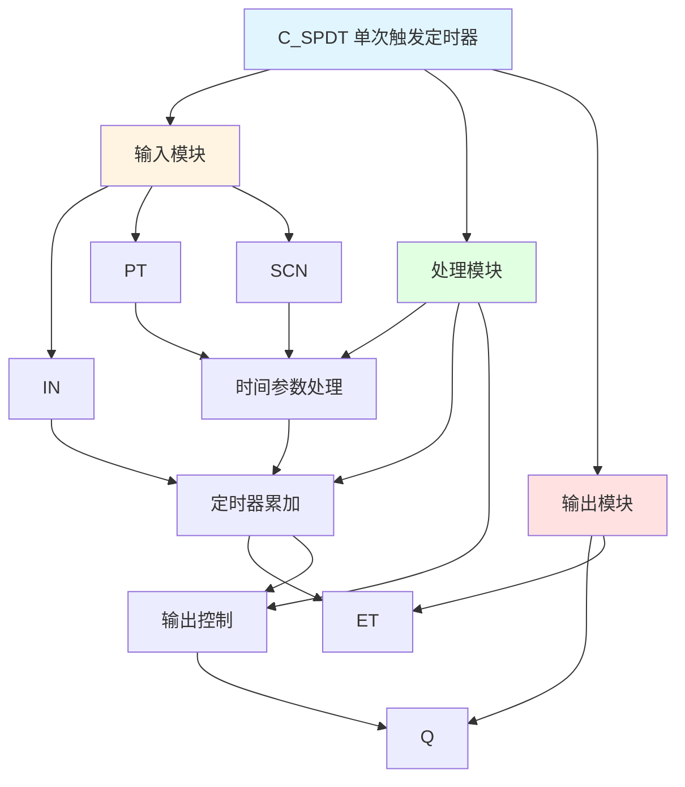

# C_SPDT 功能块分析报告

## 基本信息

| 项目 | 内容 |
|------|------|
| 功能块名称 | C_SPDT |
| 功能描述 | Single Shot Timer（单次触发定时器） |
| 最后修改 | 2015.12.28 |
| 作者 | Gao Weidi |
| 页数 | 1页 |

## 功能概述

C_SPDT 是一个单次触发定时器功能块，用于在输入信号有效时产生固定宽度的脉冲输出。

## 思维导图

## 流程路径描述

### 定时器路径：
开始 → IN信号 → 定时器累加 → ET < Delaytime → Q输出
**功能**: 产生固定宽度的脉冲

## 逐帧功能分析

### Rung 7: 时间参数处理

**功能描述**: 处理扫描时间和延时时间

**输入条件**:
| 信号名称 | 信号描述 | 信号类型 | 触发值 |
|----------|----------|----------|--------|
| SCN | 扫描时间 | INT | 设定值 |
| PT | 延时时间 | DINT | 设定值 |

**输出功能**:
| 信号名称 | 信号描述 | 信号类型 |
|----------|----------|----------|
| Scantime | 扫描时间 | DINT |
| Delaytime | 延时时间 | DINT |

**触发逻辑**:
- Scantime = LIMIT(SCN, 1, 150)
- Delaytime = ABS(PT)

**功能实现**: 
对扫描时间进行限幅，计算延时时间的绝对值。

### Rung 8: 定时器累加和输出控制

**功能描述**: 累加定时器并控制输出

**输入条件**:
| 信号名称 | 信号描述 | 信号类型 | 触发值 |
|----------|----------|----------|--------|
| IN | 输入信号 | BOOL | TRUE |
| ET | 已过时间 | DINT | 数值 |
| Delaytime | 延时时间 | DINT | 设定值 |
| Scantime | 扫描时间 | DINT | 设定值 |

**输出功能**:
| 信号名称 | 信号描述 | 信号类型 |
|----------|----------|----------|
| Q | 输出 | BOOL |
| ET | 已过时间 | DINT |

**触发逻辑**:
- IF IN = TRUE AND ET < Delaytime THEN Q = TRUE, ET = ET + Scantime
- IF ET >= Delaytime THEN Q = FALSE

**功能实现**: 
当输入信号有效且定时器未达到延时时间时，输出为TRUE并累加定时器。

### Rung 9: 定时器复位

**功能描述**: 复位定时器

**输入条件**:
| 信号名称 | 信号描述 | 信号类型 | 触发值 |
|----------|----------|----------|--------|
| IN | 输入信号 | BOOL | FALSE |

**输出功能**:
| 信号名称 | 信号描述 | 信号类型 |
|----------|----------|----------|
| Q | 输出 | BOOL |
| ET | 已过时间 | DINT |

**触发逻辑**:
- IF IN = FALSE THEN Q = FALSE, ET = 0

**功能实现**: 
当输入信号无效时，复位定时器和输出。

## 触发条件总结

### 控制条件
- **定时器启动**: IN = TRUE
- **定时器复位**: IN = FALSE

## 实现功能总结

### 主要功能
1. **单次触发**: 产生固定宽度的脉冲
2. **延时控制**: 支持设置延时时间

## 关键信号说明

| 信号名称 | 信号描述 | 信号类型 | 用途 |
|----------|----------|----------|------|
| IN | 输入信号 | BOOL | 触发输入 |
| PT | 延时时间 | DINT | 延时时间设定 |
| SCN | 扫描时间 | INT | 扫描时间设定 |
| Q | 输出 | BOOL | 脉冲输出 |
| ET | 已过时间 | DINT | 已过时间 |

## 调试技巧

### 调试步骤
1. 检查IN信号，确认触发输入正常
2. 检查PT值，确认延时时间设置
3. 检查SCN值，确认扫描时间设置
4. 监控Q和ET信号，观察脉冲输出

### 常见问题
1. **脉冲不工作**: 检查IN信号和PT值
2. **脉冲宽度不正确**: 检查PT和SCN值设置

### 监控信号列表
- IN（输入信号）
- PT、SCN（时间参数）
- Q、ET（输出）
