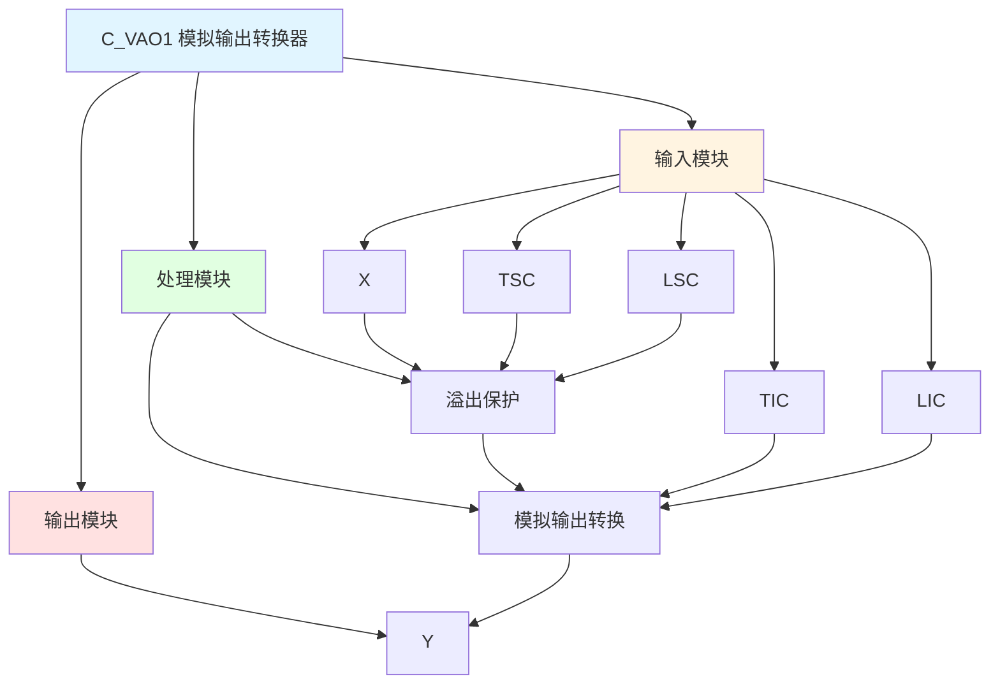

# C_VAO1 功能块分析报告

## 基本信息

| 项目 | 内容 |
|------|------|
| 功能块名称 | C_VAO1 |
| 功能描述 | Analog Output Converter(for Servo Valve)（模拟输出转换器，用于伺服阀） |
| 最后修改 | 2015.12.13 |
| 作者 | Shi Chun Liang |
| 页数 | 1页 |

## 功能概述

C_VAO1 是一个模拟输出转换器功能块，用于将实数值转换为伺服阀控制所需的整数值输出。该功能块包含溢出保护和模拟输出转换功能。

## 思维导图

## 流程路径描述

### 溢出保护路径：
开始 → 检查TSC-LSC是否为0 → 溢出保护 → 输出Y=0
**功能**: 防止除零错误

### 模拟输出转换路径：
开始 → X-LSC → 比例转换 → 整数转换 → 输出Y
**功能**: 将实数值转换为伺服阀控制整数

## 逐帧功能分析

### Rung 7: 溢出保护

**功能描述**: 检查TSC和LSC的差值是否为0，防止除零错误

**输入条件**:
| 信号名称 | 信号描述 | 信号类型 | 触发值 |
|----------|----------|----------|--------|
| TSC | 目标量程上限 | REAL | 数值 |
| LSC | 目标量程下限 | REAL | 数值 |

**输出功能**:
| 信号名称 | 信号描述 | 信号类型 |
|----------|----------|----------|
| Y | 输出 | INT |

**触发逻辑**:
- IF ABS(TSC - LSC) < 0.00001 THEN Y = 0

**功能实现**: 
使用SUB、ABS和CMP功能块检测TSC和LSC的差值是否接近0，如果接近0则输出Y=0，防止后续计算出现除零错误。

### Rung 9: 模拟输出转换

**功能描述**: 将实数值转换为伺服阀控制所需的整数值

**输入条件**:
| 信号名称 | 信号描述 | 信号类型 | 触发值 |
|----------|----------|----------|--------|
| X | 输入值 | REAL | 数值 |
| LSC | 目标量程下限 | REAL | 数值 |
| TIC | 目标整数上限 | INT | 设定值 |
| LIC | 目标整数下限 | INT | 设定值 |
| TSC | 目标量程上限 | REAL | 设定值 |

**输出功能**:
| 信号名称 | 信号描述 | 信号类型 |
|----------|----------|----------|
| Y | 输出 | INT |

**触发逻辑**:
- Y = INT((X - LSC) * (TIC - LIC) / (TSC - LSC) + LIC)

**功能实现**: 
通过减法、乘法、除法和加法运算，将输入实数值X按照量程比例转换为整数输出Y。

## 触发条件总结

### 转换条件
- **溢出保护**: ABS(TSC - LSC) < 0.00001
- **正常转换**: ABS(TSC - LSC) >= 0.00001

## 实现功能总结

### 主要功能
1. **溢出保护**: 防止除零错误
2. **模拟输出转换**: 将实数值转换为伺服阀控制整数

## 关键信号说明

| 信号名称 | 信号描述 | 信号类型 | 用途 |
|----------|----------|----------|------|
| X | 输入值 | REAL | 模拟输入值 |
| TSC | 目标量程上限 | REAL | 量程上限 |
| LSC | 目标量程下限 | REAL | 量程下限 |
| TIC | 目标整数上限 | INT | 整数上限 |
| LIC | 目标整数下限 | INT | 整数下限 |
| Y | 输出 | INT | 整数输出值 |

## 调试技巧

### 调试步骤
1. 检查X值，确认输入正常
2. 检查TSC、LSC值，确认量程设置
3. 检查TIC、LIC值，确认整数范围设置
4. 监控Y值，观察转换结果

### 常见问题
1. **输出为0**: 检查TSC和LSC是否相等
2. **转换不准确**: 检查量程和整数范围设置

### 监控信号列表
- X（输入值）
- TSC、LSC（量程值）
- TIC、LIC（整数范围）
- Y（输出）
