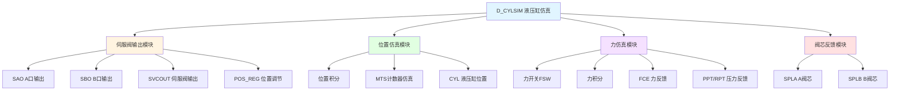

# D_CYLSIM 功能块分析报告

## 基本信息

| 项目 | 内容 |
|------|------|
| 功能块名称 | D_CYLSIM |
| 功能描述 | Cylinder Simulation Function Block（液压缸仿真功能块） |
| 最后修改 | 2017.09.15 |
| 作者 | GaoWeidi |
| 页数 | 约2页（10个程序段） |

## 功能概述

D_CYLSIM是一个液压缸仿真功能块，用于模拟液压缸的位置和力反馈。该功能块实现了液压缸MTS计数器仿真和力反馈仿真，适用于系统调试和测试。

### 应用场景
- **液压系统调试**：调试液压缸控制系统
- **仿真测试**：在没有实际设备时进行测试
- **力控制仿真**：仿真液压缸的力反馈
- **位置控制仿真**：仿真液压缸的位置反馈

### 功能特点
1. **伺服阀输出处理**：处理A口和B口的伺服阀输出
2. **位置仿真**：通过积分器仿真液压缸长度
3. **MTS计数器仿真**：仿真MTS位置传感器
4. **力反馈仿真**：仿真液压缸的力反馈
5. **伺服阀阀芯反馈**：输出伺服阀阀芯位置

## 思维导图

## 流程路径描述

### 伺服阀输出路径：
开始 → 读取SAO/SBO → 转换处理 → 计算SVCOUT → 计算POS_REG
**功能**: 处理伺服阀输出信号

### 位置仿真路径：
开始 → POS_REG积分 → 位置限幅 → MTS计数器仿真 → 输出CYL
**功能**: 仿真液压缸位置

### 力仿真路径：
开始 → 力开关判断 → 力积分 → 力限幅 → 输出FCE
**功能**: 仿真液压缸力反馈

## 逐帧功能分析

### Rung 1: 输入转换

**功能描述**: 将伺服阀输入转换为DINT类型

**输入条件**:
| 信号名称 | 信号描述 | 信号类型 | 触发值 |
|----------|----------|----------|--------|
| PST | A口设定 | INT | 数值 |
| FST | B口设定 | INT | 数值 |

**输出功能**:
| 信号名称 | 信号描述 | 信号类型 |
|----------|----------|----------|
| PSTD | A口设定DINT | DINT |
| FSTD | B口设定DINT | DINT |

**触发逻辑**:
- PSTD = INT_TO_DINT(PST)
- FSTD = INT_TO_DINT(FST)

### Rung 2: 伺服阀输出计算

**功能描述**: 计算伺服阀输出和位置调节量

**输入条件**:
| 信号名称 | 信号描述 | 信号类型 | 触发值 |
|----------|----------|----------|--------|
| SAO | A口输出 | INT | 数值 |
| SBO | B口输出 | INT | 数值 |
| SIM | 仿真模式 | BOOL | TRUE |

**输出功能**:
| 信号名称 | 信号描述 | 信号类型 |
|----------|----------|----------|
| SVCOUT | 伺服阀输出 | REAL |
| GPS | 位置增益 | REAL |
| POS_REG | 位置调节量 | REAL |

**触发逻辑**:
- SVCOUT = SAO_real + SBO_real（仿真模式）
- POS_REG = SVCOUT × GPS

### Rung 3: 位置积分仿真

**功能描述**: 通过积分器仿真液压缸长度

**输入条件**:
| 信号名称 | 信号描述 | 信号类型 | 触发值 |
|----------|----------|----------|--------|
| PMD | 位置模式 | BOOL | TRUE |
| SIM | 仿真模式 | BOOL | TRUE |
| PIT | 位置积分时间 | INT | 设定值 |
| SCN | 扫描次数 | INT | 数值 |
| POS_REG | 位置调节量 | REAL | 数值 |
| CLT | 液压缸长度 | REAL | 设定值 |

**输出功能**:
| 信号名称 | 信号描述 | 信号类型 |
|----------|----------|----------|
| POS_MEM | 位置记忆 | REAL |

**触发逻辑**:
- POS_MEM += POS_REG × (SCN / PIT)
- POS_MEM = LIMIT(POS_MEM, 0.0, CLT)

**功能实现**: 
1. 计算积分步长
2. 累加位置值
3. 调用C_LIMR进行限幅

### Rung 4: MTS计数器仿真

**功能描述**: 仿真MTS位置传感器计数器

**输入条件**:
| 信号名称 | 信号描述 | 信号类型 | 触发值 |
|----------|----------|----------|--------|
| PRT | 位置复位 | BOOL | TRUE |
| POS_MEM | 位置记忆 | REAL | 数值 |
| PSTD | A口设定 | DINT | 数值 |
| PCI | 位置转换系数 | REAL | 设定值 |

**输出功能**:
| 信号名称 | 信号描述 | 信号类型 |
|----------|----------|----------|
| CYL | 液压缸位置 | REAL |
| PCT | 位置计数 | DINT |

**触发逻辑**:
- CYL = POS_MEM（带方向处理）
- PCT = CYL / PCI

**功能实现**: 
调用C_LDLG进行滞后处理，调用C_NSWR进行方向选择。

### Rung 5: 力开关检测

**功能描述**: 检测力反馈开关状态

**输入条件**:
| 信号名称 | 信号描述 | 信号类型 | 触发值 |
|----------|----------|----------|--------|
| GFB | 力反馈位置 | REAL | 数值 |
| FPS | 力位置开关 | REAL | 设定值 |
| FMD | 力模式 | BOOL | TRUE |
| RMD | 反向模式 | BOOL | TRUE |

**输出功能**:
| 信号名称 | 信号描述 | 信号类型 |
|----------|----------|----------|
| FSW | 力开关 | BOOL |

**触发逻辑**:
- IF GFB ≤ FPS AND FMD AND RMD THEN FSW = TRUE

### Rung 6: 力积分仿真

**功能描述**: 通过积分器仿真力反馈

**输入条件**:
| 信号名称 | 信号描述 | 信号类型 | 触发值 |
|----------|----------|----------|--------|
| FSW | 力开关 | BOOL | TRUE |
| SIM | 仿真模式 | BOOL | TRUE |
| FIT | 力积分时间 | INT | 设定值 |
| SCN | 扫描次数 | INT | 数值 |
| FCE_REG | 力调节量 | REAL | 数值 |

**输出功能**:
| 信号名称 | 信号描述 | 信号类型 |
|----------|----------|----------|
| FCE_MEM | 力记忆 | REAL |
| FCE | 力反馈 | REAL |

**触发逻辑**:
- FCE_MEM += FCE_REG × (SCN / FIT)
- FCE_MEM = LIMIT(FCE_MEM, 0.0, 300.0)

### Rung 7-8: 压力反馈计算

**功能描述**: 计算压力反馈值

**输入条件**:
| 信号名称 | 信号描述 | 信号类型 | 触发值 |
|----------|----------|----------|--------|
| FCE_BSW | 力反馈开关 | BOOL | TRUE/FALSE |
| BAK_FCE | 备用力 | REAL | 数值 |
| FCE | 力反馈 | REAL | 数值 |
| ROD_AREA | 活塞杆面积 | REAL | 设定值 |
| PIS_AREA | 活塞面积 | REAL | 设定值 |

**输出功能**:
| 信号名称 | 信号描述 | 信号类型 |
|----------|----------|----------|
| PPT | 活塞压力 | INT |
| RPT | 活塞杆压力 | INT |

**触发逻辑**:
- 根据FCE_BSW状态选择不同的压力计算方式
- 使用C_SCAL2进行比例缩放

### Rung 9: 伺服阀阀芯反馈

**功能描述**: 输出伺服阀阀芯位置反馈

**输入条件**:
| 信号名称 | 信号描述 | 信号类型 | 触发值 |
|----------|----------|----------|--------|
| SAO | A口输出 | INT | 数值 |
| SBO | B口输出 | INT | 数值 |

**输出功能**:
| 信号名称 | 信号描述 | 信号类型 |
|----------|----------|----------|
| SPLA | A阀芯位置 | REAL |
| SPLB | B阀芯位置 | REAL |

**触发逻辑**:
- SPLA = C_VAO1(SAO, 32000, 6400, 1000, -1000)
- SPLB = C_VAO1(SBO, 32000, 6400, 1000, -1000)

## 触发条件总结

### 位置仿真条件
- **PMD = TRUE**: 位置模式有效
- **SIM = TRUE**: 仿真模式有效

### 力仿真条件
- **FSW = TRUE**: 力开关有效
- **SIM = TRUE**: 仿真模式有效

### 压力计算条件
- **FCE_BSW**: 选择压力计算方式

## 实现功能总结

### 主要功能
1. **伺服阀输出处理**: 处理A/B口伺服阀输出
2. **位置仿真**: 通过积分器仿真液压缸位置
3. **MTS计数器仿真**: 仿真MTS位置传感器
4. **力反馈仿真**: 仿真液压缸力反馈
5. **压力反馈**: 计算活塞和活塞杆压力
6. **阀芯反馈**: 输出伺服阀阀芯位置

### 仿真参数
| 参数 | 说明 | 用途 |
|------|------|------|
| PIT | 位置积分时间 | 控制位置变化速度 |
| FIT | 力积分时间 | 控制力变化速度 |
| GPS | 位置增益 | 位置调节系数 |
| CLT | 液压缸长度 | 位置限幅值 |
| PCI | 位置转换系数 | MTS计数器转换 |

## 关键信号说明

| 信号名称 | 信号描述 | 信号类型 | 用途 |
|----------|----------|----------|------|
| SAO/SBO | 伺服阀A/B口输出 | INT | 伺服阀控制 |
| SVCOUT | 伺服阀输出 | REAL | 合成输出 |
| POS_MEM | 位置记忆 | REAL | 位置积分值 |
| CYL | 液压缸位置 | REAL | 位置输出 |
| PCT | 位置计数 | DINT | MTS计数器 |
| FCE_MEM | 力记忆 | REAL | 力积分值 |
| FCE | 力反馈 | REAL | 力输出 |
| PPT/RPT | 压力反馈 | INT | 压力输出 |
| SPLA/SPLB | 阀芯位置 | REAL | 阀芯反馈 |

## 调试技巧

### 调试步骤
1. 检查SAO/SBO输入是否正常
2. 验证SIM仿真模式是否有效
3. 监控位置积分过程
4. 检查力反馈仿真
5. 验证压力计算

### 常见问题
1. **位置不变化**: 检查PMD和SIM信号
2. **力反馈异常**: 检查FSW和力参数
3. **压力计算错误**: 检查面积参数设置
4. **阀芯反馈异常**: 检查SAO/SBO输入

### 监控信号列表
- SAO/SBO（伺服阀输出）
- POS_MEM（位置记忆）
- CYL（液压缸位置）
- FCE（力反馈）
- PPT/RPT（压力反馈）
- SPLA/SPLB（阀芯位置）
