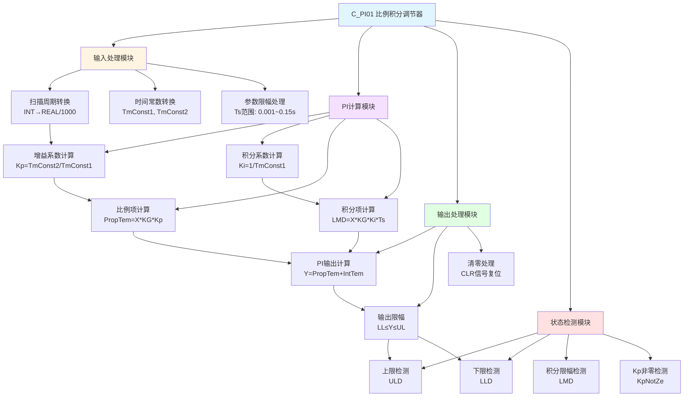

# C_PI01 功能块分析报告

## 基本信息
| 项目 | 内容 |
|------|------|
| 功能块名称 | C_PI01 |
| 功能描述 | Proportional & Integral Regulator（比例积分调节器） |
| 最后修改 | 2015.12.16 |
| 作者 | ShiChunLiang |
| 页数 | 1页 |

## 功能概述

C_PI01是一个**比例积分（PI）调节器**功能块，用于实现工业过程控制中的闭环调节功能。该功能块将比例控制（P）和积分控制（I）相结合，能够有效消除稳态误差，实现对过程变量的精确控制。

### 核心功能
- **比例控制（P）**：根据偏差大小产生即时响应，响应速度与偏差成正比
- **积分控制（I）**：累积偏差随时间积分，消除稳态误差
- **输出限幅**：限制输出在上下限范围内，防止执行机构过载
- **抗积分饱和**：当输出达到限幅时自动停止积分，防止积分饱和

## 思维导图



## 流程路径描述

### 主流程路径
```
启动 → 输入参数转换 → 使能检测 → [ENA=ON] → 增益系数计算 → PI算法计算 → 输出限幅 → 完成
                      ↓
                   [ENA=OFF] → 保持输出不变
```

### 清零流程路径
```
CLR信号 → 积分项清零 → PI计算结果清零 → 输出清零
```

## 逐帧功能分析

### 第1帧：版权信息
```
COMMENT /* Copyright 2015 (C) MASIC Automation Systems Corporation All Rights Reserved. */;
```
版权声明，标识软件归属。

### 第2-9帧：功能块头部信息
```
COMMENT /* Function Name:     C_PI01 */;
COMMENT /* Last Modified:        2015.12.16 */;
COMMENT /* Author:                     ShiChunLiang */;
COMMENT /* Description:            Proportional & Integral Regulator */;
```
定义功能块名称、修改日期、作者和功能描述。

### 第13-15帧：输入数据限幅与转换
```
H_WIRE; INT_TO_REAL SCN **; DIV_REAL ** 1000.0 **; 
H_WIRE; CALL C_LIMR ** 0.15 0.001 Ts ** **; R+; C+1; C+1; C+1; H_WIRE; END_RUNG;
```
**功能说明**：
- 将扫描周期SCN（INT类型，单位毫秒）转换为REAL类型
- 除以1000转换为秒单位
- 调用C_LIMR限幅功能块，限制Ts在0.001~0.15秒范围内
- 确保采样周期在合理范围内，防止控制异常

### 第17帧：时间常数转换
```
H_WIRE; DINT_TO_REAL T1 **; DIV_REAL ** 1000.0 TmConst1; 
H_WIRE; H_WIRE; DINT_TO_REAL T2 **; DIV_REAL ** 1000.0 TmConst2; END_RUNG;
```
**功能说明**：
- 将时间常数T1、T2从DINT转换为REAL
- 转换为秒单位存储到TmConst1、TmConst2
- TmConst1用于积分时间，TmConst2用于比例时间

### 第19-21帧：使能检测与冻结
```
NCCON ENA; H_WIRE; ... JUMPN DisEnd; END_RUNG;
```
**功能说明**：
- ENA（使能信号）为OFF时，跳转到DisEnd标签
- 当使能关闭时，PI调节器冻结，保持当前输出不变
- 这是重要的安全特性，防止在非使能状态下误动作

### 第23-25帧：比例积分增益系数计算
```
H_WIRE; CMP_REAL TmConst1 0.0 ** ** **; 
...
DIV_REAL TmConst2 TmConst1 Kp; 
DIV_REAL 1.0 TmConst1 Ki; END_RUNG;
```
**功能说明**：
- 检测TmConst1是否为0，防止除零错误
- 计算比例增益：**Kp = TmConst2 / TmConst1**
- 计算积分增益：**Ki = 1.0 / TmConst1**
- 当TmConst1为0时，设置Kp=1, Ki=0（纯比例控制）

### 第27-29帧：比例项计算
```
H_WIRE; MUL_REAL X KG **; H_WIRE; MUL_REAL ** Kp PropTem; END_RUNG;
```
**功能说明**：
- 计算比例项：**PropTem = X × KG × Kp**
- X：输入偏差信号
- KG：增益系数
- Kp：比例增益
- 比例项提供即时响应，偏差越大响应越强

### 第31帧：积分项计算与累加
```
H_WIRE; CALL C_MUL4 X KG Ki Ts ** 0.0 LMD **; 
H_WIRE; CALL C_NSWR ** 0.0 LMD ** IntTem **; 
H_WIRE; ADD_REAL ** IntTem **; 
H_WIRE; CALL C_LIMR ** UL LL IntTem ** **; END_RUNG;
```
**功能说明**：
- 计算积分增量：**LMD = X × KG × Ki × Ts**
- LMD：本次积分增量值
- 调用C_NSWR选择器，当LMD有效时累加到IntTem
- 调用C_LIMR对积分项进行限幅（UL上限，LL下限）
- 积分项累积偏差，消除稳态误差

### 第33帧：PI输出计算
```
H_WIRE; ADD_REAL PropTem IntTem PICalRsu; 
H_WIRE; H_WIRE; CALL C_LIMR PICalRsu UL LL Y ** **; END_RUNG;
```
**功能说明**：
- PI输出 = 比例项 + 积分项
- **Y = PropTem + IntTem**
- 对输出Y进行限幅处理，确保在[LL, UL]范围内

### 第35-37帧：比例增益非零检测
```
H_WIRE; NE_REAL Kp 0.0 **; ... COIL KpNotZe; END_RUNG;
```
**功能说明**：
- 检测Kp是否不等于0
- KpNotZe用于后续的抗积分饱和逻辑
- 当Kp=0时，禁用积分限幅功能

### 第39帧：DisEnd标签（跳转目标）
```
LABELN DisEnd; END_RUNG;
```
当ENA为OFF时跳转至此，跳过PI计算。

### 第41-43帧：清零处理
```
NOCON CLR; MOVE_REAL 1 0.0 IntTem; 
H_WIRE; H_WIRE; MOVE_REAL 1 0.0 PICalRsu; 
H_WIRE; H_WIRE; MOVE_REAL 1 0.0 Y; END_RUNG;
```
**功能说明**：
- CLR信号有效时，执行清零操作
- 积分项IntTem清零
- PI计算结果PICalRsu清零
- 输出Y清零
- 用于系统复位或手动干预

### 第45-47帧：上限检测
```
H_WIRE; GE_REAL PICalRsu UL **; ... COIL ULD; END_RUNG;
```
**功能说明**：
- 检测PI计算结果是否达到上限
- **ULD = (PICalRsu ≥ UL)**
- 用于抗积分饱和逻辑

### 第49-51帧：下限检测
```
H_WIRE; LE_REAL PICalRsu LL **; ... COIL LLD; END_RUNG;
```
**功能说明**：
- 检测PI计算结果是否达到下限
- **LLD = (PICalRsu ≤ LL)**
- 用于抗积分饱和逻辑

### 第51帧：积分限幅检测（抗饱和）
```
NOCON ULD; NOCON KpNotZe; ... COIL LMD; 
R+; NOCON LLD; C-; V_WIRE; END_RUNG;
```
**功能说明**：
- **LMD = ULD × KpNotZe + LLD**
- 当输出达到上限且Kp非零时，停止正向积分
- 当输出达到下限时，停止负向积分
- 这是**抗积分饱和**的关键逻辑，防止积分项无限累积

## 触发条件总结

| 触发信号 | 触发条件 | 触发动作 |
|----------|----------|----------|
| ENA | ON | 启动PI调节计算 |
| ENA | OFF | 冻结输出，跳过计算 |
| CLR | ON | 清零所有内部变量和输出 |
| Kp=0 | 检测到 | 禁用积分限幅功能 |
| ULD | ON | 停止正向积分（抗饱和） |
| LLD | ON | 停止负向积分（抗饱和） |

## 实现功能总结

### 主要功能
1. **比例控制**：根据偏差产生即时响应，响应强度与偏差成正比
2. **积分控制**：累积偏差消除稳态误差，提高控制精度
3. **输出限幅**：限制输出在安全范围内，保护执行机构
4. **抗积分饱和**：输出限幅时自动停止积分，防止超调

### 控制算法
```
PI输出 = Kp × e + Ki × ∫e dt
其中：
- e = X × KG（偏差信号）
- Kp = TmConst2 / TmConst1（比例增益）
- Ki = 1 / TmConst1（积分增益）
```

### 应用场景
- 温度控制：加热器功率调节
- 压力控制：阀门开度调节
- 流量控制：泵速调节
- 液位控制：进料阀调节
- 位置控制：伺服电机调节

## 关键信号说明

| 信号名称 | 数据类型 | 方向 | 说明 |
|----------|----------|------|------|
| SCN | INT | 输入 | 扫描周期（毫秒） |
| X | REAL | 输入 | 输入偏差信号 |
| KG | REAL | 输入 | 增益系数 |
| T1 | DINT | 输入 | 积分时间常数（毫秒） |
| T2 | DINT | 输入 | 比例时间常数（毫秒） |
| UL | REAL | 输入 | 输出上限 |
| LL | REAL | 输入 | 输出下限 |
| ENA | BOOL | 输入 | 使能信号 |
| CLR | BOOL | 输入 | 清零信号 |
| Y | REAL | 输出 | PI调节输出 |
| ULD | BOOL | 输出 | 上限检测标志 |
| LLD | BOOL | 输出 | 下限检测标志 |
| LMD | BOOL | 输出 | 积分限幅标志 |

## 调试技巧

### 参数整定方法
1. **先比例后积分**：先将Ki设为0，调整Kp使系统响应稳定
2. **逐步增加积分**：缓慢增加Ki，观察稳态误差消除情况
3. **防止超调**：如出现超调，适当减小Ki或增大Kp

### 常见问题排查
| 问题现象 | 可能原因 | 解决方法 |
|----------|----------|----------|
| 输出振荡 | Kp过大 | 减小比例增益 |
| 响应缓慢 | Kp过小 | 增大比例增益 |
| 稳态误差大 | Ki过小 | 增大积分增益 |
| 输出饱和 | 积分饱和 | 检查限幅设置，启用抗饱和 |

### 在线监测建议
- 监控偏差信号X的变化趋势
- 观察积分项IntTem是否异常累积
- 检查ULD/LLD标志是否频繁触发
- 验证输出Y是否在预期范围内
