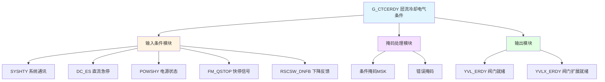

# G_CTCERDY 功能块分析报告

## 基本信息

| 项目 | 内容 |
|------|------|
| 功能块名称 | G_CTCERDY |
| 功能描述 | Laminar Cooling bank spray Electrical Condition（层流冷却喷淋电气条件） |
| 最后修改 | 2017.8.7 |
| 作者 | ZhangXiaoLiang |
| 页数 | 1页（2个程序段） |

## 功能概述

G_CTCERDY是一个层流冷却喷淋电气条件检测功能块，用于检测层流冷却系统的电气就绪状态。该功能块通过检测各种系统条件，判断喷淋系统是否具备运行条件。

### 应用场景
- **层流冷却系统**：热轧带钢层流冷却控制
- **喷淋系统控制**：控制冷却喷淋的启停
- **电气条件检测**：检测系统电气条件是否满足
- **安全联锁**：提供系统安全联锁功能

### 功能特点
1. **多条件检测**：检测多个系统条件
2. **掩码处理**：使用掩码进行条件筛选
3. **错误检测**：检测系统错误状态
4. **就绪输出**：输出系统就绪状态

## 思维导图

## 流程路径描述

### 条件检测路径：
开始 → 检测SYSHTY → 检测DC_ES → 检测POWSHY → 检测FM_QSTOP → 检测RSCSW_DNFB → 输出就绪
**功能**: 检测各系统条件是否满足

### 掩码处理路径：
开始 → 条件掩码 → 错误掩码 → 输出阀门就绪状态
**功能**: 通过掩码处理输出就绪状态

## 逐帧功能分析

### Rung 1: 阀门就绪检测

**功能描述**: 检测阀门电气条件并输出就绪状态

**输入条件**:
| 信号名称 | 信号描述 | 信号类型 | 触发值 |
|----------|----------|----------|--------|
| SYSHTY | 系统通讯正常 | BOOL | TRUE |
| DC_ES | 直流急停状态 | BOOL | FALSE |
| POWSHY | 电源状态正常 | BOOL | TRUE |
| FM_QSTOP | 快停信号 | BOOL | FALSE |
| RSCSW_DNFB | 下降反馈 | BOOL | TRUE |

**输出功能**:
| 信号名称 | 信号描述 | 信号类型 |
|----------|----------|----------|
| YVL_ERDY | 阀门就绪 | WORD |
| YVLX_ERDY | 阀门扩展就绪 | BOOL |

**触发逻辑**:
- 调用C_NSWI进行条件选择
- 使用AND_WORD进行掩码处理
- 使用NOT_WORD进行错误掩码处理
- 所有条件满足时输出就绪状态

**功能实现**: 
1. 调用C_NSWI功能块选择条件值
2. 使用AND_WORD将条件与掩码MSK相与
3. 使用NOT_WORD对错误状态取反
4. 输出YVL_ERDY和YVLX_ERDY

### Rung 2: 扩展就绪输出

**功能描述**: 输出阀门扩展就绪状态

**输入条件**:
| 信号名称 | 信号描述 | 信号类型 | 触发值 |
|----------|----------|----------|--------|
| SYSHTY | 系统通讯正常 | BOOL | TRUE |
| DC_ES | 直流急停状态 | BOOL | FALSE |
| POWSHY | 电源状态正常 | BOOL | TRUE |
| FM_QSTOP | 快停信号 | BOOL | FALSE |
| RSCSW_DNFB | 下降反馈 | BOOL | TRUE |

**输出功能**:
| 信号名称 | 信号描述 | 信号类型 |
|----------|----------|----------|
| YVLX_ERDY | 阀门扩展就绪 | BOOL |

**触发逻辑**:
- YVLX_ERDY = SYSHTY AND NOT DC_ES AND POWSHY AND NOT FM_QSTOP AND RSCSW_DNFB

**功能实现**: 
所有条件串联后直接输出YVLX_ERDY。

## 触发条件总结

### 就绪条件
| 信号名称 | 要求状态 | 说明 |
|----------|----------|------|
| SYSHTY | TRUE | 系统通讯正常 |
| DC_ES | FALSE | 无直流急停 |
| POWSHY | TRUE | 电源正常 |
| FM_QSTOP | FALSE | 无快停信号 |
| RSCSW_DNFB | TRUE | 下降反馈正常 |

### 输出条件
- **YVL_ERDY**: 所有条件满足且无错误
- **YVLX_ERDY**: 所有条件串联满足

## 实现功能总结

### 主要功能
1. **条件检测**: 检测多个系统条件
2. **掩码处理**: 使用掩码筛选有效条件
3. **错误检测**: 检测系统错误状态
4. **就绪输出**: 输出系统就绪状态

### 条件逻辑表
| SYSHTY | DC_ES | POWSHY | FM_QSTOP | RSCSW_DNFB | YVLX_ERDY |
|--------|-------|--------|----------|------------|-----------|
| 1 | 0 | 1 | 0 | 1 | 1 |
| X | 1 | X | X | X | 0 |
| X | X | 0 | X | X | 0 |
| X | X | X | 1 | X | 0 |
| X | X | X | X | 0 | 0 |

## 关键信号说明

| 信号名称 | 信号描述 | 信号类型 | 用途 |
|----------|----------|----------|------|
| SYSHTY | 系统通讯正常 | BOOL | 通讯状态检测 |
| DC_ES | 直流急停 | BOOL | 急停状态检测 |
| POWSHY | 电源状态 | BOOL | 电源状态检测 |
| FM_QSTOP | 快停信号 | BOOL | 快停状态检测 |
| RSCSW_DNFB | 下降反馈 | BOOL | 下降状态反馈 |
| MSK | 条件掩码 | WORD | 条件筛选 |
| YVL_ERDY | 阀门就绪 | WORD | 阀门就绪状态 |
| YVLX_ERDY | 阀门扩展就绪 | BOOL | 扩展就绪状态 |

## 调试技巧

### 调试步骤
1. 检查SYSHTY通讯状态
2. 验证DC_ES急停状态
3. 检查POWSHY电源状态
4. 验证FM_QSTOP快停信号
5. 检查RSCSW_DNFB下降反馈
6. 监控YVL_ERDY和YVLX_ERDY输出

### 常见问题
1. **就绪不输出**: 检查各条件信号状态
2. **通讯异常**: 检查SYSHTY信号
3. **急停未复位**: 检查DC_ES信号
4. **电源故障**: 检查POWSHY信号

### 监控信号列表
- SYSHTY（系统通讯）
- DC_ES（直流急停）
- POWSHY（电源状态）
- FM_QSTOP（快停信号）
- RSCSW_DNFB（下降反馈）
- YVL_ERDY（阀门就绪）
- YVLX_ERDY（扩展就绪）
