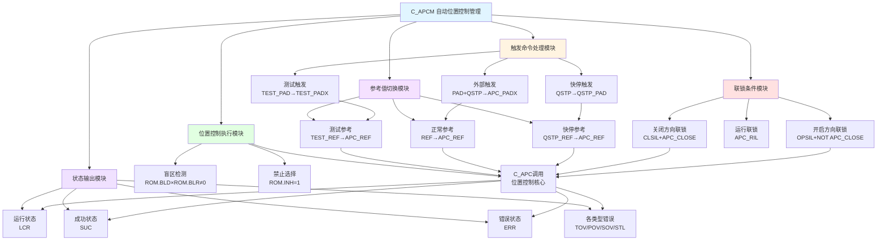

# C_APCM 功能块分析报告

## 基本信息
| 项目 | 内容 |
|------|------|
| 功能块名称 | C_APCM |
| 功能描述 | Automatic Position Control（自动位置控制） |
| 最后修改 | 2016.01.11 |
| 作者 | GaoWeidi |
| 页数 | 1页 |

## 功能概述

C_APCM是一个**自动位置控制（APC）管理**功能块，用于协调和管理位置控制系统的各种工作模式。该功能块整合了测试模式、快速停止模式和正常位置控制模式，实现了位置参考值的切换管理、运行联锁条件检测、成功/错误状态判定等核心功能。

### 核心功能
- **模式切换管理**：测试模式、快速停止模式、外部触发模式的协调切换
- **位置参考管理**：根据不同模式选择不同的位置参考值
- **联锁条件检测**：检测开/关方向的联锁条件
- **状态监控**：监控位置控制的成功、超时、位置偏差等状态
- **误差检测**：检测超时、位置偏差、传感器、堵转等错误

## 思维导图



## 流程路径描述

### 主流程路径
```
触发命令检测 → 模式识别 → 参考值切换 → 联锁条件检测 → [条件满足] → 调用C_APC执行 → 状态输出
                                            ↓
                                        [条件不满足] → 等待/报警
```

### 模式切换路径
```
TEST_PAD上升沿 → TEST_PADX → 测试模式 → TEST_REF作为参考
QSTP上升沿 → QSTP_PAD → 快停模式 → QSTP_REF作为参考
PAD有效 + QSTP无效 → APC_PADX → 正常模式 → REF作为参考
```

## 逐帧功能分析

### 第1-9帧：头部信息
```
COMMENT /* Function Name:     C_APCM */;
COMMENT /* Last Modified:        2016.01.11 */;
COMMENT /* Author:                     GaoWeidi */;
COMMENT /* Description:            Automatic Postiion Control */;
```
定义功能块基本信息，注意描述中"Position"拼写为"Postiion"。

### 第13帧：测试触发命令处理
```
H_WIRE; R_TRIG P1 ** **; R+; NOCON TEST_PAD; C+1; ... COIL TEST_PADX; END_RUNG;
```
**功能说明**：
- 使用R_TRIG上升沿检测器捕获TEST_PAD信号
- **TEST_PADX = R_TRIG(TEST_PAD)**
- TEST_PADX为测试模式的触发脉冲
- 测试模式用于系统调试和验证

### 第15帧：快速停止触发命令处理
```
H_WIRE; R_TRIG P2 ** **; R+; NOCON QSTP; C+1; ... COIL QSTP_PAD; END_RUNG;
```
**功能说明**：
- 使用R_TRIG上升沿检测器捕获QSTP信号
- **QSTP_PAD = R_TRIG(QSTP)**
- QSTP_PAD为快速停止模式的触发脉冲
- 快速停止用于紧急情况下的安全停止

### 第17帧：外部触发命令处理
```
NOCON PAD; NCCON QSTP; ... COIL APC_PADX; END_RUNG;
```
**功能说明**：
- **APC_PADX = PAD AND NOT QSTP**
- 当PAD有效且QSTP无效时，触发正常位置控制
- QSTP优先级高于PAD，确保安全

### 第19帧：测试参考值切换
```
NOCON TEST_PADX; MOVE_REAL 1 TEST_REF APC_REF; END_RUNG;
```
**功能说明**：
- 当TEST_PADX有效时，将TEST_REF赋值给APC_REF
- **APC_REF = TEST_REF**（测试模式）
- 测试参考值用于系统调试

### 第21帧：正常参考值切换
```
NOCON APC_PADX; MOVE_REAL 1 REF APC_REF; END_RUNG;
```
**功能说明**：
- 当APC_PADX有效时，将REF赋值给APC_REF
- **APC_REF = REF**（正常模式）
- REF为正常工作时的位置参考值

### 第23帧：快停参考值切换
```
NOCON QSTP_PAD; MOVE_REAL 1 QSTP_REF APC_REF; END_RUNG;
```
**功能说明**：
- 当QSTP_PAD有效时，将QSTP_REF赋值给APC_REF
- **APC_REF = QSTP_REF**（快停模式）
- 快停参考值通常为安全位置

### 第25帧：APC_PAD状态综合
```
NOCON APC_PADX; ... COIL APC_PAD; 
R+; NOCON QSTP_PAD; C-; V_WIRE; 
R+; NOCON TEST_PADX; C-; V_WIRE; END_RUNG;
```
**功能说明**：
- **APC_PAD = APC_PADX AND NOT QSTP_PAD AND NOT TEST_PADX**
- 综合三种模式的互斥关系
- 确保同一时间只有一种模式激活
- 优先级：快停 > 测试 > 正常

### 第27帧：关闭方向检测
```
H_WIRE; GE_REAL FBK APC_REF **; ... COIL APC_CLOSE; END_RUNG;
```
**功能说明**：
- 检测当前位置是否已达到或超过参考位置
- **APC_CLOSE = (FBK ≥ APC_REF)**
- FBK为位置反馈值
- 用于确定运动方向和联锁条件

### 第29帧：运行联锁条件计算
```
NOCON CLSIL; NOCON APC_CLOSE; NOCON CLRIL; NOCON APC_CLOSE; NOCON AUTX; ... COIL APC_RIL;
R+; NOCON OPSIL; NCCON APC_CLOSE; C-; V_WIRE; 
NOCON OPRIL; NCCON APC_CLOSE; C-; V_WIRE;
R+; NOCON APC_LCRX; H_WIRE; C-; V_WIRE; END_RUNG;
```
**功能说明**：
- 运行联锁条件逻辑：
  - 关闭方向：CLSIL × APC_CLOSE + CLRIL × APC_CLOSE
  - 开启方向：OPSIL × NOT APC_CLOSE + OPRIL × NOT APC_CLOSE
- **APC_RIL** = 联锁条件满足标志
- AUTX为自动模式信号
- APC_LCRX用于联锁复位

### 第31帧：跳转到盲区处理
```
NCCON APC_PAD; ... JUMPN PAD_LAB; END_RUNG;
```
**功能说明**：
- 当APC_PAD无效时，跳转到PAD_LAB标签
- 跳过盲区检测和禁止选择逻辑
- 优化程序执行效率

### 第33帧：盲区检测
```
H_WIRE; MUL_REAL ROM.BLD ROM.BLR **; 
H_WIRE; H_WIRE; NE_REAL ** 0.0 **; ... COIL APC_BL_ON; END_RUNG;
```
**功能说明**：
- 检测盲区是否启用
- **APC_BL_ON = (ROM.BLD × ROM.BLR ≠ 0)**
- ROM.BLD：盲区方向系数（±1）
- ROM.BLR：盲区范围值
- 盲区用于处理机械间隙

### 第35帧：PAD_LAB标签
```
LABELN PAD_LAB; END_RUNG;
```
跳转目标标签。

### 第37帧：禁止选择检测
```
H_WIRE; EQ_INT ROM.INH 1 **; ... NCCON APC_BL_ON; ... COIL APC_INH_SEL; END_RUNG;
```
**功能说明**：
- 检测是否启用禁止功能
- **APC_INH_SEL = (ROM.INH = 1) AND NOT APC_BL_ON**
- 当在盲区内且启用禁止时，暂停控制
- 防止在盲区内反复动作

### 第39帧：禁止条件综合
```
H_WIRE; SUB_REAL APC_REF FBK **; 
H_WIRE; ABS_REAL ** **; 
H_WIRE; LE_REAL ** ROM.ACR **; 
... NCCON APC_LCRX; NOCON APC_INH_SEL; H_WIRE; COIL APC_INH; END_RUNG;
```
**功能说明**：
- 计算位置偏差绝对值
- **APC_INH = (|APC_REF - FBK| ≤ ROM.ACR) AND NOT APC_LCRX AND APC_INH_SEL**
- ROM.ACR：精度范围
- 当偏差小于精度范围且满足禁止条件时，禁止控制
- 避免在精度范围内反复调整

### 第41帧：调用C_APC核心功能块
```
H_WIRE; H_WIRE; C_APC APC1 APC_REF FBK ** ** ROM SCN ** SPR ** ** ** ** ** **;
R+; ... COIL APC_LCRX;
R+; NOCON APC_PAD; NCCON APC_INH; C+1; ... COIL APC_SUCX;
R+; NOCON APC_RIL; H_WIRE; C+1; ... COIL APC_ER1X;
... COIL APC_ER2X; ... COIL APC_ER3X; ... COIL APC_ER4X; END_RUNG;
```
**功能说明**：
- 调用C_APC核心位置控制功能块
- 输入参数：APC_REF（参考）、FBK（反馈）、ROM（参数）、SCN（扫描周期）、SPR（速度参考）
- 输出状态：
  - **APC_LCRX**：运行中标志
  - **APC_SUCX**：成功标志
  - **APC_ER1X**：超时错误
  - **APC_ER2X**：位置偏差错误
  - **APC_ER3X**：传感器错误
  - **APC_ER4X**：堵转错误

### 第43帧：LCR输出
```
NOCON APC_LCRX; ... COIL LCR; END_RUNG;
```
**功能说明**：
- **LCR = APC_LCRX**
- LCR为运行中状态输出
- 用于HMI显示和联锁

### 第45帧：SUC输出
```
NOCON APC_SUCX; H_WIRE; NOCON AUTX; ... COIL SUC;
R+; NOCON APC_PAD; NOCON APC_INH; C-; V_WIRE;
R+; NOCON SUC; NCCON APC_PAD; C-; V_WIRE; END_RUNG;
```
**功能说明**：
- **SUC = APC_SUCX AND AUTX AND NOT (APC_PAD AND APC_INH)**
- 成功条件：核心成功 + 自动模式 + 非禁止状态
- 自保持逻辑确保状态稳定

### 第47帧：超时错误处理
```
NOCON APC_ER1X; H_WIRE; NCCON SUC; NOCON AUTX; ... COIL APC_TOV;
R+; NOCON APC_TOV; NCCON APC_PAD; C-; V_WIRE; END_RUNG;
```
**功能说明**：
- **APC_TOV = APC_ER1X AND NOT SUC AND AUTX**
- 超时错误：位置控制超时未完成
- RS触发器记忆，直到新命令触发

### 第49帧：位置偏差错误处理
```
NOCON APC_ER2X; H_WIRE; NCCON SUC; NOCON AUTX; ... COIL APC_POV;
R+; NOCON APC_POV; NCCON APC_PAD; C-; V_WIRE; END_RUNG;
```
**功能说明**：
- **APC_POV = APC_ER2X AND NOT SUC AND AUTX**
- 位置偏差错误：实际位置与参考偏差过大

### 第51帧：传感器错误处理
```
NOCON APC_ER3X; H_WIRE; NCCON SUC; NOCON AUTX; ... COIL APC_SOV;
R+; NOCON APC_SOV; NCCON APC_PAD; C-; V_WIRE; END_RUNG;
```
**功能说明**：
- **APC_SOV = APC_ER3X AND NOT SUC AND AUTX**
- 传感器错误：位置传感器故障

### 第53帧：堵转错误处理
```
NOCON APC_ER4X; H_WIRE; NCCON SUC; NOCON AUTX; ... COIL APC_STL;
R+; NOCON APC_STL; NCCON APC_PAD; C-; V_WIRE; END_RUNG;
```
**功能说明**：
- **APC_STL = APC_ER4X AND NOT SUC AND AUTX**
- 堵转错误：执行机构堵转

### 第55帧：ERR综合输出
```
NOCON APC_TOV; ... COIL ERR;
R+; NOCON APC_POV; C-; V_WIRE;
R+; NOCON APC_SOV; C-; V_WIRE;
R+; NOCON APC_STL; C-; V_WIRE; END_RUNG;
```
**功能说明**：
- **ERR = APC_TOV OR APC_POV OR APC_SOV OR APC_STL**
- 任一错误发生时，ERR输出有效
- 用于报警和联锁

## 触发条件总结

| 触发信号 | 触发条件 | 触发动作 |
|----------|----------|----------|
| TEST_PAD | 上升沿 | 进入测试模式，TEST_REF作为参考 |
| QSTP | 上升沿 | 进入快停模式，QSTP_REF作为参考 |
| PAD | ON（QSTP为OFF） | 进入正常模式，REF作为参考 |
| CLR | ON | 复位错误状态 |
| APC_INH | ON | 暂停位置控制（在精度范围内） |

## 实现功能总结

### 主要功能
1. **多模式管理**：协调测试、快停、正常三种工作模式
2. **参考值切换**：根据模式自动选择位置参考值
3. **联锁保护**：检测开/关方向的联锁条件
4. **盲区处理**：处理机械间隙导致的盲区问题
5. **状态监控**：监控运行、成功、错误等状态
6. **错误分类**：区分超时、偏差、传感器、堵转等错误类型

### 模式优先级
```
快停模式(QSTP) > 测试模式(TEST) > 正常模式(PAD)
```

### 状态转换图
```
待机 → [触发命令] → 运行中(LCR) → [成功] → 成功(SUC)
                      ↓
                   [错误] → 错误(ERR)
                      ↓
                   [新命令] → 复位错误 → 运行中
```

## 关键信号说明

| 信号名称 | 数据类型 | 方向 | 说明 |
|----------|----------|------|------|
| TEST_PAD | BOOL | 输入 | 测试触发命令 |
| QSTP | BOOL | 输入 | 快速停止命令 |
| PAD | BOOL | 输入 | 外部触发命令 |
| REF | REAL | 输入 | 正常位置参考值 |
| TEST_REF | REAL | 输入 | 测试位置参考值 |
| QSTP_REF | REAL | 输入 | 快停位置参考值 |
| FBK | REAL | 输入 | 位置反馈值 |
| AUTX | BOOL | 输入 | 自动模式信号 |
| CLSIL/CLRIL | BOOL | 输入 | 关闭方向联锁 |
| OPSIL/OPRIL | BOOL | 输入 | 开启方向联锁 |
| ROM | STRUCT | 输入 | 参数结构体 |
| LCR | BOOL | 输出 | 运行中状态 |
| SUC | BOOL | 输出 | 成功状态 |
| ERR | BOOL | 输出 | 错误状态 |
| SPR | REAL | 输出 | 速度参考输出 |

## 调试技巧

### 模式切换测试
1. 分别测试三种模式的触发和切换
2. 验证优先级逻辑是否正确
3. 检查参考值切换是否及时

### 联锁条件验证
1. 检查各联锁信号的正确性
2. 验证开/关方向联锁的独立性
3. 测试联锁触发时的系统响应

### 错误状态排查
| 错误类型 | 可能原因 | 排查方法 |
|----------|----------|----------|
| TOV（超时） | 执行机构响应慢、负载过大 | 检查执行机构、调整超时参数 |
| POV（偏差） | 传感器故障、机械卡死 | 检查传感器、机械部件 |
| SOV（传感器） | 传感器断线、损坏 | 检查传感器接线和信号 |
| STL（堵转） | 机械卡死、负载过大 | 检查机械部件、减小负载 |

### 在线监测建议
- 监控APC_REF和FBK的差值变化
- 观察APC_PAD状态切换过程
- 检查APC_INH是否频繁触发
- 验证各错误标志的正确性
